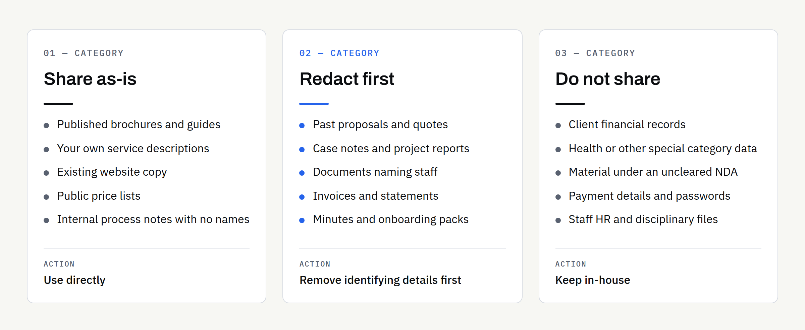

Most businesses already hold the raw material for a website, a proposal library or a set of customer-facing guides. It sits in quotes, reports, onboarding packs and email threads. The moment you decide to use an AI tool to help reshape that material, a reasonable question arrives: how much of it should leave your office?

That question deserves a better answer than "be careful". Below you will find a practical way to sort your documents, a clear idea of what redaction means, and the checks worth making before anything leaves your business. None of this is legal advice — where your obligations to clients, staff or a regulator are involved, confirm the position with a qualified adviser and get the terms of any arrangement in writing.

## Start with a simple question: whose information is it?

Before you think about tools at all, ask who the information belongs to. Your own pricing structure is yours to share. A client's unpublished accounts are not, even if the file happens to sit on your laptop. A supplier's contract may carry a confidentiality clause you agreed to and have since forgotten.

This single question resolves most cases faster than a policy document. If the information belongs to somebody else and you have not been given permission to share it with a third party, the safe default is that it stays with you.

## The three categories that matter

Almost every document falls into one of three groups. Sorting them takes minutes and saves a great deal of second-guessing later.

| Category | Typical examples | What to do |
| --- | --- | --- |
| Share as-is | Published brochures, your own service descriptions, website copy, public price lists, blog drafts, internal process notes with no names | Use directly |
| Redact first | Proposals containing client names, case notes, reports with staff details, invoices, onboarding packs, meeting minutes | Remove identifying details first |
| Do not share | Client financial records, health information, anything covered by an NDA you have not cleared, payment details, passwords, staff HR files | Keep in-house; describe the shape instead |

The middle row is where most real work sits, and it is where redaction earns its keep.

### Share as-is

If a document is already public, or is entirely about your own business and contains no personal details, there is little to protect. Service pages, published guides, internal templates and process notes usually qualify, provided no customer is named in them.

### Redact first

A great deal of useful content becomes safe once a handful of details come out. A past proposal is a good example: the structure, the reasoning and the way you explain your work are all yours and all reusable. The client's name, contact details, site address and commercial figures are not needed for that purpose at all.

### Do not share

Some material should not go into a general-purpose AI tool regardless of how carefully it is handled. This group covers client financial records, health information, children's data, anything under a confidentiality agreement you have not cleared, and any credential or payment detail. If you need help with the output rather than the content, describe the structure of the document in general terms and work from that.

## What redaction actually means — and what it does not

Redaction is removing or replacing the details that identify a person, an organisation or a commercial position, while keeping the part you actually need. Done properly, it leaves a document that is still useful and no longer sensitive.

A workable approach for a business document:

- **Names:** Replace each one consistently — "Client A", "Supplier B", "the project manager". Consistency matters because it keeps the document readable.
- **Contact details:** Remove email addresses, phone numbers, postal addresses and account references entirely. They are almost never needed.
- **Figures:** Decide case by case. A total contract value is usually sensitive; a general statement such as "a medium-sized fit-out project" often does the same job.
- **Identifiers:** Strip reference numbers, National Insurance numbers, tax references, policy numbers and anything similar.
- **Unique details:** These are the hardest to catch. A rare combination of location, sector and timing can identify a client even with the name gone. Read the redacted version and ask whether somebody in your industry would recognise who it is.

Two things redaction is not. It is not drawing a black box over text in a word processor or PDF editor — that often leaves the text underneath, retrievable by anyone who selects or copies it. And it is not enough on its own to make regulated material shareable; some documents need permission, not editing.

### A quick word on metadata

Files carry information beyond the words on the page. A PDF or spreadsheet can hold the author's name, tracked changes, comments, earlier revisions and hidden columns. Before a document leaves your business, save a clean copy: paste the text into a new file or export a flattened PDF, then check the result by opening it fresh and looking at the document properties.

## Check what happens to your data before you paste anything

Tools differ, and they differ most between consumer plans and business plans of the same product. It is worth reading the current terms for whichever tool you or your supplier use, because the position changes over time and a summary written a year ago may be out of date.

At the time of writing, providers such as Anthropic and OpenAI publish their position for business customers directly. Anthropic's [commercial terms](https://www.anthropic.com/legal/commercial-terms) state that customer content from its commercial services may not be used to train its models. OpenAI's [enterprise privacy page](https://openai.com/enterprise-privacy/) states that OpenAI does not train its models on business customer data by default, and that training happens only where a customer explicitly opts in. Both also cover data retention and processing arrangements. Check the page for your own plan rather than assuming a headline applies to you, and note that free consumer tiers often work differently.

Beyond the training question, four things are worth knowing about any tool in the chain:

- **Retention:** How long are inputs kept, and can that be reduced?
- **Location:** Where is the data processed and stored?
- **Access:** Who at the provider can see the content, and under what circumstances?
- **Sub-processors:** Does the provider pass data to others, and is there a list?

If you handle personal data, the Information Commissioner's Office publishes [guidance on artificial intelligence and data protection](https://ico.org.uk/for-organisations/uk-gdpr-guidance-and-resources/artificial-intelligence/) and [advice aimed at smaller organisations](https://ico.org.uk/for-organisations/advice-for-small-organisations/). Those pages are the right starting point for your obligations under UK data protection law — again, not legal advice, and worth confirming for your circumstances.

## Transferring documents safely

Email attachments are convenient, and they are also the easiest thing to send to the wrong recipient. Sensible habits, none of them difficult:

- Send a link to a file in a folder you control, rather than an attachment, so access can be withdrawn.
- Set the link to named people, not "anyone with the link".
- Put an expiry date on it.
- Send the file one way and any password another — never both in the same message.
- Keep a short note of what you sent and to whom.

The National Cyber Security Centre's [10 Steps to Cyber Security](https://www.ncsc.gov.uk/collection/10-steps) sets out the wider principles; it is written with larger organisations in mind, and the NCSC directs smaller ones to its Cyber Action Toolkit.

Our own [enquiry questionnaire](/enquiry/) is deliberately built to keep you in control of what you send. It runs entirely in your browser and produces a PDF on your own device — there is no upload form and nothing is transmitted to us automatically, so you decide what to send and when. Where a project genuinely needs your documents, we agree a secure transfer route as part of the engagement rather than asking for files up front.

## An illustrative example

The following is invented for the sake of illustration, not a client story.

A small commercial cleaning firm wants service pages written from what it already has: past proposals, a health and safety method statement and a pricing sheet. The method statement is generic and goes across as-is. The proposals are redacted — client names become descriptions such as "a retail client" and "an office client"; site addresses come out; contract values are replaced with a description of scale. The pricing sheet stays in-house, because the firm does not want its rate structure outside the business; a general description of how pricing works goes instead.

Most of the useful content is available, nothing sensitive leaves the business, and the parts held back are not needed for the job anyway. That is usually how it works out.

## Where a managed service fits

There is a difference between buying a tool and buying an outcome. Our AI Automation work is a managed service: we do the work and hand over the result, rather than selling prompts or software for you to run. In practice we do the sorting described above with you at the start of a project, and we may decline documents that are sensitive or regulated where we cannot handle them appropriately.

If you are weighing up what this kind of work can produce, [what AI-assisted content services actually deliver](https://fintaxtech.co.uk/blog/ai-content-services-six-examples/) covers six examples, and [turning business documents into website content](https://fintaxtech.co.uk/blog/ai-business-documents-to-website-content/) walks through the process. On the related question of who holds what at the end of a project, [who owns your business website after launch](https://fintaxtech.co.uk/blog/who-owns-your-business-website/) sets out how we treat domains, hosting, code and content.

## Your checklist before the first document leaves your office

- [ ] Sorted every document into "share as-is", "redact first" or "do not share"
- [ ] Confirmed you have the right to share anything belonging to a client or supplier
- [ ] Checked for confidentiality clauses in relevant contracts
- [ ] Replaced names consistently and removed contact details and identifiers
- [ ] Decided which figures are genuinely needed
- [ ] Re-read the redacted version to check nobody is identifiable from context
- [ ] Saved clean copies and checked document properties for hidden metadata
- [ ] Read the current data terms for the plan you or your supplier use
- [ ] Agreed a transfer route with expiry and named access
- [ ] Noted what was sent, to whom and when

If you would like help working out which of your material is usable and what needs to stay in-house, tell us what you have and what you want from it. We will be straightforward about anything we would rather not handle.

**[Start your project →](/enquiry/?service=ai-automation)**
