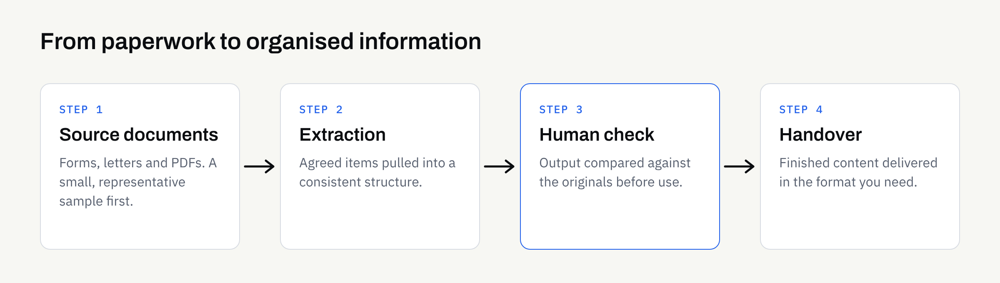

Most businesses hold a surprising amount of useful information in places that are awkward to use. It sits in PDFs, scanned letters, email attachments, forms and long reports. Someone has to read each one and copy the important parts somewhere else.

AI document extraction is one way to take that copying off people's desks. This guide explains what it is, what it can and cannot do, and how to get your paperwork ready, without assuming any technical background.

## What document extraction actually means

Extraction means pulling specific pieces of information out of a document and placing them in a consistent, organised form.

The result might be a table with one row per document, a short summary, a list of key dates, or text arranged under headings. The point is that the output is structured and repeatable, rather than a one-off summary written differently each time.

It helps to separate three related jobs:

- **Extraction:** Finding named items in a document, such as a supplier name, a date or a reference number.
- **Summarisation:** Condensing a long document into a shorter version that keeps the main points.
- **Reformatting:** Moving the same content into a new shape, such as turning a report into website-ready sections.

Many real workflows combine all three. A batch of supplier letters might be extracted into a table, summarised into a one-paragraph note each, and reformatted into a consistent template.

## Where it tends to work well

Extraction works best where documents are similar to each other and the question you are asking is clear.

### Repeating documents with a familiar layout

If you receive the same kind of document often, such as booking forms, enquiry letters or standard reports, a workflow can look for the same items every time. Consistency in the input makes the output easier to check.

### Long documents where you need the key points

Policies, reports and meeting notes often run to many pages. A structured summary with the decisions, dates and actions pulled out can save a first read, as long as someone still checks it against the original.

### Content that needs a new home

Business documents sometimes contain the raw material for a website or brochure. Our article on [turning business documents into website content](https://fintaxtech.co.uk/blog/ai-business-documents-to-website-content/) covers that use in more detail.

## Where it needs more care

Extraction is not magic, and some documents are harder than others.

- **Poor scans:** Faint, skewed or handwritten pages are more likely to be misread.
- **Unusual layouts:** Tables that span pages, text in margins and mixed columns can confuse the order of information.
- **Ambiguous wording:** If a human would need to ask "what does this mean?", the output may be wrong in a confident-sounding way.
- **Missing context:** A figure on its own may mean something different depending on a note elsewhere in the document.

None of these rules extraction out. They simply mean a person should check the output against the source before anyone relies on it. Our guide to [reviewing AI-assisted content](https://fintaxtech.co.uk/blog/how-to-review-ai-assisted-content/) sets out a practical way to do that.

## What to expect in the output

Before any work starts, it is worth agreeing what the finished result should look like. Here is an illustrative example of how a request might be described.

| Document type | What you might ask for | What a person should check |
| --- | --- | --- |
| Customer enquiry letters | Name, topic, date, requested action | That the requested action matches the letter |
| Supplier quotations | Supplier, item descriptions, quoted totals, validity date | Every figure against the original |
| Long internal reports | One-paragraph summary plus a list of decisions | That nothing important was left out |
| Event or booking forms | Name, date, headcount, special requirements | Unusual or free-text requests |

This table is an illustration only. Your own documents will differ, and the useful fields depend on what you do with the information afterwards.

## Prepare your documents first

A little preparation makes a large difference to the quality of the result.

1. **Gather a small, representative sample.** Include typical documents and at least one awkward one.
2. **Decide the fields you need.** "Everything" is not a useful instruction. A short, specific list is.
3. **Describe what a good result looks like.** A single worked example, done by hand, is often the clearest brief.
4. **Remove what is not needed.** If a document contains personal or commercial details that are irrelevant to the task, talk about redacting them before anything is shared.
5. **Note where the output will go.** A spreadsheet, a website page and an internal report each want a different shape.

If you are still deciding whether a task is worth automating at all, [which business tasks to hand to AI first](https://fintaxtech.co.uk/blog/which-business-tasks-to-hand-to-ai-first/) is a good starting point.

## Think about confidentiality early

Documents often contain more than you remember. Names, addresses, prices and contract terms can all be present in an ordinary-looking letter.

Decide before you start which documents can be shared, which need redacting and which should stay in-house. Our article on [using AI with confidential business documents](https://fintaxtech.co.uk/blog/ai-confidential-business-documents/) walks through that decision. Rules about personal data and sector regulation vary, so this is not legal advice. Check the position for your own business, and the official guidance that applies to you, before moving sensitive material.

## How a managed service handles it

With a managed AI automation service, you do not build or operate anything yourself. At FinTaxTech, the workflow is run for you and the finished content is handed over. There are no prompt products for sale.

Some practical points:

- **Documents move securely, and only once an engagement is in place.** Please do not send anything in advance.
- **Some material may be declined.** Sensitive or regulated material is not always suitable, and we would rather say so early.
- **Checking stays part of the process.** The handed-over content should be reviewed by someone who knows the subject before it is used.
- **Ownership is set out in writing.** Ownership of agreed final deliverables passes to you after full payment, as set out in the written proposal. This is not legal advice, so confirm the terms in writing.

## Signs a task is a good fit

A task is usually a sensible candidate when:

- the documents arrive regularly and look broadly alike;
- you can describe the items you need in a short list;
- errors would be caught and corrected before they matter;
- the manual version currently takes a lot of repetitive effort.

If a single mistake would be costly or hard to spot, it is usually better to start somewhere lower-risk and build confidence first.

## Your extraction checklist

- [ ] Name the one document type you want to start with
- [ ] Gather three to five real examples, including one awkward case
- [ ] Write a short list of the exact items you need from each document
- [ ] Work one example by hand to show what a good result looks like
- [ ] Decide where the output will be used and in what format
- [ ] Identify which documents contain personal or confidential details
- [ ] Decide what can be shared, what needs redacting and what stays in-house
- [ ] Name the person who will check the output against the originals
- [ ] Confirm in writing who owns the deliverables and when ownership transfers

If you have a pile of paperwork and are not sure where to begin, we are happy to talk it through. There is no pressure to proceed, and an honest "not yet" is a perfectly reasonable answer.

**[Talk to us about AI Automation →](/enquiry/?service=ai-automation)**
