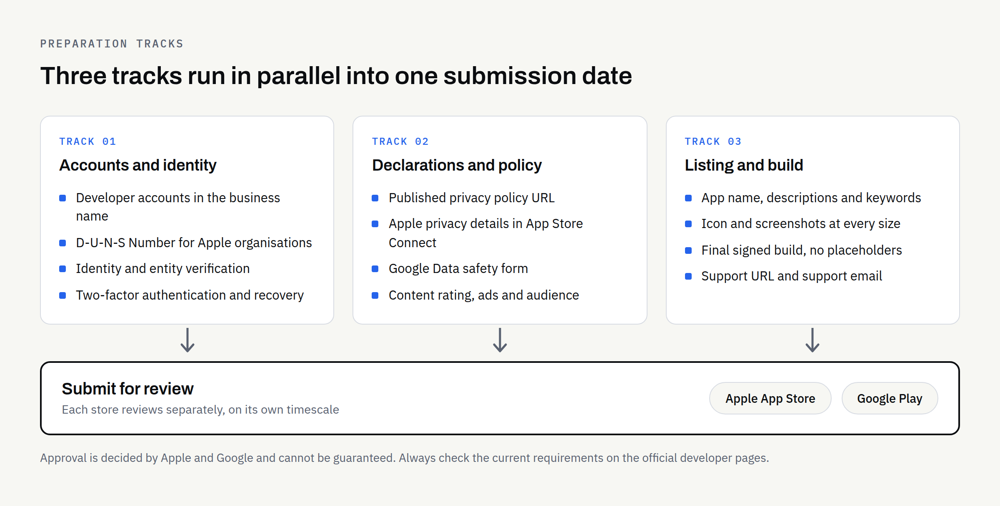
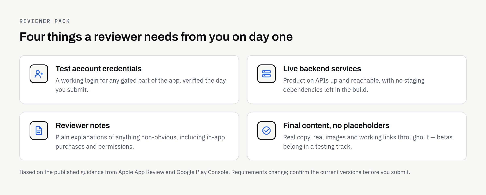

Building the app is the part most business owners plan for. Getting it accepted onto the App Store and Google Play is the part that quietly moves launch dates.

Submission is rarely difficult in itself. What catches people out is how much of it sits outside the code: company records, a published privacy policy, screenshots, declarations about what your app collects, and a working way for a stranger to log in and try it. None of that can be produced on the morning you hoped to go live, and some of it depends on third parties working to their own timetable.

This guide sets out what to have ready and where the genuine waiting happens. It is written for owners and managers rather than developers, and it covers preparation only — neither we nor anyone else can guarantee that a particular app will be approved.

## Start with the accounts, because they take the longest

Your app is published by an account, not by your development team. That account is registered to your company, holds the payment relationship, and survives if you ever change agency. It also involves identity checks that you cannot rush.

### Apple

Apple's [enrolment page](https://developer.apple.com/programs/enroll/) sets out two routes. Enrolling as an organisation — the usual choice for a limited company — asks for a legal entity that can contract with Apple, a D-U-N-S Number to verify that entity, a work email address on your own domain, and a publicly available website on a domain associated with the organisation. Apple states that trading names and branches are not accepted, and that the entity name becomes the seller name on your listing. The person enrolling must have authority to bind the company to agreements.

At the time of writing, Apple's page states the Apple Developer Program is "99 USD per membership year", with prices varying by region. Check that page yourself before budgeting, as fees change.

The D-U-N-S Number is the item most likely to hold you up if you do not already have one, so check early.

### Google

Google's [Get started with Play Console](https://support.google.com/googleplay/android-developer/answer/6112435) page describes signing up with a Google Account, accepting the Developer Distribution Agreement, paying a registration fee, choosing a Personal or Organization account type, and verifying developer identity information. It notes you may be asked for a valid government ID and a credit card in your legal name, and that the fee is not refunded if the submission is invalid. At the time of writing the page states a "US$25 one-time registration fee".

Google also applies extra testing requirements to personal developer accounts created after a cut-off date, which can add a real delay between finishing the app and publishing it. If you trade as a company, an Organization account usually avoids that path — but confirm the current rules on Google's page rather than on any summary, including this one.

### A note on ownership

Register both accounts in the business's own name, using business email addresses and payment cards. If a developer registers them for you, the accounts are theirs. [Who Owns Your Business Website After Launch?](https://fintaxtech.co.uk/blog/who-owns-your-business-website/) makes the same point about websites, and it applies just as firmly here. This is general information rather than legal advice, and the position for any engagement should be confirmed in writing.

## The declarations: what your app does with data

Both stores ask you to describe your app's data behaviour in a structured form, and both treat inaccurate answers as a policy problem rather than a paperwork slip.

**Privacy policy:** Both stores require a live, publicly reachable privacy policy URL. Apple's [App Privacy Details](https://developer.apple.com/app-store/app-privacy-details/) page lists it as required, and Google's [Data safety](https://support.google.com/googleplay/android-developer/answer/10787469) page states a privacy policy is required to complete the form, even for apps collecting no data. The policy must exist somewhere you control — usually your website — before you submit.

**Apple's privacy details:** These are entered in App Store Connect and cover your own practices as well as those of third-party partners. Apple states the information is required to submit new apps and updates. For each data type you answer what you collect, why, whether it is linked to the user's identity, and whether it is used for tracking.

**Google's Data safety form:** This is completed on the App content page in Play Console. Google is explicit that you must declare collection and sharing carried out by third-party libraries and SDKs in your app, not only your own code.

That last point is worth flagging to whoever builds your app. Analytics, crash reporting, advertising SDKs and payment libraries all count. Ask for a written list of every third-party component and what each sends off the device — you cannot answer the forms honestly without it.

Google's [Prepare your app for review](https://support.google.com/googleplay/android-developer/answer/9859455) page adds further declarations: ads, target audience and content, a permissions declaration form where sensitive permissions such as SMS or Call Log are used, and a content rating questionnaire. Google notes that apps left unrated may be removed from Google Play.

## Listing assets: what a potential customer sees

The store listing is marketing, and it is usually the piece nobody has been assigned. Someone has to write it, and someone has to produce the images.

| Asset | Apple App Store | Google Play |
| --- | --- | --- |
| App name | Up to 30 characters | Up to 30 characters |
| Short line | Subtitle, up to 30 characters | Short description, up to 80 characters |
| Long text | Description, updated when you submit a version | Full description, up to 4,000 characters |
| Keywords | Separate field, 100 characters, comma separated | No keywords field |
| Screenshots | Up to 10 per product page | Required; sizes set out in Play Console Help |
| Preview video | Up to three previews, each up to 30 seconds | Optional |
| Promotional text | Up to 170 characters, editable without a new version | Not applicable |
| Categories | One primary and one secondary | Category and tags |
| Support contact | Support URL required | Support email address required |

Sources: Apple's [Creating Your Product Page](https://developer.apple.com/app-store/product-page/) and Google's [Create and set up your app](https://support.google.com/googleplay/android-developer/answer/9859152). Both are worth reading in full before you write anything, and both stores change these fields from time to time.

Two warnings from the official guidance. Apple states screenshots must show the app in use rather than title art, a login page or a splash screen, and that improper use of keywords is a common reason for rejection. Google warns that keyword stuffing can result in suspension. Writing a listing to game search rankings is a poor trade, and no one can promise a ranking in either store.

## The build, and what a reviewer needs from you

**Format and signing:** Google Play uses Android App Bundles, and Play App Signing is configured on your first release. Google notes the package name is permanent and cannot be reused, so agree it before the first upload.

**Target API level:** Google requires apps to meet a target API level at upload, and that level rises over time. Ask your developer to confirm the current requirement for the month you submit.

**A way in:** Apple's [App Review Guidelines](https://developer.apple.com/app-store/review/guidelines/) ask for an active demo account or a fully featured demo mode, plus anything else needed to review the app, such as login credentials or a sample QR code. Google's review preparation page asks for sign-in details for any login-gated parts of the app. If your app is only useful to logged-in customers, a working test account is not optional.

**A live backend:** Apple expects backend services to be accessible during review. Switching off a server the day you submit is a familiar own goal.

**No placeholders:** Apple is direct that final builds should not contain placeholder text, empty websites or temporary content, and that betas belong in TestFlight rather than the App Store.

## Timing: plan for a round of rejection

Neither store publishes a guaranteed review turnaround, and neither guarantees approval at all. Apple's guidelines say only that review will happen as soon as Apple can manage it, and that complex or novel apps may need greater scrutiny.

The sensible assumption is that your first submission may come back with questions, and that you need slack between "the app is finished" and any date promised to customers. Book the launch campaign after approval, not before.

Rejections are usually specific and fixable — a missing declaration, an unclear screenshot, a reviewer who could not get past the login screen. Most of the causes are on the lists above, which is the argument for preparing them properly rather than at speed.

## Pre-submission checklist

- [ ] Developer accounts registered in the business's name, with business email and payment details
- [ ] D-U-N-S Number obtained, if enrolling with Apple as an organisation
- [ ] Two-factor authentication enabled, with recovery details held by the business
- [ ] Privacy policy published at a stable URL on your own site
- [ ] Written list of every third-party SDK in the build and what data each sends
- [ ] Apple privacy details completed in App Store Connect
- [ ] Google Data safety form completed in Play Console
- [ ] Content rating, ads and target audience declarations completed
- [ ] App name, short line and long description written and proofread
- [ ] Screenshots produced at every required size, showing the app in use
- [ ] App icon finalised and legible at small sizes
- [ ] Support URL and support email address live and monitored
- [ ] Test account created, verified working, and noted for reviewers
- [ ] Production backend live, with no staging dependencies left in the build
- [ ] Reviewer notes written, explaining anything non-obvious
- [ ] Target API level confirmed against current Google requirements
- [ ] Launch communications scheduled for after approval, not before

## If you would like a hand with this

Most of this list is business preparation rather than engineering, which is why it tends to fall between the two. If you are planning a new app build and would rather have the submission requirements mapped out at the start than discovered at the end, we are happy to talk it through. We build new apps and complete rebuilds, and what is agreed is set out in a written proposal.

If you are still weighing up scope, [MVP vs Full Mobile App](https://fintaxtech.co.uk/blog/mvp-vs-full-mobile-app/) and the [Mobile App Requirements Checklist](https://fintaxtech.co.uk/blog/mobile-app-requirements-checklist/) cover the decisions before this one, and [What Happens After Your Mobile App Launch?](https://fintaxtech.co.uk/blog/mobile-app-maintenance-after-launch/) covers what follows.

**[Talk to us about your app build →](/enquiry/?service=mobile-apps)**
