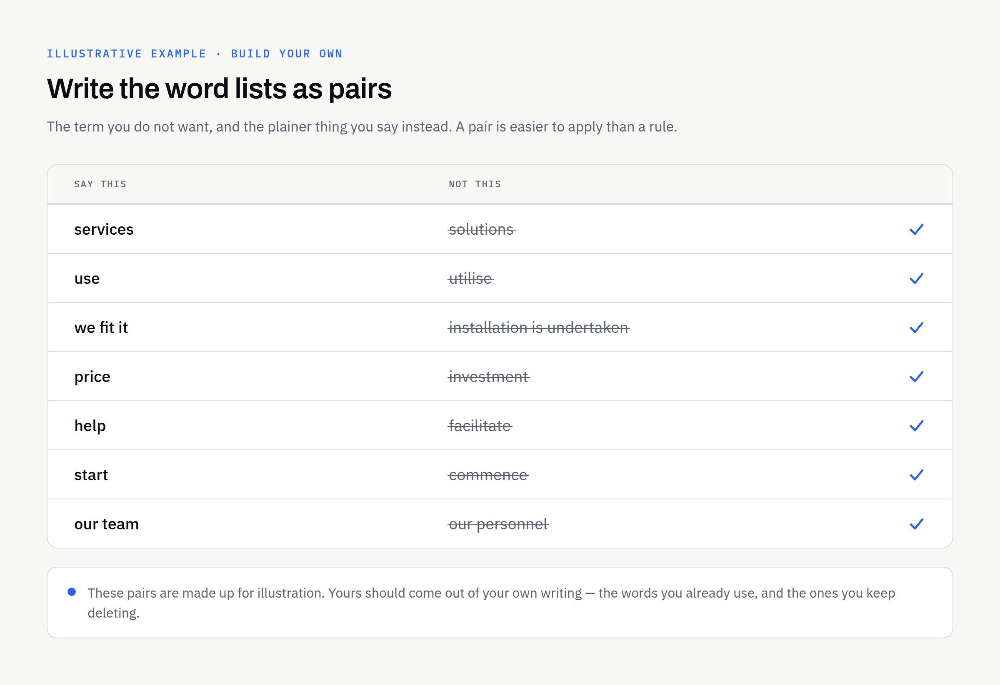
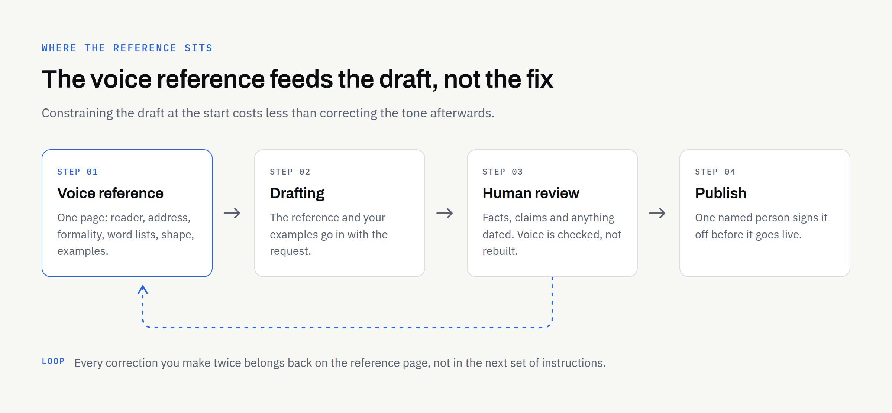

A logo can be copied exactly. A colour has a code you can hand to a printer. Your writing has neither, which is why it is usually the first thing to slip once somebody else starts producing content on your behalf. AI tools make that slip easy to miss, because the draft is rarely bad. It simply is not yours.

If you are using AI to help write service pages, customer emails or product descriptions, the useful question is not whether a tool can match your voice. It is what you can hand it so that it has something to match. This article covers how to work out what your voice actually is, what to write down, and how to keep it steady when more than one person is producing content.

## Voice is a set of decisions, not an adjective

"Professional but friendly" describes most businesses in Britain and tells a writer — human or otherwise — almost nothing. Voice becomes usable when it is broken into decisions someone else could apply without asking you:

- **How you address the reader:** Do you write "you", "our customers", or the company name?
- **How formal the sentences run:** Contractions or not? Do you write as "we", or as the business in the third person?
- **How much you explain:** Do you assume the reader knows the vocabulary of your trade, or define it each time?
- **What you never say:** the words that make you wince when you see them on a competitor's page.
- **How long a paragraph runs** before you break it.

Those five answers do more for a draft than a page of adjectives. Most owners can answer them out loud faster than they can write them down.

## Why AI-assisted drafts drift away from you

Given a bare instruction, a language model produces something close to the middle of everything it has read. Our guide to [checking AI-assisted content before you publish it](https://fintaxtech.co.uk/blog/how-to-review-ai-assisted-content/) treats that flattening as one of the standard weaknesses to look for, and voice is the one item on that list a reviewer cannot fully repair. Once a draft has settled into a generic register, fixing the tone means rewriting sentences rather than editing them. Constraining the draft at the start is cheaper than correcting it at the end.

Drift also comes from what you feed in. A tool given a formal policy document and asked for a warm homepage paragraph will follow the document, because that is the only sample of your business in front of it.

### Start from writing you already own

The raw material almost certainly exists. Go and find:

- **Two or three pieces that sound right to you:** a good email to a customer, a page you were pleased with, the covering note on a proposal.
- **One piece that sounds wrong:** stiff, over-formal, or borrowed from a template.

Read the good ones side by side and mark what they share — sentence length, whether you open with the point or set the scene first, the phrases you reach for repeatedly. Then note what the counter-example does differently. That contrast is most of a voice reference already.

Which examples you choose matters more than how you describe the tone, and [what AI-assisted content services can actually deliver](https://fintaxtech.co.uk/blog/ai-content-services-six-examples/) sets out what else is worth preparing alongside them. Two short pieces that sound like you are worth more than six that merely happen to be yours. Leave out anything written to another organisation's house style, anything your solicitor or accountant drafted, and anything from before a significant change in how the business talks about itself.

## What a one-page voice reference contains

Keep it to a single page. Anything longer stops being opened.

| Section | What to write | Why it earns its place |
| --- | --- | --- |
| Reader | The one person you are writing to, named by situation rather than demographic | Tone follows the reader; an unclear reader produces an averaged tone |
| Address | The pronouns you use for them and for yourselves | The commonest inconsistency across a website |
| Formality | Contractions, sentence length, whether questions and one-line paragraphs are allowed | Decides how the draft reads before any word choice does |
| Words you use | Ten to fifteen terms you want kept, including how you name your own services | Keeps your naming steady across pages and emails |
| Words you avoid | Ten to fifteen terms, with a replacement where there is one | The fastest-acting item on the page |
| Shape | How you open, whether you use headings and lists, where the point goes | Structure carries as much voice as vocabulary |
| Examples | Links or extracts of the two or three pieces that sound right | Does the work no description can |

### The word lists do the most work

Of everything on that page, the two lists change a draft most visibly. They are also the easiest to check afterwards, because a search for the banned terms is a mechanical test anyone can run. Write them as pairs where you can — the term you do not want, and the plainer thing you say instead. "Solutions" becoming "services", or "utilise" becoming "use", saves an argument later about what counts as too corporate.

Add to the lists as you notice things, and put a date on the page so you know how current it is.

## Where the voice reference lives

If you already have brand guidelines, voice belongs in them, which keeps one document authoritative. [What brand guidelines should include](https://fintaxtech.co.uk/blog/what-to-include-in-brand-guidelines/) covers where tone normally sits, and if you have not reached that stage yet, [the difference between a logo and a brand identity](https://fintaxtech.co.uk/blog/logo-vs-brand-identity/) is worth reading first. A single page kept alongside your logo files works perfectly well in the meantime, so long as everyone producing content knows where it is.

The practical test is whether a new member of staff, a freelancer or a tool would find it without asking. A voice reference saved in one person's email is not a reference.

## Keeping it consistent when several people write

Consistency breaks at the edges — the channels nobody thought of as content.

- **Adjust length and formality by channel, not voice:** A social post is shorter than a service page; it should not sound like a different company.
- **Name one person who decides:** When two people disagree about whether a sentence sounds right, someone has to settle it, and voice questions are not worth a committee.
- **Keep automated messages in scope:** Order confirmations, booking reminders and out-of-office replies are usually written once and never revisited. They are often the messages customers read most.
- **Revisit the page after a run of content:** If you had to make the same correction three times, the reference is missing a line.

### An invented example, for illustration only

Imagine a Dundee joinery firm — not a real client — whose owner writes short, direct emails and always says "fit" rather than "install". Its first AI-assisted service page arrived describing "bespoke installation solutions tailored to your requirements". Nothing in it was untrue. It simply read like a national chain. Adding six lines to a voice reference — say "fit", never "solutions", address the reader as "you", two sentences per paragraph — changed the next draft enough that editing it took minutes rather than a rewrite.

## What a voice reference cannot do

It cannot verify anything. A draft can sound exactly like you and still contain a wrong figure, an out-of-date policy or a claim you cannot support, so the review step stays with a person regardless of how good the voice guidance is.

It also carries no rights of its own. Writing down the words you use does not stop a competitor using them, and a distinctive phrase is not protected simply because it appears in your guidelines. Nothing here is legal advice — if exclusivity over a name or phrase matters to you, take proper advice on it.

Where a supplier produces content for you, put ownership in writing rather than assuming it. In our own written proposals, ownership of the agreed final deliverables passes to the client after full payment, and we would encourage you to confirm the equivalent with any supplier before work starts. One more practical point: if your sample writing includes customer details or commercially sensitive material, redact it or hold it back until an engagement is in place and a secure transfer has been arranged. Some regulated or sensitive material we would decline to work with at all, and it is better to establish that early.

## Your voice-consistency checklist

- [ ] You can answer the five voice decisions out loud
- [ ] Two or three pieces of your own writing are chosen as the examples
- [ ] One piece that sounds wrong is kept as a counter-example
- [ ] The words you use and the words you avoid are written down as pairs
- [ ] The reference fits on one page and carries a date
- [ ] Everyone producing content knows where it is stored
- [ ] Automated and transactional messages are covered too
- [ ] One named person settles disagreements about tone
- [ ] Every draft still goes through a factual review before publishing
- [ ] Ownership of content a supplier produces for you is confirmed in writing

If most of those are in place, AI-assisted drafting becomes a much smaller risk to how your business sounds.

If you would rather not build the reference yourself, send us the writing you already like and we will tell you honestly what is there to work from — and where a voice reference would make little difference.

**[Talk to us about AI-assisted content →](/enquiry/?service=ai-automation)**
