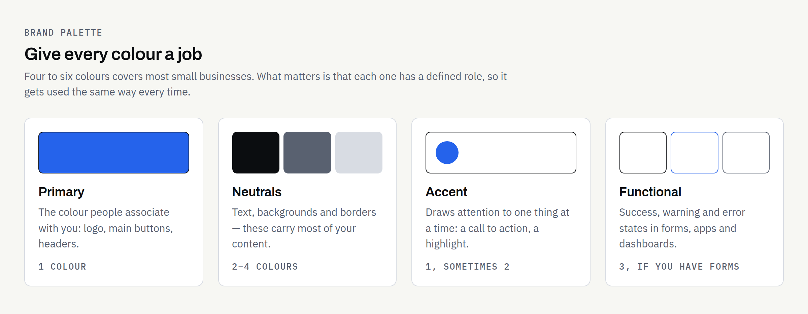
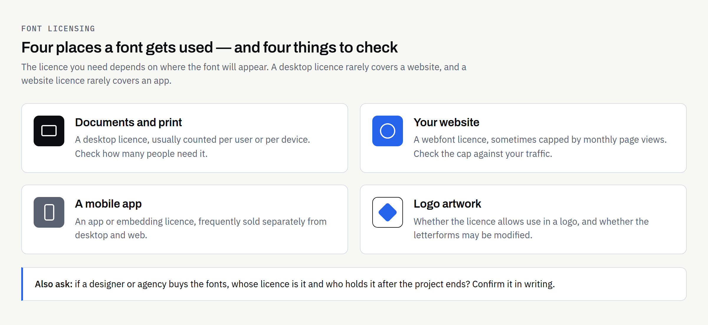

Most businesses choose their colours and fonts the same way: someone likes a shade of blue, someone else picks a font from a drop-down list, and the decision sticks for years. It usually works until the day you need a printed banner, a readable form on a phone, or a licence that covers the font in your app.

Colours and typefaces appear on everything you produce, so they carry more weight than almost any other design decision — and choosing them well is mostly practical rather than artistic. This guide covers the questions worth settling before anything gets locked in, written for business owners rather than designers.

If you are still deciding how much brand work you need at all, [logo vs brand identity](https://fintaxtech.co.uk/blog/logo-vs-brand-identity/) covers the wider picture first.

## Start from where they will actually be used

Before discussing shades, list the places your colours and fonts will have to work. The list is usually shorter than people expect, and it decides almost everything else.

A typical new business needs its brand to hold up across a website, email signatures and documents, social media profiles, invoices and quotes, and some printed items — business cards, maybe signage or vehicle livery. Add app icons and interface screens if you are planning a mobile app, and packaging and labels if you sell physical products.

Each of those has constraints. Screens emit light and handle bright colours easily; print absorbs ink and does not. A font that looks sharp in a laptop headline may be unreadable at 9pt on a delivery note. Choosing with the full list in front of you avoids a palette that looks superb in a moodboard and falls apart on an invoice.

## Colours: build a small, deliberate palette

### Give every colour a job

The most useful thing you can do with a palette is assign roles rather than collect shades. A colour with no defined job gets used inconsistently, and inconsistency is what makes a brand look unfinished.

| Role | What it does | How many |
| --- | --- | --- |
| Primary | The colour people associate with you — logo, main buttons, headers | 1 |
| Neutrals | Text, backgrounds, borders — the colours that carry most of your content | 2–4 |
| Accent | Draws attention to one thing at a time: a call to action, a highlight | 1, occasionally 2 |
| Functional | Success, warning and error states in forms, apps and dashboards | 3, if you have forms or an app |

Four to six colours in total is enough for most small businesses. Larger palettes are not better; they just need more rules to stop them being used at random.

### Treat readability as a requirement

This is the part most often skipped and the most likely to cause real problems. If text does not have enough contrast against its background, a proportion of your customers simply cannot read it.

The Web Content Accessibility Guidelines set out measurable thresholds. Success Criterion 1.4.3 Contrast (Minimum), at Level AA, requires a contrast ratio of at least 4.5:1 for normal text and at least 3:1 for large-scale text, where large-scale means at least 18 point, or 14 point if bold ([W3C, SC 1.4.3](https://www.w3.org/TR/WCAG22/#contrast-minimum)). Separately, SC 1.4.11 Non-text Contrast, also Level AA, requires at least 3:1 for the visual information needed to identify interface components and for parts of graphics required to understand the content ([W3C, SC 1.4.11](https://www.w3.org/TR/WCAG22/#non-text-contrast)). Text that forms part of a logo or brand name is explicitly excluded from the minimum-contrast requirement.

In practice: test your chosen combinations with a contrast checker before you commit, not after the website is built, and expect a mid-tone brand colour to fail as a text colour even where it works well as a background or border. That is why neutrals do most of the heavy lifting in a working palette.

The accessibility requirements that apply to your own organisation can depend on your sector and how you trade. This article is general information, not legal advice; confirm your obligations with a suitably qualified adviser.

### Screen and print are different systems

Screens mix light; print mixes ink. The same colour therefore needs more than one definition, and some bright screen colours cannot be reproduced exactly in standard process printing at all.

You will usually want, for each colour: a HEX or RGB value for screens, a CMYK value for standard printing, and sometimes a spot-colour reference where consistency matters most, such as packaging or signage. Ask your designer for all the values you need up front and to flag any colour that will shift noticeably in print. Where a printed item must match exactly, a physical proof from the printer producing the job is the only reliable check — screens and desktop printers are not a substitute.

### A note on ownership and exclusivity

Choosing a colour does not reserve it. A palette and a set of typefaces give you a consistent identity; they do not give you a trade mark, and they do not stop another business in your sector using something similar. If exclusivity matters, that is a question for a trade mark attorney or solicitor, and it is worth raising before you invest in printed stock. Again, general information rather than legal advice — and the ownership of the design work itself should be set out in writing in your proposal.

## Fonts: fewer typefaces, chosen for the jobs they do

### Two is usually enough

A common and durable setup is one typeface for headings and one for body text, each with two or three weights. Some businesses use a single family throughout and distinguish headings by weight and size alone, which is simpler still and rarely looks worse.

Add a third only for a specific reason — a monospaced face for reference numbers or code, for example. Every extra family is another file to load on your website, another licence to track, and another chance for documents to look inconsistent.

### Check the licence before you commit

Fonts are licensed software, not free assets, and the licence you need depends on where the font will be used. This catches businesses out most often when a brand built around a desktop-only licence is later extended to a website or an app.

| Where the font is used | What you typically need to check |
| --- | --- |
| Documents and print on your own computers | A desktop licence, often counted per user or per device |
| Your website | A webfont licence, sometimes limited by monthly page views |
| A mobile app | An app or embedding licence — frequently separate from the above |
| Logo artwork | Whether the licence permits use in a logo, and whether the letterforms may be modified |
| Work done by a designer or agency | Whose licence covers the work, and who holds it afterwards |

Open-source typefaces avoid much of this complexity. Many are released under the SIL Open Font License, currently version 1.1, which expressly permits use, embedding, modification and redistribution, with the main restriction being that the font software may not be sold on its own ([SIL Open Font License](https://openfontlicense.org/open-font-license-official-text/)). The licence's own FAQ confirms that embedding a font in a document does not change the licence of the document itself. Free font libraries publish licence terms alongside each family — read the terms shown for the specific family you intend to use rather than assuming the whole library is covered by one set of rules, and keep a copy of the licence with your brand files.

Licence terms vary between foundries and change over time, so confirm the current terms with the foundry or distributor for the fonts you choose and keep the paperwork.

### Practical readability checks

Before signing off a typeface, look at it doing real work rather than spelling out your company name:

- A full paragraph at the size your website and documents will actually use, read on a phone as well as a laptop.
- The characters that cause trouble: capital I, lowercase l, the digit 1 and zero against capital O. If you send invoices or reference numbers, this matters.
- Numbers in a table, to check they align in columns.
- The weights you plan to use — a family that only looks right in one weight will constrain you later.
- Any accented or non-English characters your customers' names need.

## Write the choices down

Colour and font decisions decay quickly if they only exist in a design file. Six months on, someone picks a near-enough blue in a spreadsheet, and an assistant installs a different font because the original was not on their machine.

The fix is to record the decisions where the people using them can find them: the exact colour values for each role and each output, the typefaces with their weights and sizes, and a short note on what to do when the brand font is unavailable — a named fallback for email and shared documents, for instance. That record is the practical core of a brand guidelines document, and [what brand guidelines should include](https://fintaxtech.co.uk/blog/what-to-include-in-brand-guidelines/) covers how much detail is worth producing at each stage. Make sure you hold the files themselves in the formats you will need, too — [logo file formats explained](https://fintaxtech.co.uk/blog/logo-file-formats-explained/) sets out which ones matter and why.

## Mistakes worth avoiding

**Picking colours before testing text contrast.** A palette that cannot carry readable text needs reworking, and it is far cheaper to find that out early.

**Leaving the licence until the website build.** Discovering mid-project that your heading font cannot be used on the web is an avoidable delay.

**Assuming print will match the screen.** Ask for CMYK values and, where it matters, a physical proof.

## Before you sign off your colours and fonts

- [ ] Listed every place the brand will appear, including print and any app
- [ ] Palette has defined roles: primary, neutrals, accent and functional states if needed
- [ ] Every text-and-background combination tested against the WCAG contrast thresholds
- [ ] HEX/RGB and CMYK values recorded for each colour, plus a spot reference where exactness matters
- [ ] Headline and body typefaces chosen, with the weights you will actually use
- [ ] Font licences checked for desktop, web, app and logo use as applicable, and copies kept
- [ ] Fallback fonts agreed for email and shared documents
- [ ] All values and rules written down somewhere your team can find them
- [ ] Ownership and licensing of the design work confirmed in writing in your proposal

Working through that list takes an afternoon and saves a good deal of rework later. If you would rather have the palette, typefaces and accompanying rules put together properly, built to hold up across your website, documents and print, we are happy to talk it through and tell you honestly how much you need at this stage.

**[Discuss your brand identity →](/enquiry/?service=branding)**
