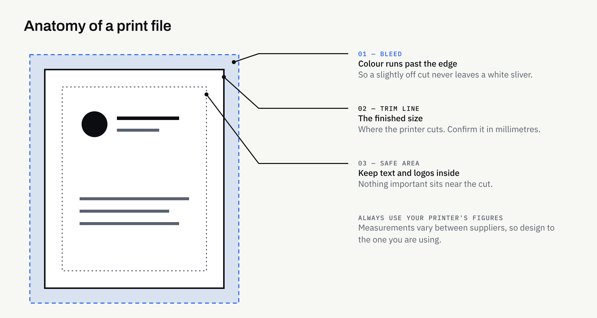

Many design studios, including ours, produce the artwork and stop there. We design; we do not print. The printing is done by a supplier you choose — a local print shop, an online printer, a signage company — and the artwork passes from one to the other.

That hand-off is where a surprising number of small problems begin. The designer assumes the printer will flag anything wrong. The printer assumes the file is exactly what you meant. Nobody has asked the other the awkward questions, and the first you see of the gap is a box of cards with the logo too close to the edge.

This guide sets out who is responsible for what, which questions to put to a printer before any artwork is finished, and what a tidy hand-over pack looks like.

## Who does what

It helps to be plain about the split.

| Step | Usually done by |
| --- | --- |
| Choosing the printer, paper and quantity | You |
| Getting the printer's file requirements | You (or your designer on your behalf, if agreed) |
| Designing the artwork to those requirements | Your designer |
| Supplying print-ready files | Your designer |
| Checking the proof and approving the run | You |
| Printing, trimming, finishing and delivery | The printer |

The point is not to pass blame around. It is that two of those steps — choosing the supplier and approving the proof — belong to you, and both are much easier when you know what to look for.

## Ask the printer before the artwork is finished

The best moment to talk to a printer is before design is signed off, not after. A printer can tell you things that change how the artwork is built.

Ask for their **file requirements sheet**. Most printers publish one, often with downloadable templates. It tells you what they want and what they will reject.

Then check these points:

- **Trim size:** The exact finished size of the item. Do not rely on a name such as "standard business card" — sizes vary between suppliers, so confirm the actual measurements in millimetres.
- **Bleed:** How far background colour and images must extend beyond the trim line, so a slightly off cut does not leave a white sliver.
- **Safe area:** How far inside the trim edge text and logos must sit to avoid being clipped.
- **File type:** Most printers ask for a PDF; some prefer others. Use the format they name.
- **Colour mode:** Whether they want CMYK, and how they handle spot colours if your brand uses them.
- **Fonts and images:** Whether fonts should be embedded or converted to outlines, and the minimum resolution for photographs.
- **Finishing:** Any special treatments such as folding, creasing, laminating or foil, which each need their own artwork considerations.

Their answers beat any generic figure you will find online, including ours. If two printers give different bleed measurements, design to the one you are actually using.

## Understand what is in a print-ready file

"Print-ready" is not a universal standard. It means ready for a particular printer's process. In practice it usually covers four things.

### Dimensions and margins

The artwork is built to the trim size, with bleed added outside it and key content kept inside the safe area. Crop marks are sometimes included, though some printers prefer files without them — ask.

### Colour

Screens mix light (RGB); most printing mixes inks (CMYK). Bright screen colours, especially strong blues and greens, can look duller when printed. That is physics, not a mistake. If your brand colours matter, you have two options: accept a close match, or ask the printer about spot colour or a printed colour reference. For more on why colours shift, [Which Logo File Formats Does Your Business Need?](https://fintaxtech.co.uk/blog/logo-file-formats-explained/) covers RGB, CMYK and Pantone in plain terms.

### Fonts and images

Text should display correctly on any machine. Fonts are therefore embedded in the PDF or converted to shapes. Photographs need enough resolution for the size they are printed at — an image that looks fine on a phone can look soft at A4.

### Vector logos

Logos should be supplied as vector artwork, so they stay sharp at any size. If you only have a PNG from your website, you will want the proper files first. The same article explains which versions to ask for.

## Compare printers like for like

Quotes only compare fairly when they describe the same job. When you ask for prices, give every printer the same specification:

- Trim size and number of pages or sides
- Paper type and weight
- Print colours — full colour on one side or both
- Finish, such as matt or gloss, and any extras
- Quantity, and whether you want a price for two quantities
- Delivery address and when you need it

Then compare delivery, proofing and reprint policy as well as price. A lower headline price that excludes a proof can cost more if the first run has to be redone.

## Proofs: what to check before you approve

A proof is your last chance to catch an error cheaply. Most printers offer a digital proof; some also offer a printed or "hard copy" proof, sometimes at extra cost.

A digital proof shows layout. It does not reliably show colour, because every screen differs. If exact colour or paper feel matters, ask whether a physical sample is possible.

When the proof arrives, check slowly:

1. **Text:** Names, phone numbers, email and web addresses — read each aloud, then call the number and type the web address.
2. **Legal details:** Business name, registered address and company number, where they are required. This is general information, not legal advice, so confirm what applies to your business structure on [gov.uk](https://www.gov.uk/running-a-limited-company/signs-stationery-and-promotional-material) or with your accountant.
3. **Edges:** Is anything uncomfortably close to the trim?
4. **Orientation and order:** Front and back the right way round, pages in sequence.
5. **Images:** Any that look soft, stretched or cropped oddly.
6. **Approval:** Remember that once you approve, errors are usually yours to bear. Ask how the printer treats their own mistakes.

Do not rush this because the deadline is close. A day lost to a correction is cheaper than a reprint.

## Plan around the order of events

Print has natural lead times: artwork, proof, production, delivery. Each stage can overrun. Ask the printer for their typical turnaround, and build in room for one round of corrections. If something is tied to a launch or event, order earlier than feels necessary.

For anything you will reuse, such as stationery, think about what happens in a year. A short first run lets you correct a phone number or address cheaply. Our article on [which stationery and marketing assets to order after a logo](https://fintaxtech.co.uk/blog/stationery-and-marketing-assets-after-logo/) covers what tends to come first and what can wait.

## What to keep afterwards

When the job is delivered, store the approved files somewhere you control. That means the final PDF as sent to the printer, the editable source files, the logo files, the colour values and the printer's specification. When you reorder in a year, you will not be hunting through old emails.

A short note of which printer, paper and finish you used is also worth keeping. It makes the next run match the last one. If you are building a more formal reference for your brand, [What Should Brand Guidelines Include?](https://fintaxtech.co.uk/blog/what-to-include-in-brand-guidelines/) shows where that sort of detail belongs.

Two housekeeping points. Agree in writing who owns the editable files. For our own work, ownership of agreed final deliverables passes to the client after full payment, as set out in the written proposal. And design work does not confer any trade mark right or guarantee of exclusivity. If a name or mark matters commercially, take separate advice.

## Hand-over checklist

- [ ] Chosen the printer, or shortlisted two, before finishing the artwork
- [ ] Obtained the printer's file requirements sheet and any templates
- [ ] Confirmed trim size, bleed and safe area in millimetres
- [ ] Agreed file type, colour mode and font handling
- [ ] Supplied vector logos and print-resolution images
- [ ] Given every printer the same specification when comparing quotes
- [ ] Asked what proofing is included and whether a physical sample is possible
- [ ] Read every detail on the proof aloud, and tested numbers and web addresses
- [ ] Checked any required legal details for your business structure
- [ ] Allowed time for one round of corrections
- [ ] Saved the final PDF, source files and printer specification

If you would like artwork prepared as print-ready files for the printer of your choice, we are happy to talk it through. FinTaxTech Ltd is a Dundee-based studio working with businesses across the UK on branding and graphic design, websites, mobile apps and AI-assisted content services.

**[Talk to us about your branding →](/enquiry/?service=branding)**
