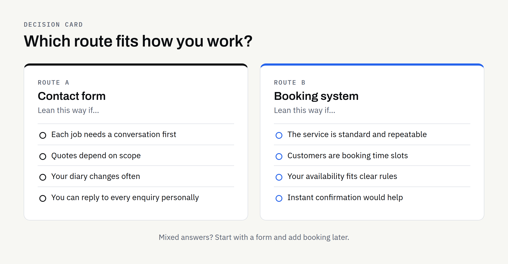

When a business plans a new website, one question comes up quickly: should visitors be able to book online, or is a contact form enough? Both are reasonable. They solve different problems, and choosing the wrong one can cost you either enquiries or a lot of unnecessary complexity.

This article sets out how the two differ, what each one asks of you behind the scenes, and a simple way to decide. It is written for business owners rather than developers, and it does not assume you have any particular software in mind.

## What each option actually does

A **contact form** lets a visitor send you a message. You read it, reply, and agree the details in conversation. The website's job ends when the message arrives.

A **booking system** lets a visitor choose a specific slot, date or service and have it recorded without anyone replying first. The website takes on part of your scheduling, and often some of the follow-up: confirmations, reminders, changes and cancellations.

The difference is not really about technology. It is about who makes the decision. With a form, you decide after the message arrives. With a booking system, you decide in advance, by setting the rules that the system applies on your behalf.

## When a contact form is enough

A form is often the better choice than it first appears. It tends to suit businesses where:

- **Each job is different:** You need to understand the request before you can say what is possible or what it involves.
- **Quotes are bespoke:** Pricing depends on scope, so a fixed slot would be premature.
- **Volume is modest:** You can reply to each enquiry personally without it becoming a burden.
- **You want a conversation first:** A short exchange helps you judge whether the work is a good fit.
- **Your availability is hard to define:** Your diary changes too often for rules to keep up.

A well-planned form can do more than a bare "name, email, message" box. Asking two or three focused questions, such as what the visitor needs, roughly when, and how best to reach them, saves you a round of back-and-forth. Our article on [what a new business website should include before launch](https://fintaxtech.co.uk/blog/new-business-website-launch-checklist/) covers where an enquiry route fits in the wider picture.

## When a booking system earns its place

A booking system makes sense where the choice is simple enough to be made by the customer without a conversation. Typical signs include:

- **Standard appointments:** The service is the same each time, or comes in a small number of clear types.
- **Time is the product:** You sell slots, such as consultations, classes, treatments or site visits.
- **Customers expect speed:** People want to book at any hour rather than wait for a reply.
- **Missed messages cost you:** Slow replies mean lost work, and automatic confirmation would help.
- **Repeat bookings are common:** Regular customers should be able to rebook without contacting you.

If most of those apply, a form may leave you doing manual work that a system could handle. If few apply, a booking system may add steps for the customer without helping anyone.

## Comparing the two side by side

| Question | Contact form | Booking system |
| --- | --- | --- |
| Who agrees the details? | You, after reading the message | The customer, within rules you set |
| Set-up effort | Low | Higher: services, hours, rules, wording |
| Ongoing upkeep | Reply to messages | Keep availability and rules accurate |
| Best for | Varied or bespoke work | Repeatable, time-based services |
| Main risk | Slow replies lose enquiries | Rules that do not match real life |
| Personal touch | High, from the first message | Lower unless you add it elsewhere |

Neither column is better in general. The right choice depends on how your work actually runs.

## What a booking system quietly asks of you

The visible part of a booking system is a calendar. The less visible part is a set of decisions you will need to make before it works well. It helps to think these through early, because each one changes what needs to be built.

### Rules about your time

- **Working hours and days off:** When can people book, and when can they not?
- **Lead time:** How much notice do you need? Same-day bookings suit some businesses and not others.
- **Buffers:** Do you need a gap between appointments for travel, preparation or notes?
- **Capacity:** Can you handle one booking at a time, or several?

### Rules about changes

- **Rescheduling:** Can customers move a booking themselves, and up to when?
- **Cancellations:** What happens, and how is that explained clearly before someone books?
- **No-shows:** Do you want to say anything about them on the confirmation?

Anything involving payments, deposits or refunds needs extra care. Confirm how you wish to handle them and take advice where you are unsure, because the right approach depends on your circumstances and is not something a website can settle for you.

### Behind the scenes

- **Where bookings land:** In a diary you already use, in an inbox, or in a dashboard?
- **Who is notified:** You, a colleague, the customer, or all three?
- **Personal data:** A booking collects names and contact details. Be clear about why you collect them and how long you keep them. The Information Commissioner's Office publishes guidance for UK organisations at [ico.org.uk](https://ico.org.uk/), and it is worth reading before you collect data on your site. This is not legal advice, so confirm your own obligations.

## A middle route: start simple, plan to grow

You do not have to choose permanently. Many businesses start with a good contact form and add booking later once they know which services are repeatable and which rules actually hold.

If you think booking may come later, tell your designer now. Planning a page structure and enquiry route that can grow is usually easier than reworking a site afterwards. This also affects how you describe your services, which is where [writing website copy that answers the questions customers actually ask](https://fintaxtech.co.uk/blog/website-copy-that-answers-customer-questions/) helps: clear service descriptions make both a form and a booking flow easier for visitors to use.

A booking experience can also grow into something more involved, with customer accounts, payment handling or a staff dashboard. At that point you are moving from a brochure site towards a web application, and the build and the budget change with it. Our article on [the difference between a website and a web application](https://fintaxtech.co.uk/blog/website-vs-web-application/) explains where that line sits.

## Why two similar-looking requests can be priced differently

"A booking system" can mean a simple slot picker or a complex scheduling platform. That range is one reason quotes differ so widely, and it is worth being specific about what you need. [Why small business website quotes vary](https://fintaxtech.co.uk/blog/small-business-website-quotes-vary/) looks at this in more detail.

For a fair comparison, describe the booking journey in plain words: who books, what they choose, what you see, and what happens if something changes. Any quote you receive should then be about the same thing.

Whichever route you take, be clear who owns the accounts and data involved. If a third-party booking service is used, the account should be in your name, and the written proposal should say what is included. Ownership of agreed final deliverables passes to you after full payment, as set out in the proposal. This is not legal advice, so confirm terms in writing.

## A simple way to decide

Answer these honestly, and count which side most of them favour.

1. **Can a customer choose without talking to you first?** If yes, booking becomes more attractive. If no, favour a form.
2. **Is your offer the same each time?** Repeatable favours booking; bespoke favours a form.
3. **Can you describe your availability in rules?** If you can, a system can apply them. If not, a form lets you decide case by case.
4. **Will you keep the system up to date?** A calendar that shows the wrong times is worse than no calendar.
5. **Would instant confirmation clearly help customers?** If so, consider booking. If a personal reply matters more, keep the form.

If the answers are mixed, start with the form and revisit booking later.

## Checklist before you decide

- [ ] I can describe in a sentence what a visitor should do to get in touch or book.
- [ ] I know whether my work is standard enough for a customer to choose without a conversation.
- [ ] I have written down my working hours, notice period and any buffers.
- [ ] I know what should happen when someone cancels or changes a booking.
- [ ] I know where enquiries or bookings should arrive, and who will check them.
- [ ] I have thought about what personal data is collected and why.
- [ ] I have decided whether payments or deposits are involved, and taken advice if needed.
- [ ] Any third-party service will be set up in my own account.
- [ ] I have asked for the scope in the proposal to be written down.

## Talk it through with us

If you are weighing a contact form against a booking experience, we are happy to talk through your situation without any pressure. FinTaxTech designs and builds new websites and complete rebuilds, including booking experiences, from our base in Dundee. We do not repair other people's existing code, but we can help you plan something new that fits how you work.

**[Plan your website with us →](/enquiry/?service=websites)**
