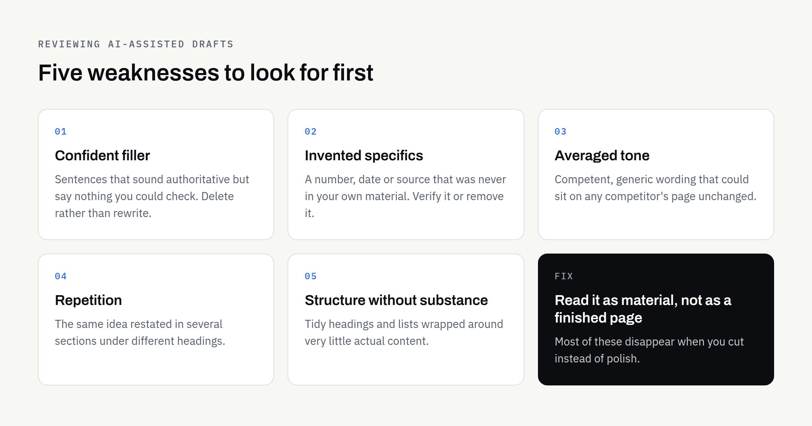
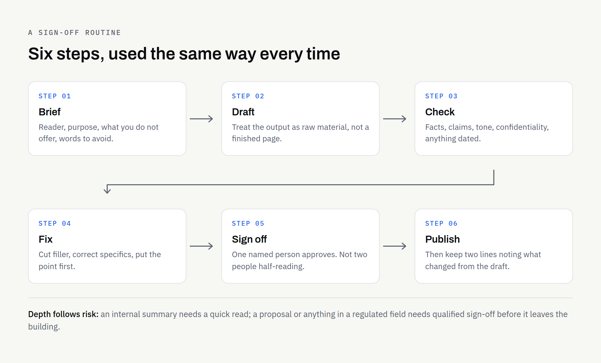

AI tools can produce a readable first draft of a service page, a customer email or a set of product descriptions very quickly. What they cannot do is decide whether that draft is true, whether your business can stand behind it, and whether it sounds like you. Those judgements stay with a person, and in a small business that person is usually the owner.

The good news is that reviewing an AI-assisted draft is a skill, not a talent. It follows a repeatable order, most of the common problems show up in the same few places, and once you have a routine you can work through a page steadily rather than rewriting it from scratch. This article sets out that routine in plain terms, with a risk table and a checklist you can reuse.

## The review step is the part you own

It helps to be clear about where the responsibility sits. Whatever tool produced a draft, the business publishing it is the one answerable for what it says — to customers, to suppliers, and to anyone who regulates your sector. "The AI wrote it" is not a position you want to be in.

That is not a reason to avoid AI-assisted drafting. It is a reason to treat the draft as exactly that: a draft, in the same way you would treat copy from a new freelancer you had not worked with before. You would read it, check anything factual, adjust the tone and then sign it off. The process here is the same; it is just faster, because the raw material arrives sooner.

If you are still deciding what these tools are realistically good for, our overview of [what AI-assisted content services can actually deliver](https://fintaxtech.co.uk/blog/ai-content-services-six-examples/) covers the practical uses before you get to reviewing.

## Sort your content by risk before you start

Not everything deserves the same scrutiny. Trying to check an internal meeting summary as carefully as a proposal wastes time you could spend on the things that matter. Decide the depth of the check before you start reading.

| Content type | What usually goes wrong | Depth of check |
| --- | --- | --- |
| Internal notes and meeting summaries | Missed nuance, wrong emphasis | Quick read for sense |
| Social posts and blog drafts | Flat tone, vague or unsupported claims | Full read, plus a claims check |
| Website service and pricing pages | Promises you cannot keep, stale figures | Full read, plus a second pair of eyes |
| Quotes, proposals and contract wording | Commitments you did not intend to make | Full read, plus professional advice where relevant |
| Anything in a regulated field | Wording that breaches sector rules | Do not publish without qualified sign-off |

The bottom two rows are the ones worth being firm about. A draft that reads well can still contain a sentence that commits you to something, and a persuasive paragraph is not the same thing as a compliant one.

## Five checks that catch most problems

Work through these in order. The first two are where the real risk sits; the rest are quality.

### 1. Facts, figures and names

Check every specific against a source you trust: your own records, your supplier's documentation, or the official page for whatever rule or fee is being described. Pay particular attention to numbers that look plausible — percentages, dates, version numbers, "industry average" figures — because these are the details most likely to have been filled in rather than looked up. If you cannot find a source, either remove the specific or rewrite the sentence in general terms.

Names matter too. Check spellings of people, companies, products and place names, and check job titles, which go out of date quietly.

### 2. Claims you can stand behind

Read the draft once looking only for promises. Words such as guaranteed, fastest, leading, certified, approved and compliant all assert something a reader can hold you to. Ask of each one: is this true of my business today, and could I show it?

In the UK, marketing claims fall under the advertising codes maintained by the Advertising Standards Authority, which publishes them on its [advertising codes page](https://www.asa.org.uk/codes-and-rulings/advertising-codes.html). If your sector has its own rules on how services may be described, those apply as well. This article is general information and not legal advice — where a claim touches on rights, ownership, accreditation or regulated activity, take proper advice and get the wording confirmed in writing.

### 3. Voice, reading level and length

AI-assisted drafts tend to average out. They are rarely wrong in tone; they are just not quite anyone's tone. Read a paragraph aloud and ask whether you would say it to a customer standing in front of you. Cut the throat-clearing openers, replace abstractions with the concrete thing you actually do, and put the point first.

Length is worth checking separately, because drafts often pad. If a section makes one point, one paragraph is usually enough.

### 4. Confidential and personal information

Two directions to check here. First, whether anything confidential went into the tool in the first place: customer names, staff details, contract terms, unpublished figures. Second, whether anything of that kind has come back out into a draft that is about to be published.

Personal data brings data protection obligations with it, and the Information Commissioner's Office publishes guidance for organisations on [artificial intelligence and data protection](https://ico.org.uk/for-organisations/uk-gdpr-guidance-and-resources/artificial-intelligence/). If you are deciding what is safe to put into a tool at all, our guide to [using AI with confidential business documents](https://fintaxtech.co.uk/blog/ai-confidential-business-documents/) goes through what to share, what to redact and how to transfer files safely.

### 5. Anything dated

Prices, opening hours, team lists, fee levels, platform policies and legal thresholds all move. Anything time-sensitive should either be checked against the official source on the day you publish, or written generally with a link to the page that carries the current figure. The second option ages much better.

## Where AI-assisted drafts usually go wrong

The same handful of weaknesses turns up again and again, and knowing them makes the read much faster.

- **Confident filler:** Sentences that sound authoritative but say nothing checkable. Delete rather than rewrite.
- **Invented specifics:** A number, date or source that was never in your material. Verify or remove.
- **Averaged tone:** competent, generic, interchangeable with a competitor's page.
- **Repetition:** the same idea restated in three sections under different headings.
- **Structure without substance:** tidy headings and lists wrapped around very little content.

None of these are hard to fix. They are hard to spot if you read the draft as a finished piece rather than as material to be cut.

## A sign-off routine you will actually follow

A review process only helps if it survives a busy week. Keep it to a small number of steps and always use the same ones.

The brief at the start does more work than people expect. If you tell the tool who the reader is, what the page must achieve, what you do not offer and which words you never use, you get a draft that needs less correcting. Our guide to [turning business documents into website content](https://fintaxtech.co.uk/blog/ai-business-documents-to-website-content/) covers how to assemble that source material.

One person should sign off, and it should be clear who. Two people each half-reading a page is how errors get through.

## What "human review" should mean when someone else does the work

If you are paying for AI-assisted content rather than doing it yourself, it is fair to ask exactly where the human judgement sits. Reasonable questions to put to any supplier:

- **Who reads the draft before it reaches me?** A named person, or nobody?
- **What gets checked?** Facts, claims, tone, or only spelling?
- **How are sources handled?** Are factual statements traceable to something?
- **What happens with sensitive material?** Some content should not go through a general tool at all.
- **Who owns the finished work, and when?** Get the answer in the written proposal.

At FinTaxTech, our Prompt Services work is a managed service rather than a product you buy off a shelf: we do the drafting and checking with you, we do not sell prompt packs or prompt libraries, and we may decline sensitive or regulated material where we cannot review it responsibly. Documents are transferred only through a secure route once an engagement is in place. Ownership of the agreed final deliverables passes to you after full payment, on the terms set out in the written proposal — and, again, that is a commercial arrangement to confirm in writing rather than legal advice from a blog post.

## Keep a short record

For anything customer-facing, keep a note of what you published, when, and what you changed from the draft. Two lines in a spreadsheet is plenty. It costs almost nothing and it answers the awkward question — "Where did that figure come from?" — months later, when nobody remembers.

If the content is going onto a new site, the same discipline belongs in your wider launch preparation; our [new business website launch checklist](https://fintaxtech.co.uk/blog/new-business-website-launch-checklist/) sets out what else needs to be in place.

## Your pre-publish checklist

- [ ] Decided the risk level and the depth of check this piece needs
- [ ] Every figure, date and name verified against a source I trust
- [ ] Every claim and promise is something the business can stand behind today
- [ ] Sector or advertising rules considered, and advice taken where needed
- [ ] No confidential or personal information left in the draft
- [ ] Anything dated either checked today or replaced with a link to the official page
- [ ] Read aloud once for tone, with filler and repetition cut
- [ ] Internal links and external links opened and working
- [ ] One named person has signed it off
- [ ] A short record kept of what was published and what changed

If you would like help setting up an AI-assisted drafting and review process for your own business — or you would rather hand the drafting and checking to someone else — we are happy to talk it through and tell you honestly where it would and would not help.

**[Talk to us about AI-assisted content →](/enquiry/?service=ai-automation)**
