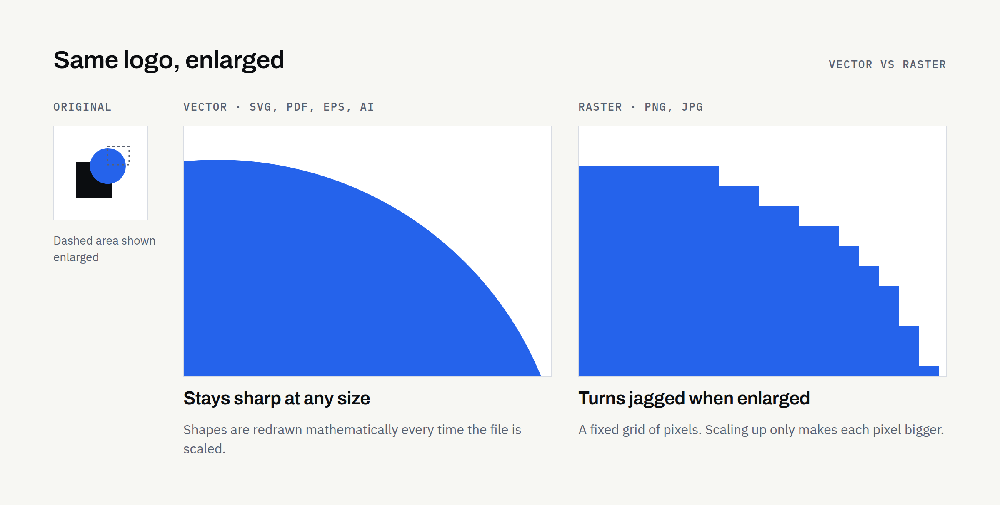
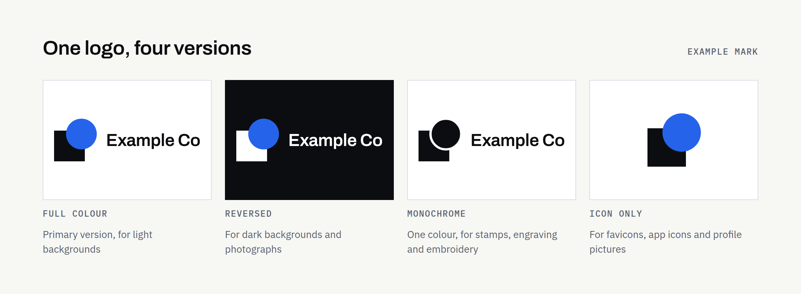

Plenty of new businesses finish a logo project with a single image: one file, often a PNG or JPG, sent by email. It looks fine on screen. Then the signwriter asks for a vector file, the embroiderer asks for a one-colour version, and the website shows a white box around the logo.

A logo is used in dozens of places, and no one file suits all of them. This guide explains what each common format does, which ones you're likely to need, and what to ask for before you approve delivery.

If you haven't commissioned the logo yet, start with [logo versus brand identity](https://fintaxtech.co.uk/blog/logo-vs-brand-identity/) and [how to write a logo design brief](https://fintaxtech.co.uk/blog/how-to-write-a-logo-design-brief/). This article picks up at the handover.

## Why one logo image isn't enough

A single image is fixed in size, colour and background. Your logo, though, has to work:

- tiny, as a browser tab icon, and huge, on a sign
- on white paper, dark photographs and coloured vans
- on screens, which make colour from light, and in print, which makes it from ink
- in software that accepts some formats and refuses others

Each of those situations favours a different file. Receiving the full set at the start costs far less than recreating files later, especially if the original designer is no longer available.

## Vector and raster: the difference that matters most

There are two families of image file, and nearly every format question comes down to which family a file belongs to.

**Raster files** are made of pixels, a fixed grid of coloured squares. Enlarge one beyond its original size and the edges turn soft or jagged. PNG and JPG are raster formats.

**Vector files** are made of shapes described mathematically: lines, curves and fills. They can be scaled to any size without losing sharpness, because the shapes are redrawn at every size. SVG, EPS and AI are vector formats, and a PDF can contain vector artwork.

The practical rule: your logo should originate as vector artwork. Raster files are exported from it for everyday use.

## SVG: websites and digital use

SVG (Scalable Vector Graphics) is the vector format made for the web. A logo in SVG stays crisp on every screen, from a small phone to a large high-resolution monitor, and the file is usually small.

It's the format your web developer will normally prefer for the site header. Most design tools also accept it.

Its limits are practical rather than technical. Some places won't accept SVG, including certain social media profile uploads and some email clients. Support in office software varies by version. Keep PNG copies for those cases.

## PNG: transparency and everyday use

PNG is a raster format that supports **transparent backgrounds**, so the logo sits cleanly on a coloured or photographic background without a white box around it.

That makes PNG the everyday workhorse: social media profiles, Word and PowerPoint documents, email signatures, online marketplaces and anywhere that won't take SVG.

Because PNG is raster, ask for it in several sizes rather than one. A small file for email signatures and a large one for presentations are both useful. A small PNG enlarged for a bigger space always looks blurred.

## JPG: fine for photographs, poor for logos

JPG (or JPEG) is designed for photographs. It compresses images by discarding detail the eye is unlikely to notice in a photo, and it has no transparency.

For logos, both of those are problems. Compression can leave faint blotches around sharp edges and flat colours, and the logo always arrives on a solid background. A JPG of your logo is occasionally useful for a system that accepts nothing else, but it shouldn't be your main file.

## PDF: printing, sharing and approval

PDF is a format almost anyone can open, which makes it ideal for sharing and approving artwork. A PDF can also hold vector artwork, so a properly exported PDF logo scales cleanly.

Many printers accept PDF for professional print work. Some ask for a specific print standard, particular colour settings or bleed around the artwork. Requirements differ between printers, so always check with yours before sending files.

One caution: a PDF isn't automatically vector. A photo of a logo saved as a PDF is still a raster image inside a PDF. Your designer should supply a PDF exported directly from the vector artwork.

## EPS and AI: professional editing and supplier requests

**AI** is Adobe Illustrator's own file format, and it's usually where the logo was actually made. It keeps editable layers and settings, but it generally needs Illustrator or compatible design software to open properly.

**EPS** is an older vector format that many signmakers, embroiderers and promotional-product suppliers still ask for. Some everyday software no longer opens EPS files, so it's mainly useful for passing to suppliers rather than for your own use.

You may never open either yourself. Having them means that when a supplier asks for "the vector file", you can send it immediately.

## RGB, CMYK and Pantone: why colours look different

Screens and printers create colour in different ways, so the same logo can look noticeably different across them.

- **RGB** is how screens make colour, by mixing red, green and blue light. Web colours are usually written as hex codes (such as `#2563EB`), which are RGB values in a different notation. Use RGB files for anything viewed on a screen.
- **CMYK** is how most printed material is produced, using cyan, magenta, yellow and black inks. Some bright screen colours, particularly vivid blues and greens, can't be reproduced exactly in CMYK and print slightly duller.
- **Pantone** is a system of standardised ink colours. Specifying a Pantone reference helps a printer match a colour consistently across jobs and suppliers, which matters for signage, packaging and branded merchandise.

Paper, fabric, screen settings and printing method all affect the result too. For anything important or expensive, ask for a printed proof before the full run. Embroidery and vinyl use their own thread and material colour ranges, so the supplier will match your colours as closely as their materials allow.

## Light, dark, monochrome and icon-only versions

A professional logo usually comes in several versions, because one version alone won't suit every background or process.

- **Full colour**, the primary version, for light backgrounds
- **Reversed or light**, for dark backgrounds and photographs
- **Monochrome**, in solid black and in solid white, for single-colour printing, stamps, engraving and embroidery
- **Icon-only** (sometimes called a mark or monogram), for small square spaces: favicons, app icons and social profile pictures
- **Horizontal and stacked layouts**, where the logo has a name alongside the symbol, so it fits both wide and square spaces

## Which format for which job

Software and supplier requirements vary, so treat this as a starting point and confirm with the people using the files.

| Use | Usually best | Also useful | Avoid |
|---|---|---|---|
| Website header | SVG | PNG (large) | JPG |
| Favicon and browser tab | PNG or ICO (icon-only) | SVG, where supported | Full logo with small text |
| Social media profiles and posts | PNG | JPG for photo posts | SVG (often not accepted) |
| Word, PowerPoint, Google Docs | PNG | SVG, in recent Microsoft Office versions | JPG |
| Email signature | PNG (small) | — | SVG, large files |
| Business cards and stationery | Print-ready PDF | EPS, AI | Small PNG |
| Signage and vehicle graphics | EPS, AI or vector PDF | SVG | Any raster file |
| Clothing and embroidery | EPS, AI or vector PDF (monochrome version) | — | JPG |
| Professional print and packaging | Print-ready PDF (CMYK or Pantone) | EPS, AI | RGB-only raster files |

## What a professional logo handover should include

The exact contents depend on what you agreed, but a sound handover usually covers:

- vector files: SVG, PDF and EPS, plus the AI or other source file if agreed
- PNG files with transparent backgrounds, in several sizes
- each version: full colour, reversed, black, white and icon-only
- RGB versions for screen and CMYK or Pantone versions for print
- a short guide to colour codes (hex, RGB, CMYK and any Pantone references), fonts, minimum size and clear space
- names and licence details for any fonts used in the logo
- clear file names, organised into folders by format or use

## Source files and ownership

Source files are the editable originals, usually AI files or the designer's working files. With them, another designer can adjust the logo later. Without them, even a small change may mean redrawing it.

Whether you receive source files, and what rights you have to use and modify the logo, depends on your agreement with the designer. Don't assume. Confirm in writing what you'll receive, when, whether any fonts or elements are licensed from third parties, and what you're permitted to do with the artwork. The principles are similar to those in [who owns your business website after launch](https://fintaxtech.co.uk/blog/who-owns-your-business-website/): agree the details before work starts, not after.

## Questions to ask before approving delivery

- Which formats and versions are included, and are any missing from this list?
- Are the vector files genuinely vector, rather than raster images saved in a vector format?
- Will I receive the editable source files, or agreed access to them?
- Are colour codes provided for both screen and print?
- Which fonts are used, and do their licences cover how I'll use the logo?
- What rights will I have to use, modify and register the logo, and is that confirmed in writing?
- How long will you keep the files, and can I request them again?

## Your logo handover checklist

- [ ] SVG for web and digital use
- [ ] PNG files with transparent backgrounds, in several sizes
- [ ] Print-ready PDF
- [ ] EPS and/or AI for suppliers
- [ ] Full-colour, reversed, black, white and icon-only versions
- [ ] RGB/hex, CMYK and any Pantone colour references
- [ ] Font names and licence details
- [ ] Minimum size and clear-space guidance
- [ ] Source files, or agreed access to them, confirmed in writing
- [ ] Usage and ownership terms confirmed in writing
- [ ] All files stored somewhere your business controls

## Planning a new brand?

If you're starting a logo or brand identity project, our questionnaire covers what the logo needs to do, where it will be used and what you'd like to receive at the end.

**[Describe your branding project →](/enquiry/?service=branding)**
