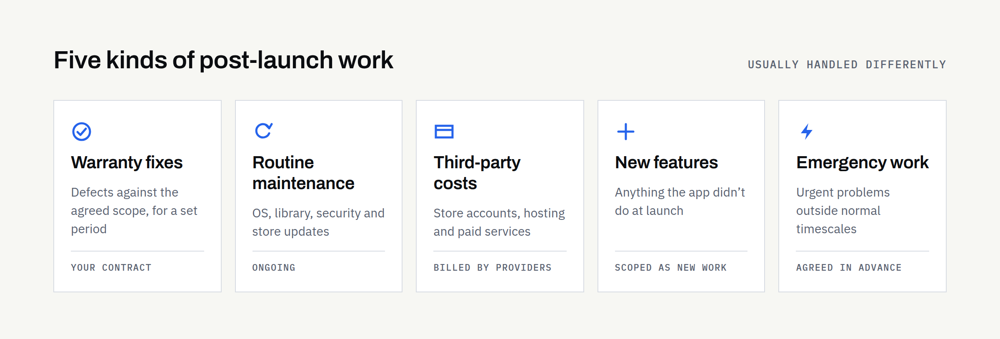

Publishing an app to the App Store or Google Play feels like the finish line. In practice, it's the start of the app's operating life.

From launch day onwards, the app runs on devices you don't control, on operating systems that change every year, and alongside services and store rules that change without asking you first. An app that nobody looks after doesn't stay as it was at launch. It slowly falls behind, then something stops working.

None of this needs to be alarming. It needs to be planned, budgeted and agreed with whoever builds the app. This article explains what post-launch work involves and what to settle before development starts.

## Five different kinds of post-launch work

"Maintenance" often gets used for everything that happens after launch. It helps to separate it into five categories, because they're usually paid for and handled differently.

**Warranty-period defect correction.** Fixing things that don't work as agreed in the original scope, for a set period after launch. Whether a warranty exists, how long it lasts and what counts as a defect all depend on your contract.

**Routine maintenance.** Keeping the app working as its surroundings change: operating system updates, library updates, security patches and store requirements. Nothing new for users, but necessary.

**Third-party operating costs.** Charges from other providers: store developer accounts, hosting, databases, email or messaging services, maps and analytics. These are usually billed by those providers rather than by your developer.

**New feature development.** Anything the app didn't do at launch. This is new work, scoped and priced as such.

**Emergency work.** Urgent problems outside normal hours or timescales, such as a crash affecting most users or a security issue. Whether it's covered, and how quickly someone responds, should be agreed in advance.

## What ongoing responsibility involves

### Monitoring crashes and technical problems

Crash-reporting tools tell you when the app fails on real devices, often before users complain. Someone needs to check them, work out which problems matter most and fix them. Without monitoring, you usually learn about problems from one-star reviews.

### Supporting new Android and iOS versions

Apple and Google release major operating system versions every year, with smaller updates in between. A new version can change permissions, background behaviour or how screens are drawn. The app should be tested against each new version, ideally before most users install it.

### Updating third-party libraries and integrations

Most apps are built partly from third-party libraries and connect to external services such as payments, maps or sign-in providers. These are updated, changed and eventually retired. Letting them fall far behind makes each later update larger and riskier.

### Security patches and dependency vulnerabilities

When a vulnerability is found in a library your app uses, a patched version is usually released. Applying it quickly reduces risk to your users and your data. How urgent a patch is depends on the vulnerability and on what the app does, which is why someone with technical knowledge needs to assess it.

### App Store and Google Play policy changes

Both stores change their technical and policy requirements over time. Google Play sets [target API level requirements](https://developer.android.com/google/play/requirements/target-sdk): new apps and updates must target a recent Android version, and existing apps that fall too far behind stop being available to new users on newer Android devices. Apple periodically sets [minimum Xcode and SDK versions](https://developer.apple.com/news/upcoming-requirements/) for apps uploaded to App Store Connect. The exact requirements and deadlines change, so check the official pages rather than relying on any article, including this one.

### Backend, database, hosting and API maintenance

If your app has a backend (a server, database and API behind the app), that needs looking after too: hosting updates, backups that are actually tested, monitoring, capacity and security. Some apps have no backend at all, which removes most of this work.

### Renewing accounts, domains and third-party services

Developer accounts, domains, SSL certificates and paid services all have renewal dates. A lapsed account or expired certificate can take an app or its backend offline. Keep a list of what renews when, and make sure payment details are current.

### Responding to reviews and support enquiries

Users will email, leave reviews and report problems. Someone needs to reply, pass genuine bugs to the developer and spot patterns. Store reviews are public, so how you respond is visible to everyone considering the app.

### Analytics, privacy disclosures and consent

Both stores require you to describe what data the app collects: Apple through its App Privacy details and Google through the Play Console's Data safety section. Those declarations must stay accurate whenever the app or its third-party services change. Consent and privacy requirements also vary by country, so what's needed depends on where your users are.

### Accessibility and device compatibility

New phones bring new screen sizes, folding displays and changes to accessibility settings. Checking that the app still works with larger text, screen readers and new devices keeps it usable for everyone who relies on those features.

### Improvements versus defects

A defect is something that doesn't work as agreed. An improvement is something that works as agreed but could be better, or something users now want. The distinction matters, because defects may be covered by a warranty while improvements are normally new work. Agreeing definitions early avoids disagreements later. If you're still deciding what goes into the first release, our articles on [what to prepare before development](https://fintaxtech.co.uk/blog/mobile-app-requirements-checklist/) and [MVP versus a full app](https://fintaxtech.co.uk/blog/mvp-vs-full-mobile-app/) help draw that line.

### When an app is no longer maintained

An unmaintained app rarely fails all at once. Typically, it becomes less reliable on newer devices, may stop being available to some new users as store requirements move on, accumulates unpatched vulnerabilities and loses the ability to be updated quickly when something does go wrong. Bringing a neglected app back up to date can cost considerably more than keeping it current would have done. Sometimes a rebuild is the more sensible option.

## Who looks after what

Responsibilities vary by project and contract, and review frequency depends on how the app is built and used. Treat this as a starting point for your own agreement.

| Responsibility | Who may own it | Review | If ignored |
|---|---|---|---|
| Crash monitoring | Developer or in-house team | Weekly, and after each release | Problems found through bad reviews |
| New OS versions | Developer | Each major release, ideally during beta | Broken features on new devices |
| Libraries and integrations | Developer | Monthly or quarterly | Harder, riskier updates later |
| Security patches | Developer | As vulnerabilities are announced | Exposure of users or data |
| Store requirements | Developer, with the account owner | When stores announce changes | Blocked updates; reduced availability |
| Backend and hosting | Developer or hosting provider | Continuously monitored; reviewed monthly | Outages, data loss, security gaps |
| Account and service renewals | Business owner | Before each renewal date | App or backend taken offline |
| Reviews and support | Business owner, with developer help | Daily or weekly | Unanswered users; lower ratings |
| Privacy disclosures and consent | Business owner, advised by developer | Whenever data use changes | Store action; regulatory risk |
| Accessibility and devices | Developer | With each major release | Users excluded; poor experience |

## How post-launch costs vary

There's no universal maintenance figure worth quoting. The effort depends on the platforms you support, whether there's a backend, how many third-party services are involved, how often you release and what response times you need. A simple offline app for staff on known devices needs far less ongoing work than a customer-facing app with accounts, payments and notifications.

Your technology choice also affects maintenance, as covered in our comparison of [native, Flutter and Kotlin Multiplatform](https://fintaxtech.co.uk/blog/native-vs-flutter-vs-kotlin-multiplatform/). For how build and running costs fit together, see [why mobile app quotes vary](https://fintaxtech.co.uk/blog/why-mobile-app-quotes-vary/).

Store developer account fees are set by Apple and Google, may vary by region and can change. Check their official enrolment pages for current figures.

## Questions to settle before development begins

- **Ownership:** who owns the app, its code and its data, and is that confirmed in writing?
- **Source code:** where is the code kept, and will you have access to the repository?
- **Store accounts:** are the Apple and Google developer accounts in your business's name?
- **Hosting:** whose account hosts the backend, and who pays for it?
- **Credentials:** where are passwords, signing keys and certificates stored, and who can access them?
- **Monitoring:** which crash-reporting and uptime tools will be used, and who receives the alerts?
- **Response expectations:** how quickly will problems be acknowledged and fixed, and does that differ for urgent issues?
- **Warranty:** how long is the defect-correction period, and what counts as a defect?
- **Maintenance arrangements:** is routine maintenance included, on a retainer or quoted as needed?
- **Exit and handover:** if you change supplier, what will you receive, in what state, and how will access be transferred?

## Your post-launch checklist

- [ ] Crash reporting set up, with a named person reviewing it
- [ ] A plan for testing each new Android and iOS release
- [ ] A schedule for library, integration and security updates
- [ ] Someone watching Apple and Google requirement announcements
- [ ] A list of every account, domain and service, with renewal dates
- [ ] Backups tested, and backend monitoring in place where relevant
- [ ] A process for answering reviews and support messages
- [ ] Privacy disclosures checked whenever data use changes
- [ ] Warranty, maintenance and emergency arrangements agreed in writing
- [ ] Access to code, accounts and credentials held by your business

## Planning an app?

If you're planning a new app or a complete rebuild, our questionnaire covers users, features, data and what should happen after launch. It helps us propose a scope that includes the app's operating life, not just the build.

**[Describe your mobile app project →](/enquiry/?service=mobile-apps)**
