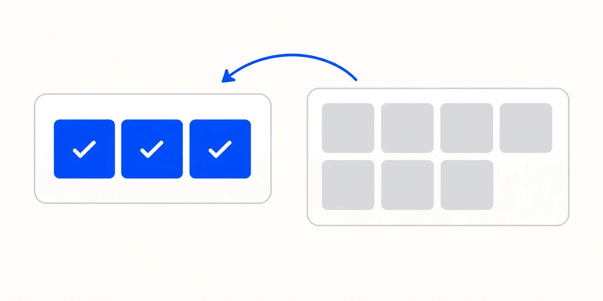
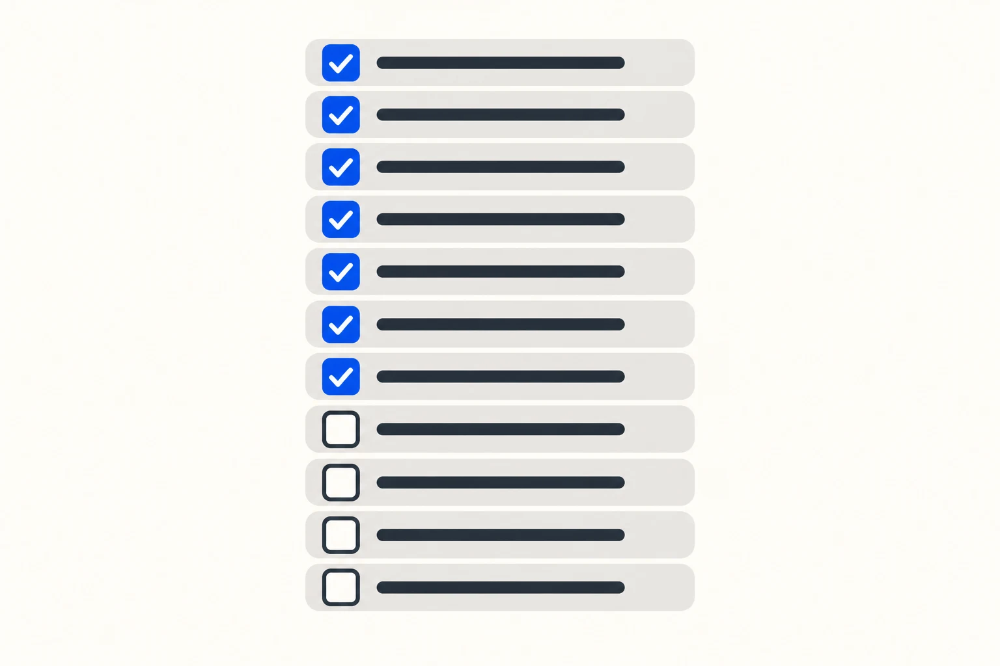

Many app projects that run late or exceed expectations begin with the same problem: nobody defined clearly enough what was being built, who it was for, or what success meant.

The questions below are written for business owners, not developers. Answering them gives a development partner enough context to challenge assumptions, recommend an approach and prepare a quotation based on scope rather than guesswork.

FinTaxTech is an AI-first agency, but AI does not replace sound product thinking. We use it to accelerate research, planning and delivery while keeping people responsible for architecture, security and quality.

---

## 1. What problem should the app solve?

Write it in one sentence, without naming a single feature.

"Our clients can't see the status of their tax return without emailing us" is a problem. "We need a client portal with document upload and push notifications" is a solution wearing a problem's clothes. Start with the first kind, because the second locks in answers before anyone has asked the question.

Then check it survives two follow-ups. Who is worse off today because this doesn't exist? And what do they currently do instead — email, phone, spreadsheet, nothing?

If the honest answer is “nothing, because it is not really a problem,” pause before investing in development.

---

## 2. Who will use the app?

Name the actual groups. Not "customers" but "existing clients who file annually" and "new enquiries who haven't signed up yet." They want different things and often need different screens.

For each group, note three things.

**Their devices.** Newer iPhones, or older Android handsets on constrained data plans? This changes what you can reasonably build.

**Their comfort with technology.** An app for accountants and an app for delivery drivers cannot look the same and be equally good.

**Where they use it.** Standing in a warehouse, driving between sites, on a sofa. Poor signal, gloves, one hand, bright sunlight — these are requirements, not details.

---

## 3. Is it for Android, iOS or both?

Don't guess. Check.

If you have a website, its analytics may indicate the devices used by your audience. Customer interviews, staff device policies and existing product data can provide stronger evidence. Audience behaviour varies by country, industry and user group, so base the decision on your users rather than a worldwide average.

Then decide whether both platforms are needed at launch or whether releasing on one first is acceptable. A single-platform launch can reduce the initial scope and produce feedback sooner, but it may exclude part of your intended audience.

If you are comparing implementation approaches as well as platforms, read [Native vs Flutter vs Kotlin Multiplatform: Which Is Right for Your Business App?](/blog/native-vs-flutter-vs-kotlin-multiplatform/).

If the app is for staff on company-issued devices, this question is already answered for you.

---

## 4. What are the essential launch features?

The test for launch scope is simple: **can one user complete the core job from start to finish?** Not comfortably, not with every convenience. Just completely.

If the app is for booking appointments, a user must be able to find a slot, book it, and see the confirmation. That's launch. Rescheduling, reminders, calendar sync and a favourites list are all reasonable, and none of them are launch.

Write your feature list, then cross out everything that isn't part of that single complete loop. What survives is version one. Expect it to feel uncomfortably small. That feeling is correct.

---

## 5. Which features can wait until a later version?

Everything you just crossed out — write it down properly, in a document you keep.

This matters more than it sounds. Parked features don't stay parked in people's heads; they leak back into version one during development, one small request at a time, and that's how a three-month build becomes six. A visible, agreed list of "yes, later" is the thing that stops the leaking.

Sort it into two groups: things you'll add once real users ask for them, and things you already know are coming. The second group is useful to your developers now, because it changes how they structure the app even if they don't build it yet.

_Version one should contain the smallest complete user journey. Keep other ideas visible for later evidence-based decisions._

---

## 6. Will users need accounts or different roles?

First, does anyone need to log in at all? Plenty of useful apps don't require it. Every login screen you add costs you a percentage of users at the front door, so add it only where the app genuinely needs to know who someone is.

If accounts are needed, list every role and what each one can see and do. A typical business app has more roles than expected: customer, staff member, manager, administrator, and sometimes a read-only accountant or auditor.

Then answer the unglamorous questions. Who creates accounts — users themselves, or your team? What happens when someone forgets their password? What happens when a staff member leaves?

---

## 7. Will the app collect personal or sensitive information?

If the app collects information about identifiable people, privacy and data-protection laws may apply. The exact obligations depend on where your organisation operates, where users live and what data you process. Names and email addresses can count as personal data, as can device identifiers and location data.

Prepare four things before development starts:

- **A list of what you collect and why.** Each item needs a purpose. If you can't name one, don't collect it.
- **How long you keep it, and how it gets deleted.** Including when a user asks you to delete their account.
- **Who else receives it.** Record every analytics tool, SDK, cloud provider and other third party, then confirm the contracts and safeguards required for your situation.
- **A privacy policy that matches reality.** Apple requires app privacy information for new apps and updates, while Google Play requires developers to complete its Data safety form. Read the current [Apple app privacy guidance](https://developer.apple.com/app-store/app-privacy-details/) and [Google Play Data safety guidance](https://support.google.com/googleplay/android-developer/answer/10787469).

Health, biometric, financial, children’s and other high-risk data can require additional safeguards. Flag it early and obtain appropriate legal advice; this checklist is not a substitute for it.

---

## 8. Does it require payments, maps, notifications or other integrations?

List every external service the app will touch. For each one, note who owns the account and who pays the bill.

**Payments** need particular care. Store rules distinguish between different kinds of purchases and contain regional programmes and exceptions. Review the current [Apple App Review Guidelines](https://developer.apple.com/app-store/review/guidelines/#business) and [Google Play Payments policy](https://support.google.com/googleplay/android-developer/answer/9858738) before choosing a payment flow.

**Maps** may use Google Maps, Apple Maps or another provider. Pricing and free usage vary by product and volume, so model expected usage against the provider’s current terms. Google publishes its [Maps Platform pricing](https://developers.google.com/maps/billing-and-pricing/pricing).

**Push notifications** need a purpose. Users switch off apps that abuse them.

**Everything else** — accounting software, CRM, calendars, messaging, analytics — needs the same three answers: does it have a usable API, what does it cost, and what should the app do when it's unavailable?

---

## 9. Is an administration dashboard required?

This is one of the easiest parts of an app project to overlook, even though it can represent substantial work.

Ask it this way: what needs to change in the app without a new release? Prices, content, opening hours, promotional messages, user permissions, refunds. Someone has to be able to change those, and if there's no admin panel, that someone is your developer, by email, at an hourly rate.

You don't always need a full dashboard at launch. Sometimes a spreadsheet or an existing back-office system is enough for the first few months. But decide deliberately rather than discovering the gap in week one of going live.

---

## 10. Who will supply branding, text and images?

Missing content delays more launches than missing code.

Prepare: your logo in vector format, brand colours as hex codes, fonts along with the licences that permit their use in an app, and photography you have the rights to. Stock images need a licence that covers software distribution.

Then the writing. Every screen needs words, every error message needs a sentence, and every empty state needs something better than a blank panel. Someone must write those, and it's faster if that person knows your business.

Finally, the store listing: app name, description, keywords, screenshots, and a support URL. Both stores require them and no app goes live without them.

---

## 11. Who will own the developer and cloud accounts?

The short answer: **you**. Always.

Your organisation should normally control the Apple Developer Program account, Google Play Console account, cloud project, domain and analytics. Your development partner can be added with the access needed to deliver the work.

This is not about distrust. It's about what happens if you change partners, or the relationship ends badly, or the agency closes. Accounts in someone else's name can be extremely difficult to recover, and in the worst cases you lose the app listing, its reviews and its install base.

Organisation enrolment and verification can take time. Check the current requirements for each platform and begin account setup early.

---

## 12. What happens after the app launches?

Launch is the beginning of the cost, not the end of it.

Android and iOS evolve continually. Store requirements change, dependencies need attention, security issues emerge and crashes need monitoring. Some changes require a new app release even when you have not requested a new feature.

Then there's support. Someone answers user emails, responds to store reviews, and handles the occasional app store rejection.

Agree who will monitor, maintain and release the app after launch. FinTaxTech prices this work after reviewing the product, responsibilities and expected support level; we do not publish a generic percentage because different apps carry very different risks.

---

## 13. The checklist

Copy this and fill it in before you brief anyone.

**Purpose**

- [ ] The problem, in one sentence, with no features in it
- [ ] Who is worse off today because the app doesn't exist
- [ ] What they do instead right now

**Users**

- [ ] Each distinct user group named
- [ ] Devices they use
- [ ] Where and how they'll use the app

**Platforms**

- [ ] iOS, Android or both, based on data rather than assumption
- [ ] Both at launch, or one first

**Scope**

- [ ] The core job a user must be able to complete end to end
- [ ] Version one feature list
- [ ] Written "later" list

**Accounts**

- [ ] Login required, or not
- [ ] Every role and what it can do
- [ ] Account creation, password reset, and staff leavers

**Data**

- [ ] What personal data is collected, and why
- [ ] Retention and deletion
- [ ] Third parties receiving data, with agreements in place
- [ ] Privacy policy written

**Integrations**

- [ ] Payments, and whether store commission applies
- [ ] Maps, notifications, and any other services
- [ ] Who owns each account and pays each bill

**Admin**

- [ ] What must be changeable without a new release
- [ ] Dashboard at launch, or later

**Content**

- [ ] Logo, colours, licensed fonts, licensed images
- [ ] Screen text, error messages, empty states
- [ ] Store listing copy and screenshots

**Ownership**

- [ ] Apple Developer account in your company's name
- [ ] Google Play Console in your company's name
- [ ] Cloud project, domain and analytics in your company's name
- [ ] D-U-N-S number obtained

**After launch**

- [ ] Who handles releases and OS updates
- [ ] Who answers users and store reviews
- [ ] Maintenance responsibilities and support approach agreed

---

## Send us your answers

FinTaxTech designs and develops new mobile products and complete app redesigns for clients worldwide. We do not take on isolated repairs to poor-quality legacy code.

Our guided questionnaire helps us understand the outcome, users, scope and technical needs of your app. Your answers remain on your device unless you choose to share the generated document with us. If you request a quotation, we will assess the requirements individually rather than forcing the project into a generic package.

**[Plan your mobile app with FinTaxTech →](/start/)**
