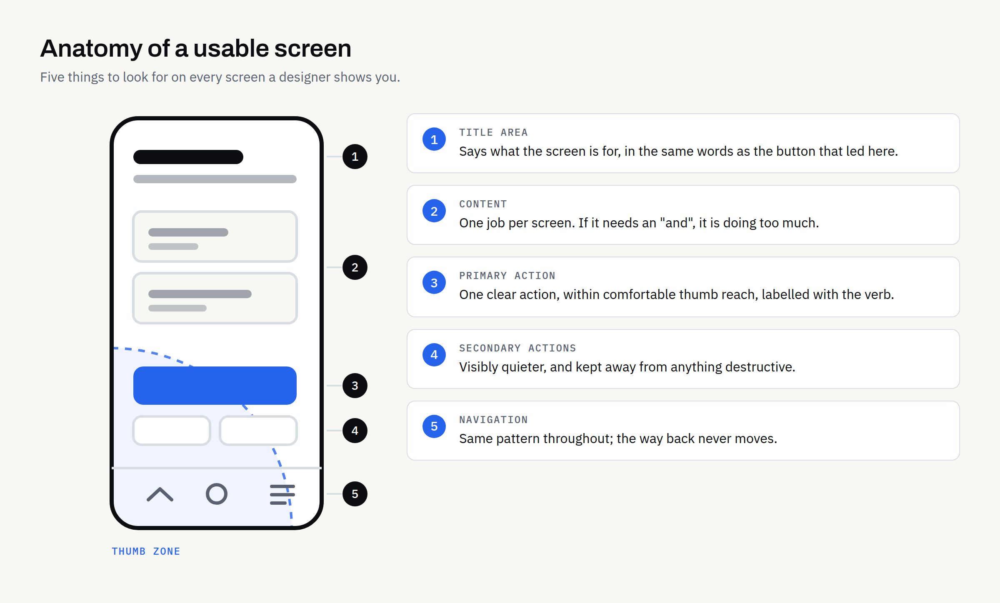
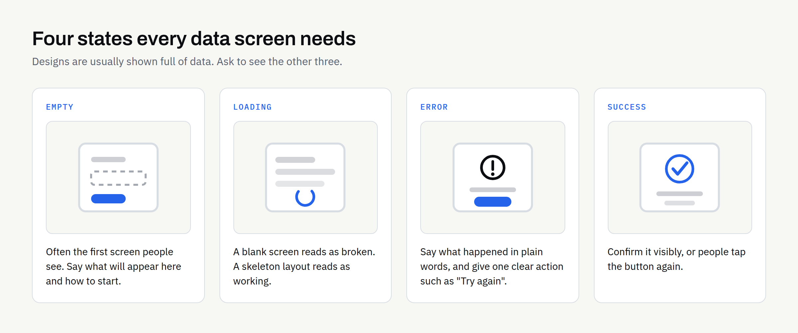

Most apps that frustrate people are not badly built. They work exactly as programmed. The problem is that the person holding the phone cannot tell what to do next, cannot hit the button they are aiming at, or fills in a form and never finds out whether it worked.

That is user experience, or UX, and it is decided long before anyone writes code. The screen designs are the part of an app project you can judge for yourself, without any technical knowledge. Here is what to look for.

## What UX actually means on a small screen

UX is the whole path a person takes through your app: what they see first, what they tap, what happens next, and how they feel about it. It is not the same as visual design — an app can look polished and still be exhausting to use.

Three constraints shape everything on a phone. Space: you have roughly a business-card-sized area, part of it covered by a thumb. Attention: people use apps on a bus, in a queue, between other tasks. Input: a finger is blunt compared with a mouse pointer, and typing on glass is slow.

Good mobile UX is mostly the discipline of removing things until what is left is obvious.

## Give every screen one job

The single most useful question to ask about any screen design is: what is this screen for?

If the answer needs an "and", the screen is doing too much. A booking screen picks a time. A profile screen shows who you are. When one screen carries your account, your last order, a promotion and a newsletter sign-up, nothing on it reads as important.

A test for any design you are shown: cover everything except the top third. Can you still tell what the screen is for and what the main action is? If not, the hierarchy needs work. Each screen should have one primary action, styled so it stands out, and everything else visibly secondary.

## Navigation: pick a pattern and stay with it

Navigation is how people move between the main parts of your app. There are only a few sensible patterns, and the right one depends on how many top-level sections you have.

| Pattern | Best for | Watch out for |
| --- | --- | --- |
| Bottom tab bar | Three to five equally important sections | Breaks down beyond five tabs; labels get squeezed |
| Single screen with drill-down | One core task with detail views beneath it | An obvious way back is needed at every level |
| Side or hamburger menu | Settings, help, legal, account | Anything hidden here gets used far less; never the main task |
| Stepped flow (wizard) | A long task split into stages | Show progress; let people go back without losing entries |

Two rules matter more than the choice itself. The pattern should not change partway through the app, and the way back should always be in the same place. People build a mental map of an app quickly, and moving the furniture afterwards is what makes it feel unreliable.

If you are still working out which sections you need at all, that is scoping rather than design: our [mobile app requirements checklist](https://fintaxtech.co.uk/blog/mobile-app-requirements-checklist/) covers writing down features and journeys first, and [MVP vs full mobile app](https://fintaxtech.co.uk/blog/mvp-vs-full-mobile-app/) looks at how much to put in a first release.

## Make things big enough to tap

This is the one area of mobile UX with published, checkable numbers, and undersized buttons are easy to spot in a design.

- Apple's iOS design guidance says to "create controls that measure at least 44 points x 44 points so they can be accurately tapped with a finger" ([Apple, UI Design Dos and Don'ts](https://developer.apple.com/design/tips/); fuller guidance sits in the [Human Interface Guidelines](https://developer.apple.com/design/human-interface-guidelines)).
- Google's Android accessibility guidance suggests touch targets of "at least 48x48dp, separated by 8dp of space or more" ([Android Accessibility Help](https://support.google.com/accessibility/android/answer/7101858)).
- The Web Content Accessibility Guidelines set a minimum of 24 by 24 CSS pixels for pointer targets, under success criterion 2.5.8 Target Size (Minimum) at Level AA ([W3C](https://www.w3.org/WAI/WCAG22/Understanding/target-size-minimum.html)). That criterion is written for web content, but the underlying point applies to any screen.

Usefully, a target can be larger than the icon inside it — a small icon with padding around it is still a generous target. So look for small icons crowded together: a row of tiny buttons in a corner is where mis-taps happen.

Position matters too. On a large phone held in one hand, comfortable reach is the lower middle of the screen, and primary actions belong there. A "delete" button sitting next to "save" at the top of a tall screen is asking for an expensive accident.

## Forms are where most apps lose people

Typing on a phone is the slowest thing your customers will do in an app, so every field must justify itself.

- **Ask for less:** If you do not need a job title today, do not ask for one.
- **Use the right keyboard:** A number field should bring up the number pad; an email field should offer the @ symbol — a small development detail people notice immediately.
- **Label fields properly:** Placeholder text vanishes as soon as someone types, leaving them guessing. Use a visible label above the field.
- **Validate helpfully:** Say what is wrong and how to fix it, next to the field it applies to — not in one red banner at the top.
- **Never lose what they typed:** If the app closes or the connection drops, the entered data should still be there.
- **Split long forms:** Three short steps with visible progress feel shorter than one long scroll, even with identical fields.

## Show people what is happening

Designs are usually presented in their perfect state: full of data, nothing loading, nothing broken. Real apps spend much of their life in the other states, and if those have not been designed, the developer has to invent them. Ask to see all four for every screen that loads data.

| State | What the person sees | Why it matters |
| --- | --- | --- |
| Empty | No data yet — a first-time user, or an emptied list | Often the first screen people see; it should say what will appear here and how to start |
| Loading | Waiting for data | A blank screen reads as broken; a skeleton layout reads as working |
| Error | Something failed | Say what happened in plain words, and give one clear action such as "Try again" |
| Success | The action worked | Confirm it visibly, or people tap the button again |

## Write the words before you polish the pictures

The text in an app is part of the interface, not decoration added afterwards. Buttons should name the action — "Book appointment" beats "Submit". Error messages should be readable by a customer, not "error 422". A screen title should match the button that led to it: if the button said "My orders", the next screen is "My orders", not "Transaction history". If you can write the key labels yourself, do it — you know how your customers describe things.

## Accessibility helps everyone

Designing for people with impaired vision, limited dexterity or a screen reader is the right thing to do, and the same choices make the app easier for everyone else — including a customer squinting at a phone in bright sunlight. Ask for: text contrast strong enough to read in daylight, with no information carried by colour alone; layouts that survive a larger system text size rather than clipping; meaningful labels on icon-only buttons, so a screen reader announces "Search" rather than "button"; and targets that meet the sizes above.

Whether your business has a specific legal duty on digital accessibility depends on your sector, your customers and where you operate. This article is not legal advice — if you think an obligation may apply, take proper advice and get the standard you are working to written into your project documents.

## Test the screens before development starts

The cheapest moment to fix a confusing screen is while it is still a drawing.

You do not need a research budget. A clickable prototype of the main journey, shown to a handful of people who resemble your customers, surfaces most of the serious problems. Give them a task — "book a slot for next Tuesday" — then stay quiet and watch. Where they hesitate is your list.

Two limits are worth being clear about. Good design cannot promise that an app will be accepted by the App Store or Google Play, because approval is the platforms' decision; our guide to [App Store and Google Play submission](https://fintaxtech.co.uk/blog/app-store-and-google-play-submission-checklist/) covers what to have ready. And if you are still deciding whether an app is the right format at all, settle the question of [a mobile app or a mobile-friendly website](https://fintaxtech.co.uk/blog/mobile-app-or-mobile-friendly-website/) first.

Finally, agree in writing who owns the design files and source assets, and when that ownership passes. At FinTaxTech, ownership of the agreed final deliverables passes to the client after full payment, as set out in the written proposal. Have it written down rather than assumed.

## A screen-review checklist

Use this when a designer or developer first shows you screens.

- [ ] Every screen has one purpose and one obvious primary action
- [ ] The navigation pattern never changes, and the way back never moves
- [ ] Main actions sit within comfortable thumb reach
- [ ] Tap targets are generous, with space between adjacent controls
- [ ] Destructive actions are separated from routine ones and ask for confirmation
- [ ] Every form field is needed, has a visible label and opens the right keyboard
- [ ] Long forms are stepped, and entered data survives an interruption
- [ ] Empty, loading, error and success states exist for every data screen
- [ ] Button labels name the action; error messages are in plain English
- [ ] Text stays readable at larger system text sizes and in bright light
- [ ] Icon-only buttons have descriptive labels for screen readers
- [ ] The main journey has been tried by real people on a real phone
- [ ] Ownership of design files and deliverables is written into the proposal

None of this is technical. What it takes is someone asking the plain questions early, while changing the answer is still cheap.

If you are planning an app and want the screens thought through before development begins, we design and build new apps and complete rebuilds from scratch, and we are glad to talk through what a first version should include.

**[Discuss your mobile app project →](/enquiry/?service=mobile-apps)**
