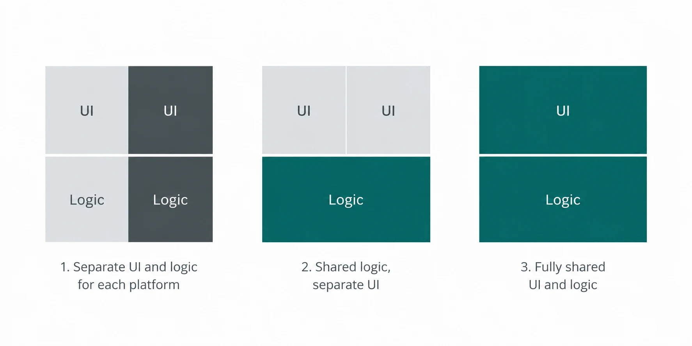

## The decision in plain English

Most people ask which technology is best for a mobile app. There isn't one. All three approaches ship apps that millions of people use daily without knowing or caring how they were built.

The real question is narrower: how much of your app can be written once for both Android and iOS, and what do you give up in exchange?

**Native** means two apps. Kotlin for Android, Swift for iOS, each built with the tools the platform owner makes. Nothing is shared except your designs and your backend.

**Flutter** means one app. You write in Dart, Flutter draws the interface itself, and the same code produces both builds. Almost everything is shared, including what the user sees and touches.

**Kotlin Multiplatform** sits between. Business logic — pricing rules, validation, API calls, offline storage — is written once in Kotlin. The interface is still built natively on each platform. The parts customers touch stay platform-specific; the shared parts stay invisible.

Share nothing, share the middle, or share everything. That is the whole spectrum.

The trade-off is predictable. More sharing means lower build and maintenance costs, and less direct control when a platform does something unusual. Less sharing means more control, paid for twice over, every year the app exists.

So the useful question isn't which is best. It's which one fits what your app actually does, how much it demands from the device, and who will still be maintaining it in three years.

---

## What native development means

Native means building each app with the tools its platform owner provides and intends you to use.

On Android that is Kotlin, written in Android Studio, with Jetpack Compose for the interface. On iOS it is Swift, written in Xcode, with SwiftUI. Two codebases, two sets of tooling, two builds.

The practical consequences follow from that. When Apple or Google ships a new OS feature, you can use it the day it launches — no waiting for a third party to wrap it. Your app behaves exactly the way users of that platform expect, because it is using the platform's own components. Every bug fix, however, has to be written twice. So does every new feature.

Native is the baseline the other two approaches are measured against.

---

## When native Android and iOS are the right choice

Native earns its cost in a few specific situations.

**The app leans hard on the device.** Camera pipelines, Bluetooth peripherals, background location, HealthKit and Health Connect, ARKit, secure hardware for payments or biometrics. Cross-platform frameworks reach these through plugins, and plugins lag behind the platform. If device capability _is_ your product, go native.

**The interface is the product.** Custom animation, gesture-heavy interaction, or a design that must feel unmistakably like an iPhone app on iPhone and an Android app on Android. Users rarely name the reason, but they notice.

**You are building for one platform only.** A field tool for company-issued Android tablets, or a consumer app targeting UK iPhone users first. Cross-platform solves a problem you don't have. Native is simpler and faster here.

**The app must live for a decade.** Platform tooling doesn't get abandoned. Kotlin and Swift will be supported as long as Android and iOS exist, which is a claim no third-party framework can make with equal confidence.

**Regulated or high-scrutiny work.** Banking, health records, anything facing an audit. Fewer dependencies means a smaller surface to explain to a security reviewer.

The cost is real and recurring: two codebases, roughly two teams, every feature built twice, forever. Choose native when something on this list is genuinely true — not as a default.

---

## When Flutter is suitable

Flutter draws its own interface rather than using the platform's, which is exactly why it fits some projects and not others.

**Screens, forms and data.** Booking tools, internal dashboards, CRM front-ends, portals, order management. Apps that are mostly lists, inputs and API calls get the biggest discount from sharing everything, because there's little platform-specific behaviour to preserve.

**Speed to market matters more than polish.** One codebase, one team, one release. For an MVP, a pilot, or a product where you need to learn from real users quickly, Flutter is usually the fastest route to both stores.

**You want a single brand look on both platforms.** Because Flutter renders everything itself, an Android build and an iOS build look identical by default. If your brand guidelines demand that, it's a feature rather than a compromise.

**A small team owns the whole thing.** Two or three developers can realistically maintain a Flutter app across both platforms. The same team maintaining two native codebases will be stretched thin.

**Where it gets uncomfortable:** deep hardware integration, heavy background processing, and any moment a platform ships something new — you wait for plugin support, or write the native code yourself and lose part of the saving. App size is larger, and the app never quite feels like the platform it's on. Most business users don't mind. Some audiences do.

---

## When Kotlin Multiplatform is suitable

KMP shares the logic and keeps the interface native. That combination fits a narrower set of projects, but fits them well.

**The logic is heavy and the interface matters.** Tax calculations, pricing engines, eligibility rules, validation, sync and offline behaviour. Write it once in Kotlin, run it on both platforms, and the rules can't drift apart between an Android release and an iOS one. Meanwhile users still get a real Compose app and a real SwiftUI app.

**You already have an Android team.** KMP is Kotlin, so an Android team can start sharing code without learning a new language. That's a genuinely lower barrier than adopting Dart.

**You have a native app already and want iOS without starting over.** KMP can be adopted gradually — extract the networking layer first, then the domain rules — rather than requiring a rewrite.

**Correctness across platforms is a hard requirement.** Regulated calculations, financial figures, anything where two platforms producing two different answers is a serious problem rather than a bug.

**Where it gets uncomfortable:** you still build and maintain two interfaces, so the saving is partial. iOS tooling and debugging around KMP is still rougher than Android's, and the talent pool is smaller than for either native or Flutter. It's the least commoditised of the three choices.

---

## Comparison

| Consideration            | Native                                                        | Flutter                                                                                          | Kotlin Multiplatform                                                       |
| ------------------------ | ------------------------------------------------------------- | ------------------------------------------------------------------------------------------------ | -------------------------------------------------------------------------- |
| **User experience**      | Platform-perfect. Feels native because it is.                 | Consistent across both, but identical everywhere — deliberate, not always desirable.             | Native UI on both platforms, so same as native.                            |
| **Performance**          | Best available, especially for graphics and heavy processing. | Strong for typical business apps; falls behind under heavy load.                                 | Native UI performance; shared logic runs compiled, not interpreted.        |
| **Device features**      | Immediate access to everything, day one of a new OS release.  | Via plugins. Common features are covered; new or niche ones mean waiting or writing native code. | Full native access on each side; shared layer handles logic, not hardware. |
| **Development speed**    | Slowest. Every feature built twice.                           | Fastest to a working app on both stores.                                                         | Faster than native, slower than Flutter. Two UIs still to build.           |
| **Maintenance**          | Two codebases forever. Highest ongoing cost.                  | One codebase, one team. Lowest ongoing cost.                                                     | One logic layer, two UI layers. Middle.                                    |
| **Existing team skills** | Kotlin and Swift developers — the largest hiring pool.        | Dart. Smaller pool, but quick for most developers to pick up.                                    | Kotlin. Natural for an existing Android team; smallest specialist pool.    |

Two lines worth reading twice. **Development speed is a one-off saving; maintenance is a recurring one** — and over a five-year life the second is far larger. And **existing team skills beat theoretical fit more often than architects like to admit.** A team shipping confidently in a technology they know will outperform a team learning the "correct" one.

---

## Example business scenarios

**A regional accountancy firm wants a client portal.** Clients upload documents, check filing deadlines, approve returns. Mostly forms, lists and API calls, no unusual hardware, and the firm has a small in-house team. **Flutter.** One codebase, both stores, lowest ongoing cost — and nothing in the app needs to feel platform-specific.

**A lender wants a mobile app for loan applications.** Affordability calculations, eligibility rules and interest figures must be identical on both platforms and defensible to a regulator. The firm already employs Android developers. **Kotlin Multiplatform.** The rules live in one Kotlin module that both apps call; the interfaces stay native, which matters for a product people trust with money.

**A logistics company needs a driver app.** Continuous background location, barcode scanning, Bluetooth printers, offline for hours at a time, on company-issued Android devices only. **Native Android.** There is no iOS version to share with, and every hard requirement sits close to the hardware.

Notice that in all three cases the technology was decided by the app's demands and the team's shape — not by preference.

---

## Questions to answer before choosing

Work through these before anyone writes code. The answers usually point at one option clearly enough that the debate ends.

1. **Which platforms do you actually need?** If it's one, cross-platform is solving a problem you don't have.
2. **What does the app ask of the device?** List every hardware and OS feature. If that list is long or unusual, native moves ahead.
3. **How much of the app is business logic versus screens?** Heavy logic favours KMP. Mostly screens favours Flutter.
4. **Does the interface need to feel platform-native?** Be honest — for many internal tools it doesn't.
5. **Who maintains this in three years?** In-house team, agency, or nobody decided yet? An answer of "nobody decided yet" argues for one codebase.
6. **What does your team know today?** Existing Kotlin skills lower the cost of KMP. No mobile team at all widens the field.
7. **What does a poor experience cost you?** A consumer app losing installs is a different risk to an internal tool nobody can uninstall.
8. **What's the realistic lifespan?** A two-year pilot and a ten-year platform justify different decisions.

If questions 2, 4 and 7 all point the same way, you have your answer. If they conflict, KMP is often the compromise that costs least.

---

## How FinTaxTech evaluates a mobile project

We don't start with the technology. We start with the eight questions above, in a short discovery conversation with whoever owns the outcome.

From there the sequence is straightforward. We map what the app must do, and specifically what it asks of the device. We look at who will maintain it and what they already know. We size the realistic lifespan and budget — build cost and the five-year running cost, separately, because the second is the one that surprises people.

Only then do we recommend an approach, in writing, with the trade-offs stated plainly. If native is the honest answer, we say so, even though it's the more expensive one.

---

## Plan your mobile app with FinTaxTech

The right technology should follow the product requirements rather than personal preference. If you are planning a new Android or iOS app, or a complete rebuild, FinTaxTech can help you define those requirements before recommending an approach.

Our structured mobile-app questionnaire asks about your users, platforms, key features, device capabilities, data, integrations and long-term support. Your answers remain in your browser until you generate a project-enquiry PDF and choose to share it with us.

We review the requirements ourselves. You will not receive an automatic technology recommendation or price from the website. If the project is a suitable fit, we will discuss the trade-offs with you and prepare a written proposal covering scope, delivery and cost.

Completing the questionnaire does not create a contract or commit you to a project. It gives both sides a clearer starting point for the conversation.
