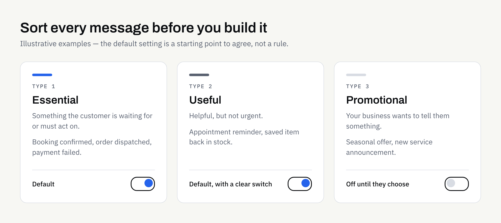

Push notifications are one of the few ways an app can reach a customer when it is not open. That is exactly why they are easy to misuse. A message that arrives at the right moment feels helpful. The same message sent too often, or about nothing in particular, gets switched off — or the app gets deleted.

Notifications are also a feature, not an afterthought. They need decisions about content, timing, permission and settings, and those decisions are much cheaper to make before development begins. This guide covers what to plan.

## Start with the job each message does

Before anyone discusses technology, list the messages your app might send and say what each one is for. If you cannot finish the sentence "This message helps the customer to…", it probably should not exist.

A useful way to sort them is by how much the customer needs them:

| Type | What it is | Examples (illustrative) | Typical default |
| --- | --- | --- | --- |
| Essential | Something the customer is waiting for or must act on | Booking confirmed, order dispatched, payment failed, security code | On |
| Useful | Helpful, but not urgent | Appointment reminder, a saved item is back in stock | On, with a clear switch |
| Promotional | Your business wants to tell them something | Seasonal offer, new service announcement | Off until they choose |

The groups matter because they behave differently. Essential messages are rarely resented. Promotional ones are where most of the annoyance comes from, and where the rules are strictest.

### Ask whether it needs to be a notification at all

Some information is better inside the app, where the customer finds it when they choose to look. An in-app message centre or a small badge on an icon can carry news without interrupting anyone. Keep the interruption for things that cannot wait.

## Decide when to ask for permission

On both major platforms, people are asked whether an app may send notifications, and they can say no. On Android 13 and later, apps must request a runtime permission before sending most notifications, and notifications are off by default for new installs. Google's guidance is available on the [Android notification permission page](https://developer.android.com/develop/ui/views/notifications/notification-permission). Apple publishes its own recommendations in its [Human Interface Guidelines on notifications](https://developer.apple.com/design/human-interface-guidelines/notifications). Platform rules change, so your developer should check the current versions of both.

What this means for planning:

- **A "no" is hard to undo.** On iOS, a customer who declines the system prompt has to go into device settings to change their mind. Do not waste the one clear chance you get.
- **Timing beats wording.** Asking on first launch, before the customer has seen any value, tends to be a poor moment. Asking just after they book something, with a line such as "Want a reminder before your appointment?", gives them a reason.
- **Explain first, then ask.** A short screen in your own words, shown before the system prompt, lets you say what they will receive. If they decline that screen, you have not used up the system prompt.
- **Plan for refusal.** The app should work properly without notifications. A customer who says no should still be able to find their booking or order status inside the app.

This is the same thinking that goes into the rest of the screen design. Our guide to [mobile app UX basics](https://fintaxtech.co.uk/blog/mobile-app-ux-basics/) covers how to judge whether a flow makes sense to a first-time user.

## Set a frequency and timing policy

Decide the limits in advance, in writing, so nobody has to improvise later when a busy week tempts someone to send "just one more".

Questions worth answering:

1. **How many promotional messages per week or month is the ceiling?** Pick a number that you would be comfortable receiving yourself.
2. **What hours are acceptable?** A reminder at 3am is a complaint waiting to happen. Consider the customer's local time rather than yours.
3. **Which messages can interrupt, and which can wait?** A delivery update may arrive straight away. A newsletter-style update can be bundled.
4. **What happens if several events occur together?** Grouping several updates into one message is usually kinder than sending five.
5. **Who approves messages before they go out?** Someone should own the content, the same way someone owns the website.

Both platforms offer ways for customers to limit interruptions, such as quiet modes and per-app controls. Your own settings should work with those, not against them.

## Write messages people can act on

A notification has very little room. The customer sees it for a second, often on a locked screen.

- **Lead with the useful part.** "Your appointment is tomorrow at 10:00" is better than "Don't forget!".
- **Be specific.** Say what has changed and what, if anything, they need to do.
- **Avoid pressure.** Manufactured urgency irritates people and damages trust.
- **Avoid sensitive detail on the lock screen.** Anyone nearby can read it. Think about whether a message should show account balances, health information or personal details, and consider keeping the notification vague and the detail inside the app.
- **Make the tap land somewhere useful.** Tapping a notification about a booking should open that booking, not the home screen.

## Give customers control inside the app

Every app that sends notifications should have a settings screen that lets people choose what they receive. Aim for simple, honest controls:

- A switch for each message type, matching the table above.
- Plain labels, not internal jargon.
- A visible way to turn promotional messages off without turning off the essential ones.
- A note, where appropriate, that the device's own settings can also limit notifications.

Giving people a choice is good for the relationship, and it usually reduces the number of people who simply switch everything off in the device settings.

## Consent, privacy and marketing rules

If notifications are used for marketing, UK rules on electronic marketing and data protection may apply. The Information Commissioner's Office explains the basics on its [direct marketing and electronic communications guidance](https://ico.org.uk/for-organisations/direct-marketing-and-privacy-and-electronic-communications/). Which rules apply to your messages depends on their content, who receives them and how you obtained consent.

This is not legal advice. Decide the consent approach and the privacy wording with a suitably qualified adviser, and keep the agreed approach in writing. Your app's privacy information should also describe what you collect and why — and the app stores ask for this at submission, as our [app store and Google Play submission checklist](https://fintaxtech.co.uk/blog/app-store-and-google-play-submission-checklist/) explains.

## What it affects behind the scenes

Notifications are not only a design question. Plan for:

- **Accounts and identity.** Sending to the right person usually means the app knows who they are, or at least which device they are using.
- **A way to send.** Someone needs to be able to trigger and schedule messages, whether automatically from events such as a new booking or manually from an admin screen.
- **Testing on real devices.** Behaviour differs between platforms, versions and device settings, so allow time for it.
- **Ongoing upkeep.** Operating systems change how notifications work from time to time, which is one reason to read about [mobile app maintenance after launch](https://fintaxtech.co.uk/blog/mobile-app-maintenance-after-launch/) before you commit.
- **Store review.** Apps are reviewed against store rules, and approval can never be guaranteed. Clear, honest use of notifications is one less thing to explain.

If you are writing up a full specification, add notifications to your [mobile app requirements checklist](https://fintaxtech.co.uk/blog/mobile-app-requirements-checklist/) as their own line, so the idea does not arrive late in the project.

## Planning checklist

Use this before you brief a developer:

- [ ] I have listed every message the app might send and the job each one does.
- [ ] Each message is marked essential, useful or promotional.
- [ ] I have checked whether each one could live inside the app instead.
- [ ] I know when and where the app will ask for permission, and what it will say first.
- [ ] The app works properly if the customer says no.
- [ ] I have set a maximum frequency and acceptable sending hours.
- [ ] Message wording leads with the useful detail and avoids pressure.
- [ ] Nothing sensitive appears on a locked screen.
- [ ] Customers can control each message type in the app.
- [ ] Marketing consent and privacy wording have been confirmed in writing with a suitable adviser.
- [ ] Someone is named as owner of notification content.

## Planning an app that needs notifications?

If you are scoping a new app and want notifications handled sensibly from the start, we are happy to talk it through. We build new apps for iOS and Android, including Flutter, and can support store submission, though approval can never be guaranteed. Tell us what you have in mind and we will reply with practical next steps.

**[Discuss your app project →](/enquiry/?service=mobile-apps)**
