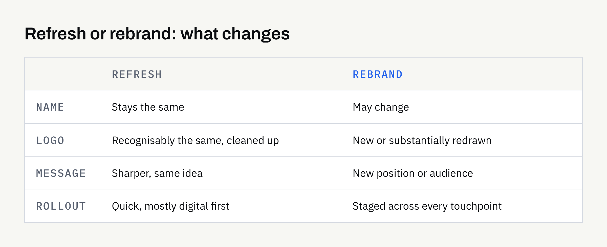

At some point, most businesses look at their logo, their leaflets and their website and think: this no longer feels like us. The next thought is usually "we need a rebrand".

Sometimes that is true. Often it is not. A brand that looks dated may only need tidying, while a brand that looks fine may be telling customers the wrong story. Knowing which situation you are in saves money, time and a good deal of confusion.

This guide explains the difference between a refresh and a rebrand, the signs that point to each, and what to settle before you brief a designer.

## What is the difference?

The words are used loosely, so it helps to define them.

- **A refresh** keeps the idea of your brand and improves how it is expressed. The name stays, the logo is recognisably the same, and the changes are to things like colour, typography, spacing, file quality and consistency.
- **A rebrand** changes the idea itself. That might mean a new name, a new logo, a new position in the market, or a new way of speaking to customers.

Think of a refresh as renovating a house you still want to live in. A rebrand is moving somewhere else.

Neither is better. The right one depends on what has actually changed in your business, not on how long the current logo has been around.

## Signs you probably need a refresh

A refresh is usually enough when the business itself is sound but the presentation has drifted.

- **Inconsistency:** Your logo appears in three slightly different versions, and your colours differ between the website, invoices and social media.
- **Poor files:** The only logo you have is a low-resolution image that looks blurry when enlarged. Our guide to [logo file formats](https://fintaxtech.co.uk/blog/logo-file-formats-explained/) explains what a complete set looks like.
- **Dated details:** The idea is still right, but the typeface, colour palette or layout styles look as if they belong to another decade.
- **Missing pieces:** You have a logo but no written rules, so each new leaflet or post is designed from scratch.
- **Digital problems:** The logo does not work at small sizes, such as a social media profile picture or a browser tab.

In these cases the foundations are fine. The work is to clean, complete and document what you already have.

## Signs you may need a rebrand

A rebrand is worth considering when the business has moved and the brand has not.

- **A change of direction:** You now serve different customers or offer different services from when the brand was created.
- **A merger or split:** Two businesses are becoming one, or one is becoming two.
- **A name that no longer fits:** The name describes something you no longer do, or causes regular confusion.
- **A genuine positioning shift:** You are moving from the cheapest option to a premium one, or the reverse.
- **A brand that was never really designed:** It was assembled quickly at the start, and there is nothing solid to refresh.

Notice that none of these is "we are bored of it". Boredom is a poor reason, because the people who see your brand daily are usually the first to tire of it and the last to be affected by it.

## A quick way to compare the two

The table below is a rough guide, not a rule. Your own circumstances matter more.

| Question | Points towards a refresh | Points towards a rebrand |
| --- | --- | --- |
| Is the name still right? | Yes | No |
| Do customers recognise and trust the current look? | Yes | Not really |
| Has the business model or audience changed? | Barely | Substantially |
| Is the problem mostly consistency and file quality? | Yes | No |
| Is there a written brand guide? | Easily added | Needs rewriting from the start |

If most of your answers sit in one column, that is a sensible starting point for the conversation.

## What recognition is worth

One thing is easy to undervalue: familiarity. If customers already know your logo and colours, those have built-up value that a complete change throws away.

A cautious approach is to ask what is worth keeping. That could be the colour that people associate with you, the shape in your logo, or the tone of your writing. A refresh can sharpen these elements without losing the connection customers already have.

Equally, if your current brand is hurting you — it is confused with another business, or it signals something you are not — then recognition is less valuable than it seems.

## Decisions to make before you brief a designer

Whichever route you take, a designer can do better work if some things are settled first. You do not need all the answers, but you should have thought about them.

### Why now?

Write down the real trigger. "Our website is being rebuilt" and "we have changed what we sell" lead to quite different projects. If you cannot name a reason beyond "it feels old", consider a refresh.

### Who is the brand for?

Describe your current customers, and the ones you would like. If they differ, say how. The brief should reflect the audience you are heading towards, not only the one you have today.

### What must stay?

List anything you are not willing to lose: the name, a colour, a symbol, a phrase. This keeps the project honest and stops it from becoming a rebrand by accident.

### What must change?

Be specific. "Make it modern" is hard to act on. "The logo is unreadable at small sizes and our colours clash with our packaging" gives a designer something to solve.

### Where will it appear?

Make a list of every place the brand is seen: signage, vehicles, uniforms, packaging, invoices, email signatures, the website, social accounts. A rebrand touches all of them, and the real cost often lies in replacing things rather than designing them. Our article on [stationery and marketing assets after the logo](https://fintaxtech.co.uk/blog/stationery-and-marketing-assets-after-logo/) can help you prioritise.

## Planning the rollout

A new look does not have to appear everywhere on the same day. Many businesses stage the change.

1. **Start with digital:** Update the website, email signature and social profiles first, as they are quick to change.
2. **Use up old stock:** There is little sense in binning a box of printed cards that are still usable.
3. **Replace public-facing items next:** Signage, vehicles and packaging follow, ideally as they come up for renewal.
4. **Tell people:** A short note to customers explaining the change avoids confusion, especially if the name or logo is noticeably different.

Printing and fabrication are done by suppliers you choose. FinTaxTech designs the assets and supplies print-ready files for your chosen printer, but does not print.

## A word on names, rights and ownership

If a rebrand includes a new business name or logo, check carefully before you commit. A design studio can create an identity, but design work on its own does not give you a trade mark or any guarantee of exclusivity. Whether a name or mark is available to you is a question for a qualified professional or the relevant official register, and this article is not legal advice.

Likewise, confirm in writing what you will own at the end of the project. Ownership of agreed final deliverables normally passes to you after full payment, as set out in the written proposal, so read that proposal before you sign.

## Write the rules down

Whichever route you choose, finish with guidelines. A refresh without documentation tends to drift again within a year. Our article on [what brand guidelines should include](https://fintaxtech.co.uk/blog/what-to-include-in-brand-guidelines/) covers compact and extended options. If you are unsure how a logo differs from a full identity, [logo vs brand identity](https://fintaxtech.co.uk/blog/logo-vs-brand-identity/) is a useful starting point.

## Checklist: before you commission the work

- [ ] I can name the real reason for the change, beyond "it looks old"
- [ ] I have checked whether the name still fits the business
- [ ] I know which elements customers recognise and should be kept
- [ ] I have listed everything that must change, and why
- [ ] I have listed every place the brand appears today
- [ ] I have a rough rollout order, starting with digital
- [ ] I have asked a qualified professional about any new name or mark
- [ ] I have confirmed in writing what I will own and when
- [ ] I have agreed that written guidelines are part of the project

## Talking it through

If you are unsure whether your brand needs a refresh or a rebrand, a short conversation is usually enough to find out. There is no obligation, and we will tell you plainly if a lighter touch will do.

**[Discuss your branding →](/enquiry/?service=branding)**
