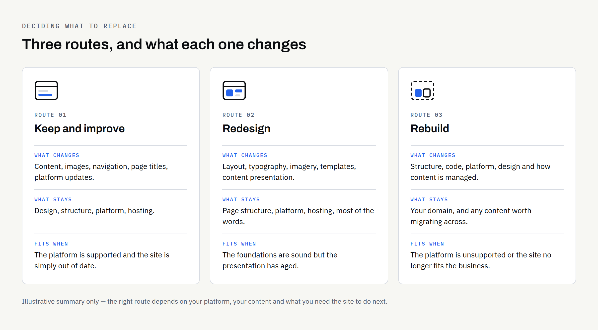
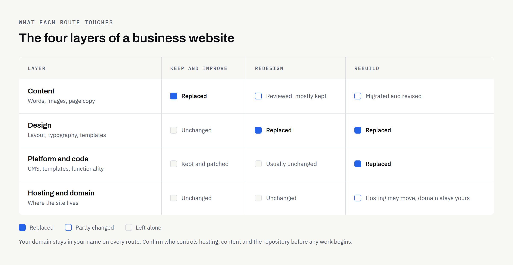

Most business owners do not wake up one morning certain that their website needs replacing. The feeling builds slowly. Something looks dated. A page is awkward to edit. Enquiries have gone quiet, and the site seems like the obvious suspect. Eventually someone suggests a redesign, someone else says the whole thing should be rebuilt, and the decision stalls because the two words get used as though they mean the same thing.

They do not. A redesign and a rebuild differ in what gets replaced, how much of the existing site survives, and how much work sits on your side of the table. This article sets out how to tell which one you actually need — and when the honest answer is that you need neither.

## Start with the problem, not the platform

Before comparing options, write down what is actually going wrong, in plain language and without guessing at causes. Not "the site needs modernising" but "the contact form sends enquiries to an inbox nobody checks", or "I cannot update prices without emailing someone".

This matters because the three routes below solve very different problems. A rebuild will not fix vague copy, and new copy will not fix an unsupported platform. If you cannot name the problem, any quote you receive will be a guess dressed up as a plan — one of the reasons [website quotes vary so much between suppliers](https://fintaxtech.co.uk/blog/small-business-website-quotes-vary/).

## Three routes, not two

### Keep and improve

The site stays as it is structurally. You update content, replace images, tidy the navigation, fix broken links, improve page titles and descriptions, and keep the platform patched. No new design, no new code.

This is the right route far more often than people expect. A site built sensibly a few years ago, on a platform that is still supported, will usually respond well to a content pass and a maintenance routine. It is also the cheapest way to find out whether the website was ever the real problem.

Worth being straightforward about scope here: ongoing repair work on an existing codebase is not something every studio takes on, and FinTaxTech does not — we work on new builds and complete rebuilds. If this route fits you, speak to whoever maintains the site now, or to a developer who specialises in maintenance work.

### Redesign

The look and the layout change. The words, the page structure and usually the underlying platform stay. Think new templates, new typography, new imagery, a clearer homepage — sitting on the same foundations.

A redesign makes sense when the content is broadly right and the platform is healthy, but the presentation has aged or was never quite right. It is a smaller undertaking than a rebuild, though "smaller" still means real work: someone has to decide what every page type looks like and make sure nothing breaks along the way.

### Rebuild

The site is built again from the ground up: new structure, new code, often a new platform, and a fresh decision about how content is managed. Existing text and images can be carried across, but they are migrated into something new rather than reused in place.

A rebuild is the right answer when the foundations are the problem — an unsupported platform, a structure that no longer matches the business, or functionality the original build was never designed to carry.

## What each route actually replaces

Thinking in layers helps. Every website is roughly four things stacked together: the content you publish, the design that presents it, the platform or code that runs it, and the hosting and domain it lives on. Keeping and improving touches the top layer, a redesign touches the top two, and a rebuild touches everything except, usually, the domain — which stays yours throughout.

That last point is worth holding on to. Whichever route you take, you should keep control of the domain, the hosting account, the content and the repository. If you are unsure who holds what today, sort that out before commissioning anything — our article on [who owns your business website after launch](https://fintaxtech.co.uk/blog/who-owns-your-business-website/) walks through the accounts to check.

## Which symptoms point where

The table below is a starting point for a conversation, not a diagnosis. Two businesses can report the same symptom and need completely different work.

| What you are noticing | Usual underlying cause | Route that often fits |
| --- | --- | --- |
| Pages look dated next to competitors | Visual design has aged; structure is broadly sound | Redesign |
| Text is thin, wrong or years out of date | Content has not been maintained | Keep and improve |
| Any edit needs a developer | No usable CMS, or it was never set up for you | Redesign or rebuild, depending on the platform |
| Slow or awkward on phones | Heavy templates, unoptimised images or ageing hosting | Investigate first — sometimes a fix, sometimes structural |
| Nobody knows who built it or where it is hosted | Access was never properly handed over | Sort ownership first, then decide |
| Security warnings or an unsupported platform version | The platform is past end of support | Rebuild |
| The business now sells something different | Site structure no longer matches the business | Rebuild |
| You need bookings, accounts or payments it was never built for | Scope has outgrown the original build | Rebuild, and consider whether you need a web application |

That last row is a genuine fork in the road. If what you are describing is closer to software that customers log into than to a set of pages they read, the distinction in [website vs web application](https://fintaxtech.co.uk/blog/website-vs-web-application/) is the one to settle before anything else.

## Five questions to answer before you decide

**Is the platform still supported?** Check whether the software your site runs on still receives updates from whoever maintains it. An unsupported platform is the clearest single argument for a rebuild, because the risk grows quietly and no amount of design work reduces it.

**Can you edit the site yourself?** If routine changes — prices, opening hours, a new staff member — require someone else, that is a structural issue rather than a cosmetic one. Whether it needs a rebuild depends on the platform, and [whether your website needs a CMS](https://fintaxtech.co.uk/blog/does-your-website-need-a-cms/) is worth reading before you assume it does.

**Has the business changed more than the site has?** A site built for a two-person consultancy rarely stretches to a larger firm with three service lines. Structure, not styling, is what fails first.

**What evidence do you have that the site is the problem?** Look at where enquiries actually come from before assuming the website is the weak link. If most of your work arrives by referral and always has, a rebuild may still be worth doing — but it will not necessarily change your enquiry numbers.

**What happens if you do nothing for six months?** Sometimes the answer is "nothing much", which is useful information. Sometimes it is "we carry on running software that no longer receives security updates", which settles the matter.

## Do not throw away what is already working

Rebuilds go wrong most often in the migration, not the build. A few things to protect deliberately:

**Existing page addresses:** If a page currently ranks or gets linked to, either keep its address or redirect the old one to the new page. Do not let addresses change silently.

**Content that took effort to write:** Case studies, detailed service pages and answers to common customer questions are assets. Review them, but do not bin them because they are old.

**Tracking and forms:** Whatever measures your enquiries today needs to exist on the new site from day one, or you lose any ability to compare before and after.

**Accessibility:** If you are replacing the site anyway, it is the cheapest moment to improve how usable it is for people with disabilities. The W3C's [WCAG 2 Overview](https://www.w3.org/WAI/standards-guidelines/wcag/) is the official starting point, and requirements vary by sector and jurisdiction, so check what applies to you.

A rebuild is also the natural moment to work through a full pre-launch list rather than discovering gaps afterwards — [our launch checklist](https://fintaxtech.co.uk/blog/new-business-website-launch-checklist/) covers what a new site should have in place before it goes live.

## What to settle in writing

Whichever route you choose, agree the boundaries before work starts: what is being delivered, who provides content, and which accounts stay in your name. At FinTaxTech, ownership of the agreed final deliverables passes after full payment, as set out in the written proposal — and it is reasonable to expect any supplier to state their equivalent position clearly.

No one can promise that a new site will rank better or produce more enquiries, and you should be cautious of anyone who does. This article is general information rather than legal advice; where rights, ownership or compliance obligations are involved, confirm the position in writing and take proper advice if the stakes justify it.

## Your decision checklist

- [ ] Write down the three specific problems you want solved, in plain language
- [ ] Check whether your current platform is still supported and patched
- [ ] Confirm who controls the domain, hosting, content and repository
- [ ] List the pages that currently earn attention, so they survive any move
- [ ] Decide whether you need to edit the site yourself, and how often
- [ ] Note any new functionality the current site was never built to carry
- [ ] Look at where your enquiries actually come from today
- [ ] Ask what happens if you change nothing for six months
- [ ] Get the scope, content responsibilities and ownership terms in writing

If you work through that list and the answer is "content and maintenance", that is a good outcome — spend the money there instead. If the foundations are the problem and a complete rebuild is what you need, we are happy to look at it with you, and to say so plainly if we think a smaller piece of work would serve you better.

Our enquiry questionnaire runs in your browser and produces a PDF on your own device, so you can read it over before deciding to send anything.

**[Talk to us about a website rebuild →](/enquiry/?service=websites)**
