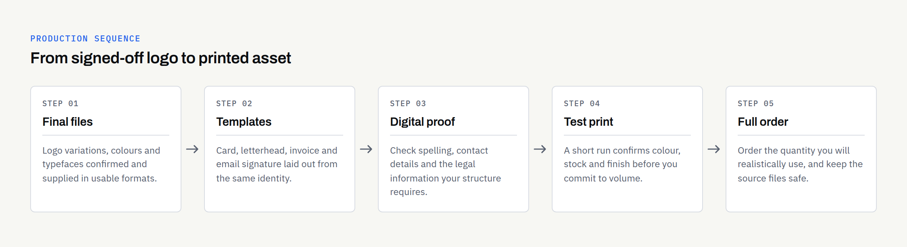

Signing off a logo feels like the finish line. It usually is not. Within a week or two you need something to hand to a customer, something to put at the top of a quote, and something that appears under every email you send. That is when most new business owners discover that a logo on its own does not do very much.

The good news is that the list is shorter than it looks. A small business does not need a full print suite on day one. It needs a handful of assets that match the way it actually trades, produced properly so they can be reused for years. This guide sets out what usually comes first, what can wait, and what to check before you place an order.

## Start with what people already ask you for

Before you decide anything, spend ten minutes listing every moment in the past month when someone asked you for something in writing. A price. An invoice. A contact detail. A leaflet at an event. A link to a page.

That list is your real brief. It is far more reliable than a generic checklist, because it reflects how your customers find you and what they expect to receive. A mobile dog groomer and a firm of consultants both need branding, but almost nothing on their first order will overlap.

If you have not yet settled what the brand actually consists of — the logo variations, the colours, the typefaces — it is worth reading [Logo vs Brand Identity: What Does a New Business Actually Need?](https://fintaxtech.co.uk/blog/logo-vs-brand-identity/) before you commission artwork. Ordering stationery from an incomplete identity tends to mean ordering it twice.

## Tier one: the assets almost every business uses

These four turn up in nearly every small business, whatever the sector. They are cheap to produce, they get used constantly, and they set the tone for everything that follows.

| Asset | What it is actually for | Print or digital |
| --- | --- | --- |
| Business card | Handing over contact details in person, at events, on site | Print |
| Email signature | The thing your customers see most often, several times a week | Digital |
| Quote and invoice template | Looking established at the exact moment someone decides to pay you | Digital, sometimes printed |
| Letterhead | Formal letters, references, contracts, anything on headed paper | Both |

A few notes on each.

**Business card:** Still useful, and usually the cheapest branded item you will buy. Keep it to the details you genuinely want someone to use. A card crowded with four phone numbers and three social handles gets ignored.

**Email signature:** Easy to overlook and disproportionately visible. Ask for it as a simple, well-structured block that works in plain text as well as formatted email, and avoid large images — they often appear as broken attachments or get stripped by the recipient's mail client.

**Quote and invoice template:** Worth doing properly once. Whatever software you raise invoices in, the layout, logo placement and typography should match everything else you send.

**Letterhead:** You may print very few. You will still want a digital version for PDFs. A single well-set template usually covers both.

## Tier two: assets that depend on how you trade

This is where the generic checklists stop being useful. What you order next depends entirely on where your customers encounter you. The table below is a starting point, not a prescription.

| If your business | The assets usually worth doing next |
| --- | --- |
| Visits customers' homes or premises | Vehicle graphics, ID badge, branded workwear, a simple leaflet to leave behind |
| Has a shop, studio or office customers visit | Exterior signage, window graphics, a price or menu board, packaging or stickers |
| Sells mainly online | Social media profile and banner images, packaging inserts, email templates, ad creative |
| Sells to other businesses | Proposal and slide templates, a one-page capability sheet, a well-set case study layout |
| Exhibits or attends events | Pull-up banner, table cover, a short-run leaflet, a QR code linking to a specific page |

Two things are worth saying about this list. First, most businesses sit in more than one row, and that is fine — pick the row where you spend the most time. Second, almost every item here works better once the website is live, because so many of them point people towards it. If that part is still in progress, [What Should a New Business Website Include? A Practical Launch Checklist](https://fintaxtech.co.uk/blog/new-business-website-launch-checklist/) covers the groundwork.

## What UK law expects on your business documents

This is one area where getting it wrong is genuinely awkward, so it is worth checking rather than assuming. The requirements differ depending on how your business is set up.

If you run a **limited company**, gov.uk states that you must include your company's name on all company documents, publicity and letters, and that on business letters, order forms and websites you must also show the company's registered number, its registered office address, where the company is registered, and the fact that it is a limited company. There are also rules about displaying a sign at your registered address, with an exemption if you run the business from home. The current guidance is on the [gov.uk page on signs, stationery and promotional material](https://www.gov.uk/running-a-limited-company/signs-stationery-and-promotional-material).

If you are a **sole trader**, gov.uk states that you must include your name and business name, if you have one, on official paperwork such as invoices and letters — see [choosing your business name](https://www.gov.uk/become-sole-trader/choose-your-business-name). For a **partnership**, the equivalent guidance says all the partners' names and the business name must appear on official paperwork: see [naming your partnership](https://www.gov.uk/set-up-business-partnership/naming-your-partnership).

Invoices have their own separate requirements, particularly if you are VAT registered, and those are set out on gov.uk as well.

This is general information, not legal advice, and the rules can change. Check the official pages for your own circumstances, or ask your accountant or solicitor, before a print run — a thousand cards with the wrong registered address is an expensive correction.

Two related points are worth flagging here. Designing a logo or a name does not give you trade mark rights and does not guarantee that nobody else can use something similar. If a name or mark matters commercially, take separate advice on registering and protecting it, and confirm in writing who owns the final artwork — for our own work, ownership of the agreed final deliverables passes to the client after full payment, on the terms set out in the written proposal.

## Getting artwork ready for print

Print is less forgiving than screens. Three things cause most of the problems.

**Bleed and safe area:** Printers trim slightly inside or outside the cut line, so any background colour needs to extend past the edge — that overhang is the bleed. Text and logos need to sit comfortably inside a safe margin so nothing important gets sliced off. Your printer will publish their own required measurements; use theirs rather than a generic figure.

**Resolution:** A logo pulled from a website is almost never good enough for print. Artwork should come from vector files wherever possible, and any photography should be supplied at print resolution rather than screen resolution.

**Colour:** Screens use RGB, most printing uses CMYK, and some processes use spot colours. The same brand blue can look noticeably different across the three. If exact colour matching matters to you — and for some brands it genuinely does — say so early, and ask for a printed proof rather than approving on screen.

Having the right files to hand makes all of this straightforward. [Which Logo File Formats Does Your Business Need?](https://fintaxtech.co.uk/blog/logo-file-formats-explained/) explains what each format is for and which one your printer will ask for.

## Keeping it consistent once you add more

The first three or four items are easy to keep consistent because one person made them at the same time. Item eleven, ordered eight months later from a different supplier, is where drift creeps in — a slightly different blue, a logo squashed to fit, a typeface nobody has a licence for.

A short written reference solves most of it: colour values in the formats you will actually be asked for, the logo variations and their minimum sizes, the typefaces and where they came from, and a few clear examples of what not to do. [What Should Brand Guidelines Include?](https://fintaxtech.co.uk/blog/what-to-include-in-brand-guidelines/) goes through what that document sensibly contains at different sizes of business.

## What can usually wait

Not everything needs to exist in month one. Things that commonly get ordered too early include branded merchandise, large-format signage before premises are confirmed, printed brochures before the offering has settled, and anything produced in bulk to get the unit price down. Short runs cost more per item, but they cost far less than reprinting a thousand of the wrong thing.

As an illustrative example — invented, not a client — a new consultancy might order 100 cards, an email signature and a proposal template in its first month, then add a capability sheet and slide template once it has seen which questions prospects actually ask. That order is deliberately small, and it is easier to correct.

## Before you place the order

- [ ] Listed the moments customers actually ask you for something in writing
- [ ] Confirmed the logo variations, colours and typefaces are final
- [ ] Checked which legal details must appear for your business structure
- [ ] Confirmed contact details, address and web address are the ones you will still be using next year
- [ ] Asked the printer for their bleed, safe area and file format requirements
- [ ] Reviewed a digital proof, and a printed proof where colour matters
- [ ] Ordered a short run first, before committing to volume
- [ ] Stored the final source and export files somewhere you control
- [ ] Noted the colour values and typefaces for whoever makes the next item

If you would like a second pair of eyes on what to produce first, we are happy to talk it through — including where you would be better off spending nothing at all for now. FinTaxTech Ltd is a Dundee-based studio working with businesses across the UK on branding and graphic design, websites, mobile apps and AI-assisted content services.

**[Talk to us about your branding →](/enquiry/?service=branding)**
