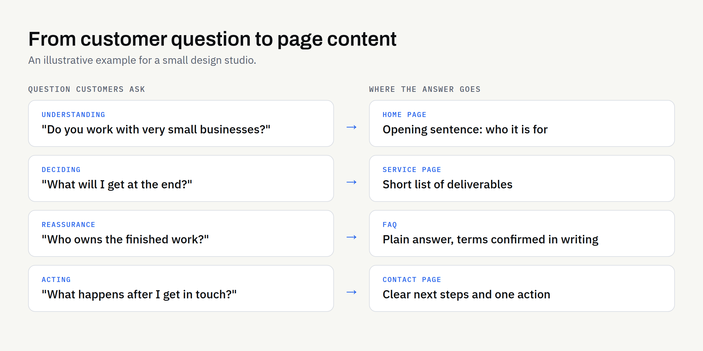

Most business websites are written from the inside out. They describe the company, its history and its services in the order the owner thinks about them. Visitors arrive with a different order in mind: "Can you help me? Is it right for me? What happens next?"

Good website copy answers those questions quickly and plainly. It does not need to be clever. It needs to be clear, specific and easy to find.

This article sets out a practical way to gather the questions your customers ask, turn them into page content, and check the result before it goes live. It is written for business owners, not writers, and none of it requires special tools.

## Start with questions, not with pages

Before you write a word, collect the questions. The best source is the one you already have: the conversations you have with customers.

### Where to find the real questions

- **Enquiry emails and messages:** Look at what people ask first, and what they ask again after your reply.
- **Phone calls and meetings:** Note the questions you answer repeatedly. If you have said the same thing ten times, it belongs on the website.
- **Quotes and proposals:** The sections customers query or push back on show where the website could have explained more.
- **Your team:** Whoever speaks to customers most often usually knows the common worries better than anyone.
- **Reviews and feedback:** Customers often describe in their own words what they were unsure about before they bought.

Write each question down in the customer's own words, not yours. "Do you work with very small businesses?" is more useful than "Target market".

### Sort them into stages

Questions tend to fall into a few stages of a customer's thinking. Sorting them helps you decide where each answer belongs.

| Stage | Typical questions | Where the answer usually lives |
| --- | --- | --- |
| Understanding | What do you do? Who is it for? | Home page, service pages |
| Deciding | How does it work? What will it involve? Why you? | Service pages, process section, about page |
| Reassurance | What if something goes wrong? Who owns the work? | FAQ, terms summary, about page |
| Acting | How do I get in touch? What happens after I do? | Contact page, enquiry page |

This table is a starting point, not a rule. A simple service may not need every stage; a complex one may need more.

## Answer the question in the first sentence

Visitors skim. A heading and the first sentence beneath it do most of the work, so put the answer there and use the rest of the section for detail.

Compare these two openings for a page about a service:

- **Weaker:** "We have been passionate about helping local businesses since we started, and we pride ourselves on our values."
- **Stronger:** "We design logos and brand guidelines for new and growing businesses. You get files ready to use on your website and to send to your chosen printer."

Both are illustrative, and neither is a promise on anyone's behalf. The point is that the second tells a visitor within seconds whether they are in the right place.

### Use headings that are questions or plain labels

Headings such as "How the process works" or "What is included" help skimmers and screen-reader users alike. Avoid headings that only make sense once you have read the paragraph, such as "Our approach" or "The difference".

## Be specific, and be honest about limits

Specific copy builds trust. Vague copy ("tailored solutions", "end-to-end service") could describe any business and so tells the visitor nothing.

Specific does not mean boastful. If you cannot back a claim up, leave it out. Do not invent figures, testimonials or results, and avoid promising outcomes that depend on things outside your control, such as search rankings or sales.

It is equally useful to say what you do not do. A line such as "We build new websites and complete rebuilds, and we do not repair other people's older code" saves time on both sides. Visitors who are not a fit leave quickly; those who are a fit trust you more.

Where a topic touches on rights, ownership or compliance, say plainly that your page is general information and not legal advice, and that terms should be confirmed in writing.

## Plan the page order around the visitor

A reliable order for a service page runs like this:

1. **What it is and who it is for:** One or two sentences.
2. **What the customer gets:** A short list of deliverables.
3. **How it works:** The steps, in plain language.
4. **What it depends on:** What you need from the customer, and any limits.
5. **Common questions:** Short answers to the real questions you collected.
6. **What to do next:** One clear action.

If you want to see how this fits into a wider build, our [new business website launch checklist](https://fintaxtech.co.uk/blog/new-business-website-launch-checklist/) covers the pages most small sites need.

### Give each page one job

A page that tries to sell three services, tell the company story and collect enquiries rarely does any of them well. Decide the single question each page answers, and move the rest elsewhere.

## Make the next step obvious

Every page should end with a clear next step that matches where the visitor is. A person still reading about how a service works may not be ready for "Buy now", but may welcome "See what to prepare" or "Ask a question".

Use one primary action per page, written as a plain verb phrase: "Start an enquiry", "Read the process". Repeating the same link at the end of long sections is fine; offering five different choices is not.

## Keep the voice consistent

Visitors notice when one page sounds friendly and another sounds like a contract. Pick a few simple rules and apply them everywhere:

- Use "you" and "we", not "the client" and "the company".
- Prefer short sentences and everyday words.
- Explain a technical term the first time it appears, or avoid it.
- Choose one spelling convention and stay with it.

If you plan to use AI tools to help draft or tidy text, set the voice rules first and review the output carefully. Our articles on [keeping your brand voice consistent with AI-assisted content](https://fintaxtech.co.uk/blog/brand-voice-with-ai-assisted-content/) and [reviewing AI-assisted content](https://fintaxtech.co.uk/blog/how-to-review-ai-assisted-content/) set out how.

## Get the copy ready before the build needs it

Copy is one of the most common reasons a website launch slips. Designs built around placeholder text often need reworking when the real words are longer or shorter than expected. We cover this and the other usual holdups in [what slows a website build down](https://fintaxtech.co.uk/blog/what-slows-a-website-build-down/).

A practical approach is to agree the page list first, then write the key pages in order of importance: home, main services, about, contact. Smaller pages can follow, as long as the structure is settled.

### Who should write it?

You can write it yourself, ask a colleague, or work with a writer. You know your customers best, so even if someone else does the polishing, your question list is the most valuable input. If you would like help turning existing documents into website text, that is something our AI Automation service can support, subject to the limits on material it can handle.

## A simple test before you publish

Read each page as if you were a new customer and had thirty seconds. Then check:

| Check | What to look for |
| --- | --- |
| First impression | Can you tell what the page is about from the heading and first sentence? |
| Clarity | Is there any word or phrase a stranger would not understand? |
| Evidence | Is every claim something you can support? |
| Limits | Does the page say what you do not do, where that matters? |
| Next step | Is there one obvious action at the end? |
| Accuracy | Are names, contact details, services and legal wording correct? |

Ask someone outside the business to read it too. Their questions show where the copy still has gaps.

## Copy planning checklist

- [ ] I have collected real customer questions from emails, calls and feedback.
- [ ] The questions are written in my customers' own words.
- [ ] Each question is matched to a page or section.
- [ ] Every page has one clear job.
- [ ] Each heading and first sentence answers the question it raises.
- [ ] Claims are specific and I can support each one.
- [ ] The copy says what we do not do, where it matters.
- [ ] Rights, ownership and compliance wording is general, with terms confirmed in writing.
- [ ] Each page ends with one clear next step.
- [ ] Voice rules are agreed and applied consistently.
- [ ] Someone outside the business has read it.
- [ ] The key pages are written before design and build need them.

## Planning a website and want to start with the right content?

If you are planning a new website or a complete rebuild, we can talk through the structure and content with you. There is no obligation, and our enquiry questionnaire creates a PDF on your own device, so you can look it over before sending anything.

**[Start a website enquiry →](/enquiry/?service=websites)**
