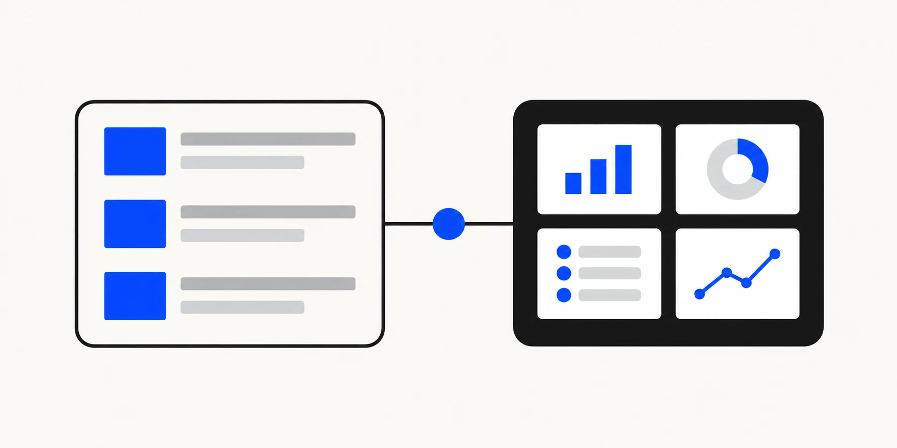

Most businesses know they need something online. Far fewer know whether that should be a website, portal, dashboard or full application. Because those words are used loosely, two suppliers can interpret the same brief as entirely different projects.

There's a single question underneath all of it: **what must your users be able to accomplish?** Everything else follows.

---

## 1. Why the terms are commonly confused

Both live in a browser, both have pages, both can look identical to a visitor. The difference isn't visual. It's what happens after someone arrives.

Two other confusions muddy things further.

**"Static" is assumed to mean plain.** It does not. A static site can use sophisticated design and browser-based interaction. The term describes how its pages are produced and delivered, not how they look.

**"Dynamic" is assumed to mean better.** It is not. Dynamic systems can retrieve or change content and data in response to a user, request or event. That capability is valuable when the service needs it and unnecessary complexity when it does not.

Neither word is a quality rating. They describe machinery, and the right machinery depends entirely on the job.

---

## 2. What is a business website?

A website exists to explain, build trust and generate enquiries. Visitors read, look, and decide whether to contact you.

The typical shape is a homepage, service pages, company information, useful resources or case studies, and a contact route. Information mainly flows outward. A visitor might send an enquiry, subscribe to updates or download a resource.

Success is usually measured in visibility and conversion—qualified visits, enquiries and booked conversations. The site may collect form submissions, but it does not normally maintain an ongoing personalised workspace for every visitor.

That is not a limitation. For many businesses it is the whole job, and extra machinery would not improve the customer journey.

---

## 3. What is a web application?

A web application exists so users can accomplish something. They interact with data and workflows, and the software performs tasks on their behalf. Many web applications require an account, although authentication is not the definition by itself.

The signs are consistent: accounts and logins, data belonging to specific people, workflows with steps and states, and screens whose contents differ depending on who's looking at them. Bookings, submissions, approvals, uploads, dashboards, records.

Behind that usually sits additional infrastructure: user records, authentication, permissions, session handling, audit trails and security controls appropriate to the data and actions involved.

Success is measured differently too. Not traffic, but task completion. Did users do the thing, quickly, without contacting support?

---

## 4. Website versus web application

|                         | Business website                                 | Web application                                          |
| ----------------------- | ------------------------------------------------ | -------------------------------------------------------- |
| **Main purpose**        | Explain, build trust, generate enquiries         | Let users complete tasks                                 |
| **User action**         | Reads, browses, submits an enquiry               | Completes workflows and manages data                     |
| **Accounts**            | Often unnecessary                                | Common, where identity or permissions matter             |
| **Content**             | Mainly shared public content                     | May change by user, task or stored data                  |
| **Data held**           | Usually limited to enquiries and analytics       | Persistent user or business records, sometimes sensitive |
| **Success measured by** | Traffic, rankings, enquiries                     | Task completion, retention                               |
| **Operations**          | Content, analytics and form handling             | Hosting, monitoring, security, data and user support     |
| **Change risk**         | Usually concentrated in content and presentation | Can affect workflows, permissions and stored data        |

A web application is not simply a website with extra pages. It is operational software, with responsibilities that continue after launch.

---

## 5. Choose a website when your main goal is visibility and leads

A website is the right answer when your online presence needs to bring people to you rather than serve them once they arrive.

That is the case if buying from you happens through a conversation, quotation or meeting. It also applies when customers need to understand and trust you before engaging—professional services, consultancies, trades and clinics, for example—and when the main outcome you need is a qualified enquiry.

The test: **if nobody ever needed a personalised workspace, would anything be lost?** If the honest answer is no, build the website well and focus your effort on useful content, trust and a clear enquiry journey.

---

## 6. Choose a web application when users must complete ongoing tasks

A web application is right when the value happens _inside_ the software, repeatedly.

The signals are recognisable. Users come back regularly to do something rather than read something. Each user's view depends on their own data. There's a process with stages — submitted, in review, approved. Something today is handled by email, spreadsheets and manual copying, and it's straining. Or your staff need to see and manage what customers have done.

One useful signal is a repeated process currently handled through email, spreadsheets and manual copying. Measure its volume, errors and delays before deciding whether custom software is justified.

---

## 7. When your business needs both

This is a common answer for growing businesses. It may be one coordinated product, but its public and private areas have different jobs.

The pattern: a public marketing website that anyone can find through search, plus a private application behind a login for existing customers or staff. The website earns attention. The application delivers the service.

They can be separate deployments or clearly separated parts of one architecture. Either way, they should share branding and a coherent journey while allowing the private application to be secured and operated according to its own risks.

Sequence them according to the business need. A new service may need a public website to generate demand first; a software product may need a working application before marketing claims can be demonstrated.

_The public experience earns attention and explains the offer. The private application lets authorised users complete ongoing tasks._

---

## 8. Static website, CMS and web application: three separate decisions

These get collapsed into one choice and shouldn't be.

**Static or dynamic** describes how content is produced and updated. Static pages are generated ahead of time and served as files. They can still contain interactive components or connect to external services. Dynamic systems produce or retrieve changing data at runtime. A static architecture can reduce the runtime attack surface, but it still requires secure dependencies, forms, third-party services and deployment settings.

**With or without a CMS** is about how authorised people manage content. A CMS may be useful when non-technical editors publish frequently or follow an approval workflow. A simpler file-based process may be better when changes are infrequent and handled by the development team.

Crucially, a modern static site _can_ have a CMS. Content can be edited through a friendly interface and published by rebuilding the site. This provides editability without requiring a public runtime database solely to serve the content.

**Website or application** is the decision this article is about: do users mainly consume information, or do they manage their own data and complete ongoing tasks?

Three axes, not one. A static, CMS-managed marketing site alongside a separate secured application is one valid combination.

FinTaxTech's own lead-generation website demonstrates another valid combination: a static Astro site hosted on GitHub Pages, with questionnaires that generate documents in the visitor's browser. The answers are not saved by the website and are shared only when the visitor chooses to send them.

---

## 9. Examples

**A professional-services firm** — accountancy, law, surveying. Clients arrive through search and referral, then convert through conversation. **A website.** Fast, well-written, with strong local search presence. A portal comes later, if document exchange volume justifies it.

**An appointment-booking business** — clinic, salon, garage. Customers need real availability and self-service booking. **A website with booking functionality**, often using a suitable third-party booking system. Custom booking becomes a web application and should be justified by requirements an existing service cannot meet well.

**A customer document portal.** Clients log in to upload, download and check status. **A web application**, with a marketing website in front of it. Sensitive documents make security and access control central rather than incidental.

**An internal staff dashboard.** Rotas, jobs, reporting, approvals. **A web application.** It may have no public marketing element, and access should be restricted to authorised users.

**An online marketplace.** Two sides transacting, with listings, payments and messaging. **A full web application** with substantial operational complexity. Public listing pages may need to be discoverable in search, so the boundary between public and private requires deliberate design.

---

## 10. Questions to answer before development

1. **What must a user be able to accomplish?** Write it as verbs. Read, compare, enquire — that's a website. Submit, track, approve, book — that's an application.
2. **Does anyone need an account or personalised workspace?** A login alone does not define a web application, but persistent user-specific tasks are a strong signal.
3. **Whose data would you hold, and how sensitive is it?** Names and emails, or financial and health records? This determines the safeguards and compliance work that may be required.
4. **How often does content change, and who changes it?** Determines whether a CMS earns its keep.
5. **What are you doing manually today?** Often the strongest evidence for an application.
6. **Who maintains it in two years?** An application without an owner degrades.
7. **Do you need to be found in search?** If yes, important public content must be accessible to search engines. Google does not crawl pages that require login, according to its [technical requirements for Search](https://developers.google.com/search/docs/essentials/technical).

---

## 11. Why unnecessary backend functionality creates avoidable complexity

Every feature behind a login brings a permanent tail with it.

A database needs backing up, and recovery needs testing. User accounts require password resets, access controls, lockout handling and deletion processes. Personal data may bring privacy obligations based on where the organisation and users are located. UK-based organisations should assess the [UK GDPR's scope](https://ico.org.uk/for-organisations/uk-gdpr-guidance-and-resources/personal-information-what-is-it/who-does-the-uk-gdpr-apply-to/), while international projects may involve additional laws. Obtain qualified advice for your circumstances. Servers, managed services and dependencies all require ownership and maintenance. Authentication also introduces an attack surface that a public content page does not have.

Those responsibilities are reasonable when the functionality justifies them. Without a user need, they become avoidable operational overhead.

A common mismatch is a marketing site built on a heavy dynamic platform, with a database and administrator login, even though its public content never changes by user. The extra operational surface may deliver no customer benefit. The complexity was inherited from a default choice rather than justified by the requirements.

Ask what each moving part does for a user. Parts that can't answer shouldn't be there.

---

## 12. How AI assists delivery while people remain responsible for architecture and security

AI tooling can accelerate parts of web delivery—page scaffolding, component code, content drafts, test preparation and routine migrations. FinTaxTech uses it to make delivery more focused while keeping people responsible for the result.

AI should not own the consequential decisions: whether a login is needed, how read-only access should work, where personal data lives, how long it is retained, or what happens to a half-finished submission when the connection drops. Those architecture and security choices require informed human accountability.

Generated code may compile and appear to work. Whether it is safe to place customer records behind it is a separate question, answered through architecture, review and testing rather than output alone. We use AI to accelerate mechanical work while retaining human accountability for consequential decisions.

---

## 13. Decision checklist

- [ ] The main thing users must accomplish, written as a verb
- [ ] Whether anyone needs an account or personalised workspace
- [ ] Data you'd hold, and how sensitive it is
- [ ] How often content changes, and who edits it
- [ ] What's currently handled manually, and at what volume
- [ ] Whether search visibility matters, and for which pages
- [ ] Whether the public and private parts should be separate systems
- [ ] Static, CMS-managed, or dynamic — decided deliberately, not inherited
- [ ] Who owns maintenance, security updates and operational support
- [ ] What you'd build first if you could only build one thing

If the last item is a website and you're being quoted for an application, ask why. If it's an application and you're being quoted for a website, ask that too.

---

## Tell us what your users need to do

FinTaxTech creates new websites and web applications, as well as complete redesigns, for clients worldwide. We do not take on isolated repairs to poor-quality legacy code.

Our guided questionnaire covers users, tasks, data and content. Your answers remain on your device unless you choose to share the generated document with us. Any quotation will be based on the requirements you provide rather than a generic package.

Planning a new website or complete redesign? Tell FinTaxTech what your users need to accomplish.

**[Plan your website with FinTaxTech →](/start/)**
