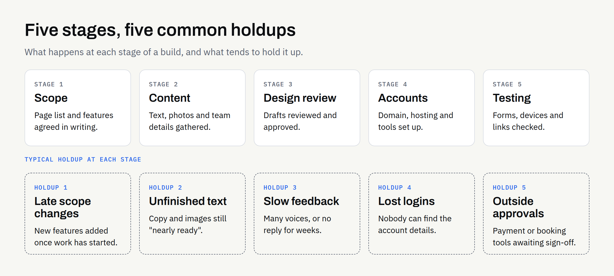

When a website launch runs late, it is tempting to assume the build itself is the problem. Sometimes it is. Far more often, the work is waiting on something that only the business owner can supply: a decision, a piece of text, a login or a sign-off.

None of this is a criticism. Running a business is demanding, and a website rarely tops the list on a busy Tuesday. But a project is a chain of small hand-offs, and a delay at one link moves everything after it.

This article sets out the most common holdups on the client side, and what you can settle early to avoid them. It describes patterns, not promises: we can't give a universal timescale, because a ten-page brochure site and a booking system are very different jobs.

## Why delays usually start before any design is drawn

A website build needs roughly three things from you: clear decisions, finished content and access to the accounts involved. If any of the three is missing, the designer or developer has two choices — stop, or guess.

Guessing feels faster, but it usually costs more later. A page built around placeholder text often needs reworking once the real words arrive, because real words are longer, shorter or shaped differently from the ones imagined.

So a sensible studio will ask for things up front, and it is worth knowing why.

## The five most common holdups

### 1. Content that is "nearly ready"

This is the most frequent cause of slipped launches. Text exists in someone's head, or in a half-finished document, or on the old website with a note to "freshen it up".

Writing for the web is real work. It means deciding what each page says, in what order, and for whom. Photographs, team biographies, service descriptions and prices all need to exist in a usable form before they can be placed.

If you would like a hand with the words, say so at the start, so that it can be planned and agreed in writing rather than assumed.

### 2. Unmade decisions about scope

"We'll add booking later" and "perhaps customers should be able to log in" are the sorts of sentences that quietly change a project. Each one can turn a simple site into something larger — we explain the difference in [website or web application: which does your business need](https://fintaxtech.co.uk/blog/website-vs-web-application/).

Changing scope mid-build is not forbidden, but it does mean revisiting the design, the quote and the schedule. It is far cheaper to decide before work starts.

### 3. Slow or split feedback

Feedback is where many projects lose weeks. Common patterns include:

- **One round, many voices:** Three people review separately and send conflicting comments.
- **Silence:** A draft sits unopened for a fortnight, and then a long list of changes arrives.
- **Moving goalposts:** Approved sections are reopened late in the project.

The fix is simple but needs discipline: nominate one person who gathers comments and gives a single, consolidated reply.

### 4. Access to accounts you own

A launch needs a domain name, somewhere to host the site and often an email setup, analytics and a business profile on other services. Those accounts should belong to you — we cover why in [who owns your business website after launch](https://fintaxtech.co.uk/blog/who-owns-your-business-website/).

The catch is that someone has to find the login, or remember which email address was used five years ago, or contact the previous supplier. Account recovery can take days. It is worth checking now, long before launch week.

### 5. Third-party tools and approvals

Payment providers, booking tools and email services often have their own sign-up, verification and approval steps. These sit outside anyone's control, including ours, and their timing varies. If your site depends on one, start the application early and check the provider's own documentation for what they require.

## What can wait, and what can't

Not everything has to be perfect on day one. The trick is separating what the launch genuinely needs from what can follow.

| Item | Needed before build starts | Needed before launch | Can follow after launch |
| --- | --- | --- | --- |
| Agreed page list and scope | Yes | | |
| Logo and brand colours | Yes | | |
| Core page text | | Yes | |
| Photographs and team images | | Yes | Replacements and extras |
| Domain and hosting access | | Yes | |
| Contact form recipient | | Yes | |
| Legal pages (privacy, cookies) | | Yes | |
| Blog or news articles | | | Yes |
| Extra services pages | | | Yes |
| Advanced integrations | | | Often yes |

Treat the table as a starting point. Your own project may need some of these earlier or later, and your supplier should be able to tell you which.

For a fuller view of the essentials, see [what a new business website should include at launch](https://fintaxtech.co.uk/blog/new-business-website-launch-checklist/).

## How the pieces fit together

The diagram below shows where the common holdups tend to sit in a typical build, and which side of the project normally owns each.

## Habits that keep a project moving

A few small habits make a surprising difference.

### Decide who decides

Name one person with authority to approve. Others can advise, but one voice keeps feedback coherent.

### Block out review time

Ask for the review schedule at the start and put it in your calendar. A review slot that is already booked is much harder to lose.

### Gather content in one place

A shared folder with clear file names is better than text scattered through emails. Final means final: version three of a page that someone is still editing is not ready to hand over.

### Be honest about what you don't have

If you don't have photographs, say so. If you can't decide between two services to feature, say that too. The earlier a gap is known, the more options there are for filling it.

### Keep the first version modest

A smaller site launched sooner can be extended once it is live. A sprawling site stuck in review helps nobody. If you are replacing an existing site, [should you redesign or rebuild](https://fintaxtech.co.uk/blog/redesign-or-rebuild-business-website/) is a useful first question.

## A note on timescales and quotes

We don't quote a fixed number of weeks in a blog post, because it would be misleading. Duration depends on the size of the site, how quickly decisions are made and how ready your content is. Your written proposal should set out the stages and what is expected from you at each.

If two quotes differ widely, check whether they assume the same level of content and the same number of review rounds. We've covered this in [why small business website quotes vary so much](https://fintaxtech.co.uk/blog/small-business-website-quotes-vary/).

As always, this isn't legal advice. If a contract or proposal covers delays, payment dates or ownership of the finished work, confirm the terms in writing before you sign.

## Pre-build readiness checklist

Use this before the build begins. Each tick removes a likely delay.

- [ ] One named person approves designs and content.
- [ ] The page list and scope are agreed in writing.
- [ ] Logo files and brand colours are to hand.
- [ ] Core page text is written, or a plan for who writes it is agreed.
- [ ] Photographs are chosen, or a plan for sourcing them is agreed.
- [ ] Domain registrar login has been found and tested.
- [ ] Any hosting, email or analytics accounts are in your name.
- [ ] Third-party sign-ups (payments, bookings, email) have been started.
- [ ] Privacy and cookie information has been drafted.
- [ ] Review dates are in the diary.

## Where to go from here

If you are planning a new website or a complete rebuild and would like to talk through what will be needed from you, we are happy to help. Our enquiry questionnaire creates a PDF on your own device, so you can see your answers and decide what to send us.

**[Plan your website project →](/enquiry/?service=websites)**
