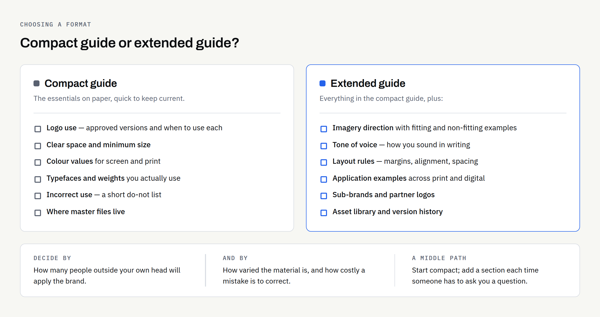
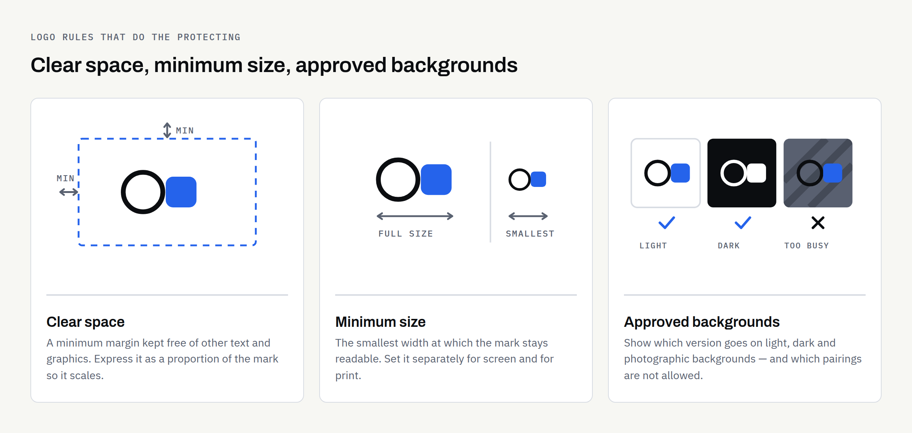

A logo arrives as a folder of files, and for a while that feels like enough. Then a printer asks which blue to use, a new member of staff builds a poster in whatever typeface was already installed, and the mark on your van no longer quite matches the one on your invoices. None of that is carelessness. It is what happens when the decisions live in one person's head instead of on paper.

Brand guidelines are the document that settles those questions once, so anyone who touches your brand makes roughly the same choices you would have made. This article covers what a guide usually contains, how a compact guide differs from an extended one, and how to judge which is proportionate for your business right now.

## What brand guidelines are actually for

A guide is not a design showcase. It is a reference document with one job: to let someone who was not in the room produce something on-brand without asking you first. That "someone" changes as a business grows — a printer or sign maker early on, later a new employee, a partner, an agency or a developer building your website.

It helps to separate the logo from the wider identity. A logo is one asset; the identity is the whole system — colour, type, imagery, layout and tone — of which the logo is the most recognisable part, a distinction we covered in [logo vs brand identity](https://fintaxtech.co.uk/blog/logo-vs-brand-identity/). Brand guidelines are that system written down in a form other people can follow.

## Compact or extended: which do you need?

There is no single correct size. The honest test is how many people outside your own head will apply the brand, and how varied the things they produce will be.

| Consideration | Compact guide | Extended guide |
| --- | --- | --- |
| Shape | A short document covering the essentials | A structured, sectioned document with examples |
| Suits | Sole traders and small teams; one or two people producing most material | Multiple staff, partners, franchisees or external agencies |
| Typical use | Briefing a printer, sign maker or occasional freelancer | Onboarding staff, briefing agencies, keeping locations consistent |
| Covers | Logo use, colour, type and a short list of what not to do | All of the compact content plus imagery, layout, tone of voice, digital and print application, asset library |
| Trade-off | Quick to read and easy to keep current; leaves more to judgement | Answers more questions up front; takes longer to produce and to maintain |

A compact guide is usually enough when you are the main person producing material, your outputs are few and predictable, and you can answer an unusual question yourself. The extended version earns its keep when you are handing work to people you do not sit next to, when more than one location or partner applies the brand, or when mistakes are expensive to correct.

A reasonable middle path is to start compact and extend it as real questions arrive. Every time someone has to ask you something, that is a section the guide was missing.

## The core sections almost every guide needs

Whatever the size, a handful of sections do most of the work.

| Section | What to specify | The question it answers |
| --- | --- | --- |
| Logo use | Primary and alternative versions, clear space, minimum size, approved backgrounds | "Which file do I use here, and how much room does it need?" |
| Colour | Exact values for screen and print, plus which colours are primary and which are accents | "Is this the right blue?" |
| Typography | Typeface names, weights, licensing notes, fallbacks, basic hierarchy | "What do I set the headings in?" |
| Imagery | The kind of photography or illustration that fits, and what to avoid | "Can I use this stock photo?" |
| Incorrect use | Clear examples of what not to do | "Am I allowed to stretch it a bit?" |
| Files and access | Where the master files live and who can release them | "Where do I get the proper version?" |

### Logo use

This is the section people actually open. It should show each approved version of the mark, say when to use which, and set the rules that keep it legible.

Three rules do most of the protecting:

- **Clear space:** Define a minimum margin that stays free of other text and graphics, expressed as a proportion of the logo itself so it scales.
- **Minimum size:** State the smallest width at which the mark stays readable, separately for screen and for print, because printed detail behaves differently.
- **Approved backgrounds:** Show which versions go on light, dark, photographic or single-colour backgrounds.

Pair this with a short list of what not to do — do not recolour, do not stretch, do not add effects, do not rebuild it in a different typeface. Showing the wrong version is often more effective than describing it.

It also helps to say which file format belongs where, so nobody sends a screen graphic to a printer; [logo file formats explained](https://fintaxtech.co.uk/blog/logo-file-formats-explained/) covers that in plain terms.

### Colour

Give exact values rather than descriptions: the digital values used on screen, and the print values your printer will ask for. Say which colours are primary, which are secondary and which are reserved for small accents; a palette without a hierarchy gets used in equal measure and loses its character.

Two extras are worth including: how the palette behaves on dark backgrounds — a colour that reads well on white can disappear on charcoal — and which pairings you have checked for legibility. Contrast matters for readability generally and for accessibility on your website in particular; the current requirements are published by the W3C in the [Web Content Accessibility Guidelines](https://www.w3.org/WAI/standards-guidelines/wcag/), which is the source to check rather than a summary in a design document.

### Typography

Name the typefaces, the weights you actually use, and the fallback for situations where the licensed font is not available — an email signature or an office document, for example. Record where the fonts came from and what the licence permits, because web use, app embedding and commercial print are often licensed separately — a question for whoever supplied the licence, not one a guide can settle on your behalf.

Then set a simple hierarchy: what headings look like, what body text looks like, and how much space sits between them. Most inconsistency comes from hierarchy drifting, not from the wrong typeface being chosen.

### Imagery, tone and layout

For imagery, describe the character you want — the subjects, the treatment, the level of formality — and show a few examples that fit alongside a few that do not. For tone of voice, two or three words describing how you sound, plus phrases you use and phrases you avoid, is usually enough. Layout guidance can be equally light: a note on margins, alignment and spacing keeps documents looking related whoever produces them.

## Sections worth adding as you grow

- **Application examples:** real items — stationery, signage, a social post, a page of the website — showing the system in use rather than in the abstract.
- **Digital specifics:** favicon, social profile crops, email signature and how the identity translates to a screen. If a website is imminent, these pair with our [new business website launch checklist](https://fintaxtech.co.uk/blog/new-business-website-launch-checklist/).
- **Sub-brands and partners:** How a second product line, a location or a sponsor's logo sits alongside yours.
- **Asset library:** a single named location for master files, with a note on who can release them.
- **Version history:** the date, what changed and who approved it.

## What brand guidelines cannot do

It is worth being straight about the limits.

A guide is an internal standard, not a legal right over a name or a mark. Design work gives you an identity to use; it does not give you trade-mark protection or exclusivity, and it does not confirm that nobody else is using something similar. Registered protection is a separate process with the UK Intellectual Property Office — see [Register a trade mark](https://www.gov.uk/how-to-register-a-trade-mark) on GOV.UK. This article is not legal advice, and it is worth taking proper advice before relying on a name commercially.

Ownership of the design work is a matter for your written agreement rather than the guide. At FinTaxTech, ownership of the agreed final deliverables passes to the client after full payment, as set out in the written proposal — and whatever supplier you use, have it stated in writing rather than assumed, then check that it names the source files and not only the exported ones.

A guide also does not enforce itself. It reduces the number of decisions people have to improvise, but somebody still has to notice when something has drifted.

### An illustrative example

Imagine — and this is an invented example, not a client — a small café that opens a second site. The first year's material was all made by the owner, so it was consistent by default. The second site orders menus and signage from a local printer who has the logo but no colour values, and picks a near-enough blue. Within months the two sites look like different businesses. Nothing went wrong in the design; the decisions simply never left the owner's head.

## Keeping it useful

A guide nobody can find is the same as no guide. Keep the current version in one place, name it with a version and a date, and send the link rather than an attachment so people are not working from an old copy. Review it when something real changes rather than on a schedule.

The measure of a good guide is not how impressive it looks. It is how rarely people need to ask you a question it should have answered.

## Before you sign yours off

- [ ] Every approved logo version is shown, with a note on when each is used
- [ ] Clear space and minimum size are defined, for screen and for print
- [ ] Incorrect use is shown with examples, not only described
- [ ] Colour values are given in the formats your suppliers will ask for
- [ ] Primary, secondary and accent colours are distinguished
- [ ] Typefaces, weights, fallbacks and licence notes are recorded
- [ ] A basic hierarchy for headings and body text is set out
- [ ] Imagery direction is shown with examples that fit and examples that do not
- [ ] The master file location is named, and it is somewhere you control
- [ ] The document carries a version number, a date and an owner
- [ ] Ownership of the design work is confirmed in writing in your agreement
- [ ] Someone is responsible for keeping it current

Whether a compact guide covers you, or the extended version is the better use of the budget, depends mostly on who else will be applying the brand. We are happy to talk it through, and to say plainly when the compact version is enough. If it helps to write the logo work down first, our guide to [writing a logo design brief](https://fintaxtech.co.uk/blog/how-to-write-a-logo-design-brief/) is a sensible starting point.

**[Talk to us about brand guidelines →](/enquiry/?service=branding)**
