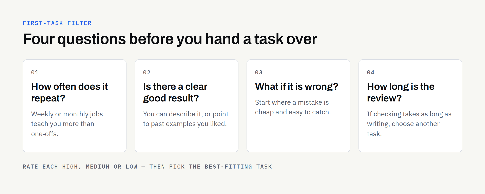

Most business owners who are curious about AI do not lack ideas. They have the opposite problem: a long list of tasks that might be worth handing over, and no clear way to decide which one to try first.

Pick badly and the first experience is a frustrating one — a task that was too vague, too risky or too rare to learn anything from. Pick well and you get a quick, low-risk win that shows what the approach can and cannot do. This article gives you a simple way to choose, using four questions you can answer without any technical knowledge.

## Why the first task matters more than it seems

The first task sets your expectations for everything that follows. A small, well-defined job that goes smoothly builds confidence and teaches you what good instructions and good source material look like. A sprawling, high-stakes job that goes wrong can put a team off for months.

It also helps to be clear about what "handing over" means. AI is good at producing a first version quickly. It is not a substitute for knowing your business, and it cannot confirm that a claim is true. Somebody on your side still reads the result and decides whether it goes out. That review step is part of the job, not an extra — our guide to [checking AI-assisted content before you publish it](https://fintaxtech.co.uk/blog/how-to-review-ai-assisted-content/) sets out a routine you can follow.

## The four questions

Run each candidate task through these questions. None of them needs a score out of a hundred; a plain high, medium or low is enough.

### 1. How often does it repeat?

Tasks that come round weekly or monthly teach you more, and save more, than one-off jobs. Writing the same type of summary from each new supplier document is a better candidate than drafting a single anniversary announcement.

### 2. Is there a clear "good" result?

Can you describe what a finished piece looks like — length, structure, tone, what must be included? If you can point to two or three past examples you were happy with, that is a strong sign. If "good" depends entirely on a feeling, the task needs more definition before it is worth handing over.

### 3. What happens if it is wrong?

Think about the worst realistic outcome if an error slipped through. A slightly clumsy sentence in an internal summary is minor. A wrong figure in a customer quote, or a claim about regulated advice, is not. Start where mistakes are cheap and easy to catch.

### 4. How much effort does the review take?

If checking a result takes almost as long as writing it yourself, the task is not a good first choice. The best candidates are ones where the source material is to hand, so a reviewer can compare the output against it quickly.

## A simple way to compare candidates

List five to ten tasks, then rate each one against the four questions. A table like this one works well. The ratings below are illustrative only — yours will differ.

| Task (illustrative) | Repeats? | Clear "good"? | Cost of an error | Review effort | First-task fit |
| --- | --- | --- | --- | --- | --- |
| Summarising supplier documents into a standard one-page brief | High | High | Low | Low | Strong |
| Drafting FAQ answers from existing policy documents | Medium | High | Medium | Medium | Good |
| Writing service descriptions from a fixed set of facts | Medium | High | Low | Low | Strong |
| Drafting replies to unusual customer complaints | Low | Low | High | High | Poor |
| Producing a one-off legal-style agreement | Low | Low | High | High | Poor |

The "first-task fit" column is a judgement, not a formula. The pattern to look for is the top of the table: frequent, well defined, low in consequence and quick to check.

## Tasks that usually make good starting points

These are the kinds of jobs that tend to score well. They are examples of the pattern rather than a promised list of deliverables for any particular business.

- **Summaries of documents you already have:** Reports, meeting notes, supplier terms and similar material, condensed into a consistent format.
- **Extraction of key details:** Pulling dates, names, amounts or requirements out of documents into a tidy list or table, ready for a person to check.
- **Draft web or product copy from agreed facts:** Service descriptions, product summaries and FAQs, written from material you have supplied.
- **First drafts that follow a template:** Onboarding guides, how-to sheets and standard update emails with a fixed structure.

For more detail on how these look in practice, see [six practical examples of AI-assisted content services](https://fintaxtech.co.uk/blog/ai-content-services-six-examples/). If your starting point is a folder of existing paperwork, [turning business documents into website content](https://fintaxtech.co.uk/blog/ai-business-documents-to-website-content/) explains how that works.

## Tasks to leave until later

Some tasks are not impossible, but they make poor first experiments.

- **Anything that needs fresh facts or live data:** AI cannot check today's prices, stock or opening hours for you.
- **Advice with legal, medical or financial consequences:** These need a qualified person, and some material of this kind may be declined by a managed service.
- **Highly personal or sensitive messages:** Condolences, disputes and difficult conversations usually need your own voice.
- **Work built on confidential material you have not sorted yet:** Decide what can be shared, what must be redacted and what must stay in-house before anything leaves your office. Our article on [using AI with confidential business documents](https://fintaxtech.co.uk/blog/ai-confidential-business-documents/) covers that sorting step.

## Start with a small, honest trial

Once you have picked a candidate, keep the trial deliberately small.

1. **Choose one task and one type of source document.** Resist the urge to add extras.
2. **Gather three to five real examples.** Include one awkward case, so the trial is not too flattering.
3. **Write down what "good" looks like.** Length, tone, must-include points and anything that must never appear.
4. **Name the person who reviews the result.** One accountable reviewer is better than a vague "the team".
5. **Compare the output against your source material.** Note what was right, what needed correcting and how long checking took.
6. **Decide whether to repeat, adjust or stop.** A trial that ends with "not for us" has still done its job.

## How a managed service fits

With a managed AI automation service, you do not need to build or run anything yourself. At FinTaxTech, the workflow is run for you and the finished content is handed over — there are no prompt products for sale, and no tools for you to learn.

A few practical points are worth knowing before you start:

- **Documents move securely, and only once an engagement is in place.** Nothing should be sent in advance.
- **Some material may be declined.** Sensitive or regulated material is not always suitable, and we would rather say so early.
- **You still own the review.** The content is yours to approve, correct or reject before it is used.
- **Ownership is set out in writing.** Ownership of agreed final deliverables passes to you after full payment, as set out in the written proposal. This is not legal advice, so confirm the terms in writing and take your own advice where it matters.

## Your first-task checklist

- [ ] List five to ten tasks you would consider handing over
- [ ] Rate each for how often it repeats, how clear "good" is, the cost of an error and the review effort
- [ ] Pick one task that is frequent, well defined and low in consequence
- [ ] Gather three to five real examples, including one awkward case
- [ ] Write down what a good result looks like, in a few lines
- [ ] Decide which source material can be shared, which needs redacting and which stays in-house
- [ ] Name one person who will review and approve the result
- [ ] Agree in advance how you will judge the trial — accuracy, time saved and tone
- [ ] Confirm in writing who owns the final deliverables and when ownership transfers

If you have a task in mind and are not sure it is the right one to start with, we are happy to talk it through. There is no pressure to proceed, and an honest "not yet" is a perfectly good answer.

**[Talk to us about AI Automation →](/enquiry/?service=ai-automation)**
