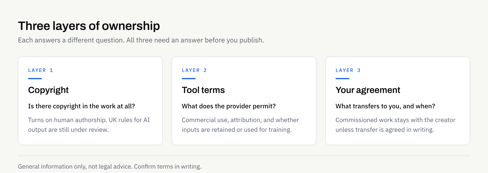
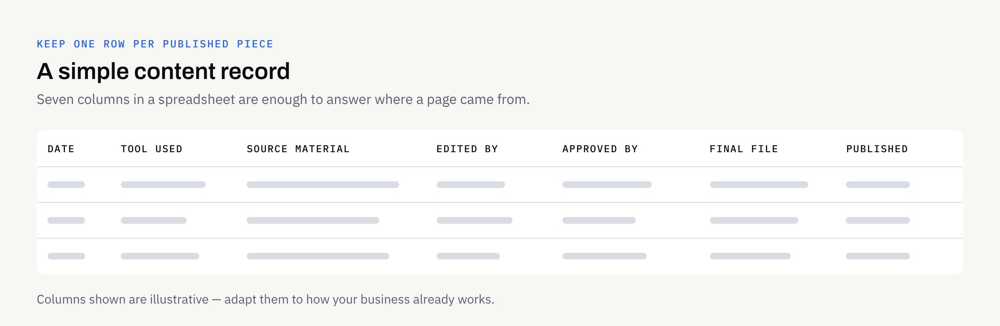

If your business uses AI to help draft web copy, product descriptions, service pages or social posts, a fair question follows: who actually owns the result? It matters once that content sits on your own website, goes into a printed brochure, or forms part of work you have paid someone else to produce.

The honest answer is that "who owns it" is not one question but three, and they have different answers. This article separates them, points to what current UK guidance says, and sets out what to get written down before work starts. It is general information, not legal advice — for anything with money or risk attached, take your own professional advice and confirm the terms in writing.

## "Who owns it?" is really three questions

### 1. Is there copyright in it at all?

Copyright is not something you apply for in the UK — it arises automatically when a qualifying work is created. The interesting part with AI-assisted content is whether the material is the product of enough human authorship to qualify in the first place.

### 2. What do the AI tool's terms permit?

Separate from copyright, every AI tool comes with its own terms covering what you may do with the output — commercial use, attribution, whether your inputs may be retained or used for training. Those terms are a contract between you and the provider, and they change. Read them, and re-read them when a provider announces an update.

### 3. What transfers from your supplier, and when?

If a studio, freelancer or agency produced the content, your agreement with them — not copyright law alone — decides what you end up holding. This is the part most businesses forget to pin down, and the easiest to fix.

## What UK guidance says today

Two things are worth knowing, and they pull in slightly different directions.

**The default rules are well established.** GOV.UK's guidance on [ownership of copyright works](https://www.gov.uk/guidance/ownership-of-copyright-works) states that the author or creator is usually the first owner. An employer owns work created by an employee in the course of their employment, but someone working under a contract for services — a freelancer or a studio — "will usually retain copyright in any works he produces, unless there is a contractual agreement to the contrary". For commissioned work the guidance is blunter still: the first legal owner is the person or organisation that created the work, "and not you the commissioner, unless you otherwise agree it in writing".

That single sentence is the practical heart of this article. Paying an invoice does not, by itself, transfer copyright. A written agreement does.

**The AI-specific position is unsettled.** The Government's [report on copyright and artificial intelligence](https://www.gov.uk/government/publications/report-and-impact-assessment-on-copyright-and-artificial-intelligence/report-on-copyright-and-artificial-intelligence), published on 18 March 2026 and presented to Parliament, proposes removing copyright protection for wholly computer-generated works, but frames this as a proposal for further consideration rather than a change in force. It also confirms that a broad text and data mining exception with opt-out "is no longer the government's preferred way forward", and that reforms will not be introduced until the Government is confident about them. Separately, the [code of practice on copyright and AI](https://www.gov.uk/guidance/the-governments-code-of-practice-on-copyright-and-ai) remains voluntary.

So: no settled special rule for AI output, and active policy work in progress. Check those pages yourself before relying on anything here — they are the official sources and they are being updated.

The practical reading for a small business is reasonably intuitive. Content that a person has directed, edited, selected and shaped sits on more comfortable ground than a block of text that came out of a tool untouched. That is also, not coincidentally, the content that reads better.

## What to check, asset by asset

Different outputs raise different questions. This table is a starting point for a conversation, not a legal opinion.

| Asset | The question that usually matters | What to confirm in writing |
| --- | --- | --- |
| Website page copy | Can we keep publishing this if we change supplier? | Ownership of the final approved copy transfers to you; no ongoing licence needed |
| Blog articles | Who can republish or syndicate it? | Ownership plus confirmation that it has not been published elsewhere |
| Product descriptions | Were competitors' listings used as source material? | Which sources were used; that output was reviewed, not copied |
| Social captions | Do platform terms affect what we post? | Nothing unusual — but check the platform's own rules on disclosure |
| Images and illustrations | Is any third-party or stock material inside it? | Licences for every stock asset, font and image, named individually |
| Logo and wordmark | Is it ours exclusively? | Ownership of the final files — exclusivity is a separate matter (see below) |
| Translated content | Who owns the translation? | Translations are separate works; confirm they transfer too |
| Internal documents | Was anything confidential put into a tool? | Which tool, what was shared, and what was redacted first |

## When a supplier is involved

If someone else is producing the content, the written proposal should answer these without you having to ask twice.

- **Which deliverables are final:** Name the actual files and formats that are being handed over, so there is no argument later about drafts versus deliverables.
- **When ownership passes:** At FinTaxTech, ownership of the agreed final deliverables passes to the client after full payment, as set out in the written proposal. Whatever your supplier's position is, it should be on paper in those terms.
- **What stays with the supplier:** Working files, internal templates, workflows and methods normally remain the supplier's property. That is normal and not a problem, provided the handover list is complete enough that you can keep operating without them.
- **Which tools were used:** You cannot assess the tool-terms layer if you do not know which tools were involved.
- **Third-party licences:** Fonts, stock photography and icons come with their own terms. These should be listed, not assumed.
- **Confidentiality:** Agree what source material can be shared and how it is transferred. Our AI-assisted content work is a managed service — we run the workflow and hand over finished content, rather than selling prompts as a product — and we may decline sensitive or regulated material. Documents are transferred securely, and only once an engagement is in place. Our guide to [using AI with confidential business documents](https://fintaxtech.co.uk/blog/ai-confidential-business-documents/) covers what to share and what to redact first.

This mirrors the position for your website as a whole, where domains, hosting, repositories and content each need to be accounted for separately. We set that out in [who owns your business website after launch](https://fintaxtech.co.uk/blog/who-owns-your-business-website/). As a general principle, your business should hold its own domain, repository, app store and cloud accounts in its own name, whoever builds on top of them.

## Ownership is not the same as exclusivity

This is the distinction that causes the most disappointment, so it is worth stating plainly.

Owning a file means you control that file. It does not stop a competitor publishing something similar. Two businesses in the same sector, giving a similar brief to a similar tool, can quite easily end up with content that covers the same points in the same order. Nothing in copyright prevents that.

For names, logos and straplines, exclusivity comes from trade mark registration, which is a separate process with its own searches, fees and risks — the official starting point is GOV.UK's guidance on [how to register a trade mark](https://www.gov.uk/how-to-register-a-trade-mark). Design and branding work, ours included, delivers identity assets; it does not confer trade mark rights or guarantee that a name is free to use. If exclusivity matters to your business, that is a conversation with a trade mark attorney, not a design question.

The practical defence against sameness is not legal at all. It is specificity: your own examples, your own service boundaries, your own way of explaining things. Our guide to [keeping your brand voice consistent](https://fintaxtech.co.uk/blog/brand-voice-with-ai-assisted-content/) goes into how to hold that line when AI is helping with the drafting.

## The risks that actually bite: copied phrasing and wrong facts

In day-to-day work, ownership disputes are rare. Other problems are far more common.

AI output can reproduce a distinctive passage from somewhere else, present a quoted sentence as original phrasing, or confidently assert a fact, figure or regulation that is wrong or out of date. Any of those can reach your website unnoticed if nobody is checking. A short, consistent review step before publishing catches most of it — our [review process for AI-assisted content](https://fintaxtech.co.uk/blog/how-to-review-ai-assisted-content/) sets out one that works for a small team.

## Keep a record that makes ownership easy to prove

None of this needs a system. A single spreadsheet, one row per published piece, is enough for most small businesses.

The point is not bureaucracy. It is that two years from now, if anyone asks where a page came from — a buyer doing due diligence, or simply a new member of staff — you can answer in a minute rather than reconstructing it from memory.

## Before you publish AI-assisted content

- [ ] Read the current terms of every AI tool used, including commercial use and data retention
- [ ] Confirm in writing that ownership of the agreed final deliverables transfers to your business, and when
- [ ] Get a complete list of third-party fonts, images and stock assets, with their licences
- [ ] Check your business is named on the domain, repository, store and cloud accounts
- [ ] Record which source documents were supplied, and what was redacted before sharing
- [ ] Have a named person review every piece for accuracy, tone and copied phrasing
- [ ] Keep one row per published piece: date, tool, sources, editor, approver, file location
- [ ] Treat exclusivity as a separate question, and take proper advice if it matters

Most of this takes an afternoon to set up and then looks after itself. If you would rather the ownership position were clear from the outset — stated in the proposal, with a handover list you can check — that is how we prefer to work, and we are happy to talk it through before anything starts.

**[Talk to us about AI-assisted content →](/enquiry/?service=ai-automation)**
